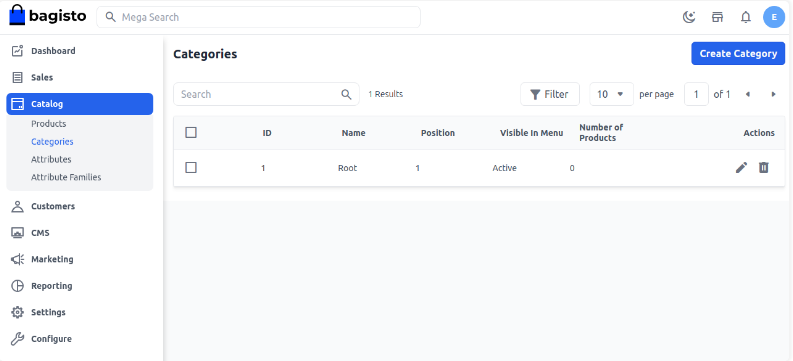
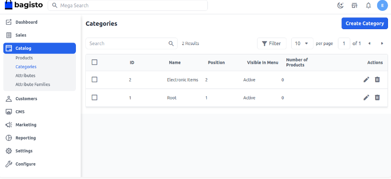
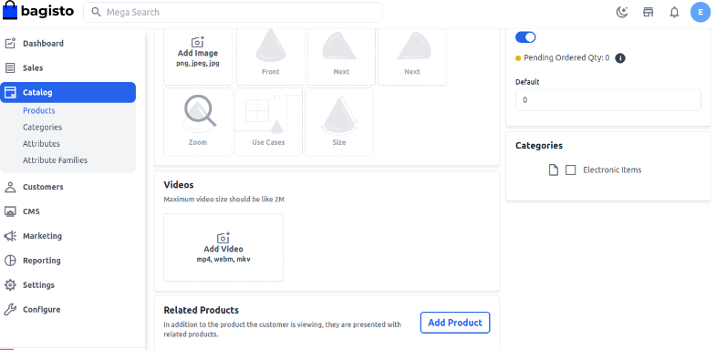

# How to Create Categories in The Bagisto2.0

The category is a structure of your catalog. By creating a category, customers can easily find the specific product amongst the lot on your e-commerce website. It is used for making the hierarchical arrangement of your website. Here we have listed down steps to create a new category and root category in Bagisto.

### Root Category

Bagisto comes with a default root category, i.e., Root, but you can also create your root category. The Root Category is not visible on the front end because it acts as a container to contain the categories to be displayed on the website.

### Steps to Create a New Root Category in Bagisto 2.0

1. Click on **Catalog >> Categories >> Create Category** as shown in the below image.

   

2. Enter the general values like name, position, and description, and add images.

3. **Display Mode** - Display mode is about which content detail is visible on the category page. There are three options:
   - Product and Description
   - Product
   - Description

   - **Product and Description:** When you set the display mode to "Product and Description," then the product and description about the category both will be visible on the front end as shown below image.

   - **Description:** When you set the display mode to "Description," then only the category description will be visible on the front end.

   - **Product:** When you set the display mode to "Product," the product will be visible on the front end.

      

4. Save the category, and a new category is created by the name of Electronic Items as shown in the below image.

      

5. Now check the product edit page while creating a product, and you will be able to see our new category right there.

      

### Category on Front-End

By following the above steps, you can easily create a new category.

