# Configure

Generally, a configuration is the arrangement - or the process of making the arrangement - of the parts that make up a whole.

How the parts of something, or a group of things, are arranged.

## Weight Unit

**1)** To add Weight Unit go to the Admin panel and go to **Configure >> General**.Next, select the **Weight Unit** from dropdown **lbs or kgs** according to your requirement and click on the **Save Configuration** button as shown in the below image.

 

## Configurable Choices.

Settings refer to configurable choices that control how a system, application, or device behaves, tailored to user preferences and requirements.

**1)** Now to add Weight Unit go to the Admin panel and go to **Configure >> Content**.Next, you will able to see the below options.

**Compare Options** - By this, you can easily compare your products.

**Wishlist Option** - This helps to add the functionality of Wishlist. 

**Image Search Option** - This option helps to search your image.

 

After clicking on the **Save Configuration** button.

## Custom Scripts

Custom scripts are personalized pieces of code created to add specific functions or features to the software, enhancing its capabilities uniquely.

Here, in this specified section CSS and JS Admin can write the code. And in last, it will automatically append the code to the master file.

**1)** Now to add **Custom Scripts** go to the Admin panel go to **Configure >> Content**.Next you will able to see the below options.

### Custom CSS

We have used a background color by **Light Blue** and saved the Configurations.

 

Now the storefront background color has changed as shown below image.

 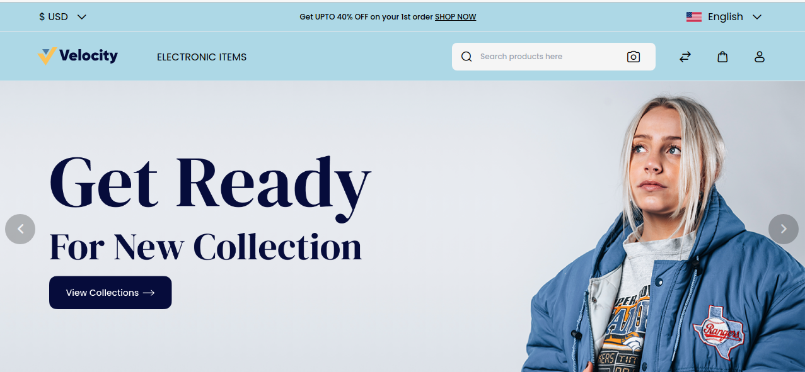

### Custom JS

You can apply javascript also according to your requirement and click on the **Save Configuration** button.

 

After clicking on the **Save Configuration** button. 

## Design 

Admin logo is the distinctive image or emblem representing the administration interface of a system or website, often customizable.

To add **Designs** like **Admin logo, Favicon** go to the Admin Panel and click on **Configure >> Design** and you can easily update a new logo image and favicon from here. click on the **Choose Files**  option to select an image last click on the **Save Configuration** button.

 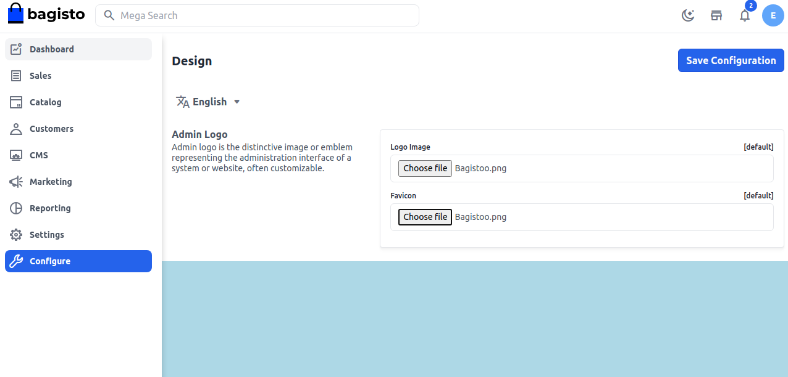

The new **Admin Logo** and **Favicon** images are updated.

 

## Back Orders

A backorder is an order for a good or service that cannot be filled immediately because of a lack of available supply. Backorders give insight into a company's inventory management. 

A manageable backorder with a short turnaround is a net positive, but a large backorder with longer wait times can be problematic.

You can easily manage **Backorders** by going to the Admin Panel and clicking on **Configure >> Inventory**.

There is an option present to **Enable or Disable** a Backorder and then click on **Save Configuration** as shown below.

 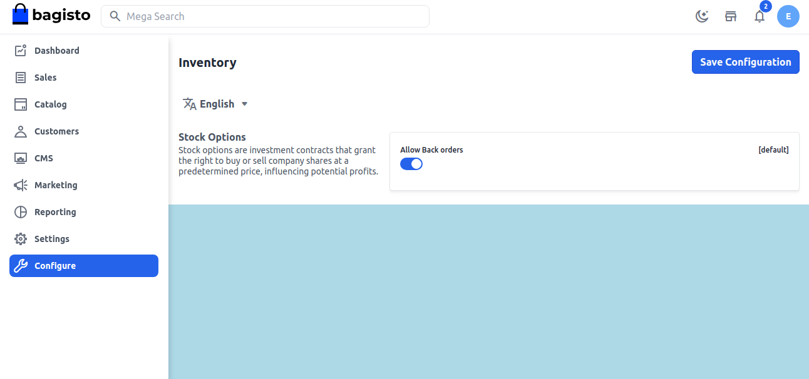

**Note:- If the product is Out of Stock then also customer is able to Place an Order after Enabling the Backorder Option**

 

In the above image these products are **Out of Stock** but you can still able to Add the product to the Cart and **Place an Order**.

 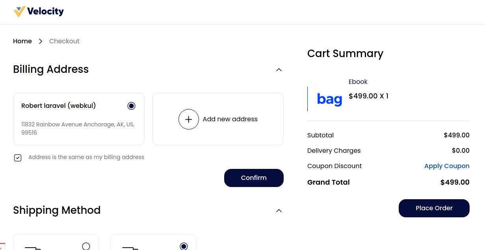

 

## Guest Checkout

Guest checkout allows customers to buy products without creating an account, streamlining the purchase process for convenience and faster transactions.

To manage Guest checkout go to Admin Panel and click on **Configure >> Products**.You can see an option of **Enable or Disable** of Guest Checkout and then click the **Save Configuration** button.

 

## Product View Page

Product view page configuration entails adjusting the layout and elements on a product's display page, enhancing user experience and information presentation.

To add go to Admin Panel and click on **Configure >> Products**

 

After clicking on the **Save Configuration** button.

## Cart View Page

Cart view page configuration involves arranging items, details, and options on the shopping cart page, improving user interaction and purchase flow.

To add go to Admin Panel and click on **Configure >> Products**

 

After clicking on the **Save Configuration** button. 

## Storefront

Storefront is the customer-facing interface of an online shop, showcasing products, categories, and navigation for a seamless shopping experience.

To add go to Admin Panel and click on **Configure >> Products >> Storefront**

**1.Search Mode:** Select the search mode by **Dropdown or Elasticsearch** as per your requirements.

**2.Default List Mode:** You manage in which format your products will be visible on the storefront select from the dropdown **Grid or List**.

**3.Products Per Page:** You can enter the quantity that how many products that will be visible per page on the Storefront.

**4.Sort By** Select a sort-by option from the dropdown according to your requirements.

**5.Buy Now Products** Select from the **Enable/Disable** option as per requirement.After enabling it will get visible on product detail page as shown in the below image.

 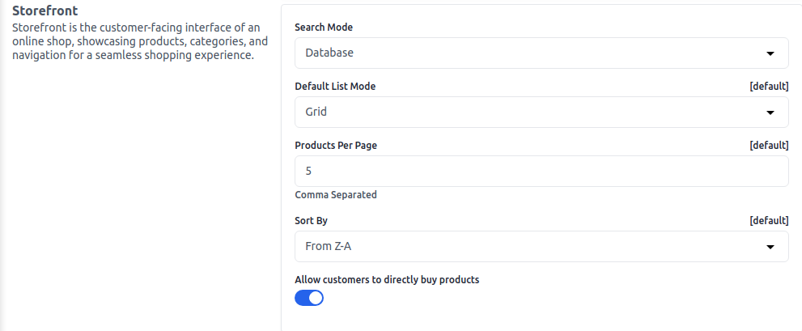

 

After clicking on the **Save Configuration** button. 

## Image Size

Storefront is the customer-facing interface of an online shop, showcasing products, categories, and navigation for a seamless shopping experience.

To add go to Admin Panel and click on **Configure >> Products**

### Small Image

Select **Height and Width** for the small images.

### Medium Image

Select **Height and Width** for the medium images.

### Large Image

Select **Height and Width** for the Large images.

 

After clicking on the **Save Configuration** button. 

## Review

Evaluation or assessment of something, often involving opinions and feedback.

To add go to Admin Panel and click on **Configure >> Products >> Review**

 

After clicking on the **Save Configuration** button. 

## Attribute

Characteristic or property that defines an object, influencing its behavior, appearance, or function.

You can easily allow **Image and File** upload size (in KB) from here.

To add go to Admin Panel and click on **Configure >> Products >> Attribute**

 

After clicking on the **Save Configuration** button. 

## Social Share

Sharing things from a website with friends on social media platforms like Facebook, Twitter, or Instagram.

To add go to Admin Panel and click on **Configure >> Products >> Social Share**

 

After clicking on the **Save Configuration** button. 

### Frontend:-

All the icons that you just enabled from the Admin Panel are created as shown in the below image.

## Rich Snippets

Rich Snippets (also known as “Rich Results”) are normal Google search results with additional data displayed. This extra data is usually pulled from Structured Data found in a page's HTML.

Set products and category configurations. To add to the Admin Panel click on **Configure >> Rich Snippets** 

### Products

Items available for purchase or use, offered by a business or seller. Select the option of **Enable/Disable** and click on **Save Configuration** Button.

 

### Categories

"Categories" refer to groups or classifications that help organize and group similar products or items for easier browsing and navigation.

Select the option of **Enable/Disable** and click on **Save Configuration** Button.

 

## Address 

To add an address on the Admin Panel go to **Configure >> Address** and manage your **Requirements & Information** and then click on **Save Configuration** button.

 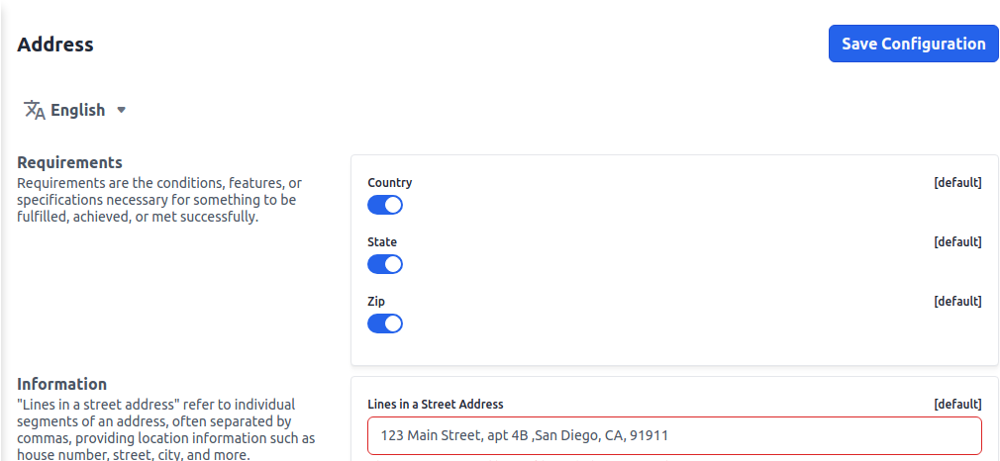

## Captcha

"Sitemap: Website layout map for search engines. Secret key: Secure code for data encryption, authentication, or API access protection."

On the Admin Panel go to **Configure >> Captcha** add the **Site Key & Secret Key** and enable/disable the **Status** according to your requirement.

 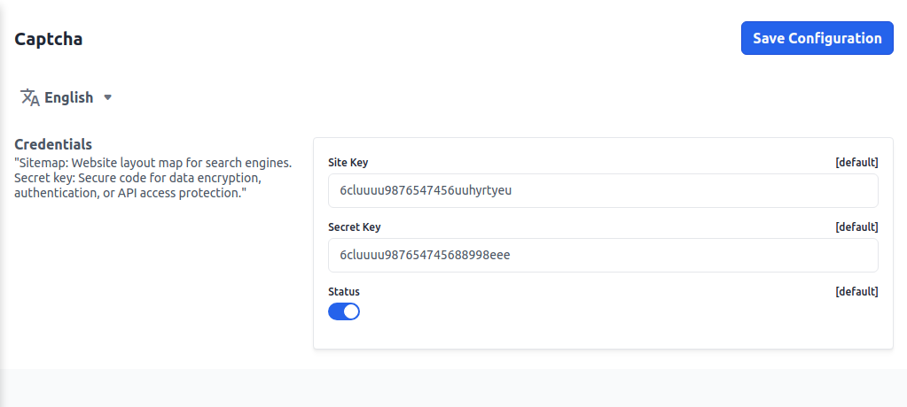

After clicking on the **Save Configuration** button. 

## Settings

Set newsletter subscriptions, email verifications, and social login.
To add go to the Admin Panel and click on **Configure >> Settings** 

### Newsletter Subscription

"Newsletter information" contains updates, offers, or content shared regularly through emails to subscribers, keeping them informed and engaged.

### Email Verification

"Email verification" confirms the authenticity of an email address, often by sending a confirmation link, enhancing account security and communication reliability.

### Social Login

"Social login" enables users to access websites using their social media accounts, streamlining registration and login processes for convenience.

After clicking on the **Save Configuration** button.

 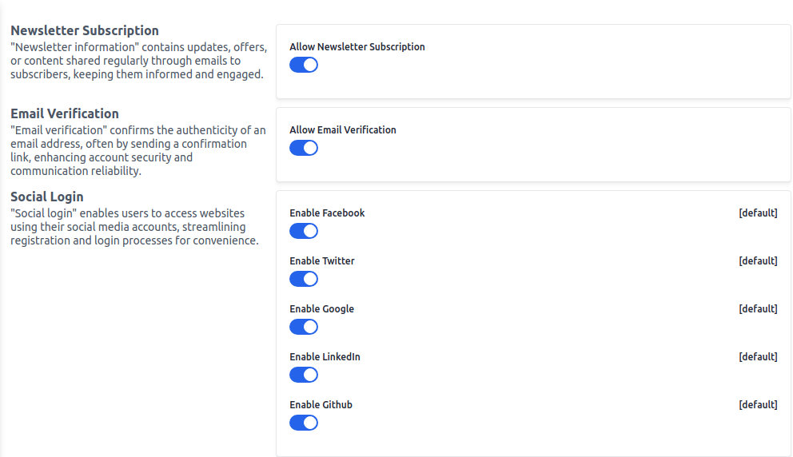

## E-mail Settings

Set email sender name, shop email address, admin name, and admin email address.

To add go to the Admin Panel and click on **Configure >> Email Settings** 

 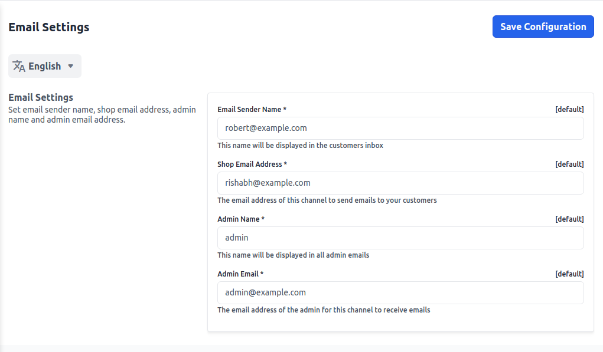

After clicking on the **Save Configuration** button.

## Notifications

"Notification" is a message or alert that informs users about events, updates, or actions, enhancing user engagement and awareness.

To add go to the Admin Panel and click on **Configure >> Notifications** 

 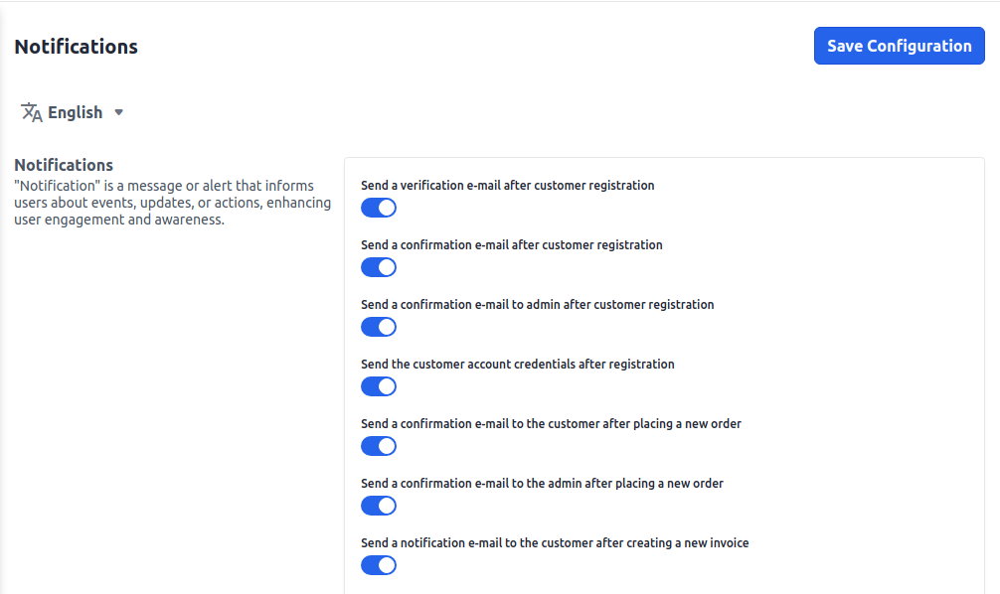

After clicking on the **Save Configuration** button. 

## Shipping

Shipping origin refers to the location where goods or products originate before being transported to their destination.

To add go to the Admin Panel and click on **Configure >> Shipping** 

 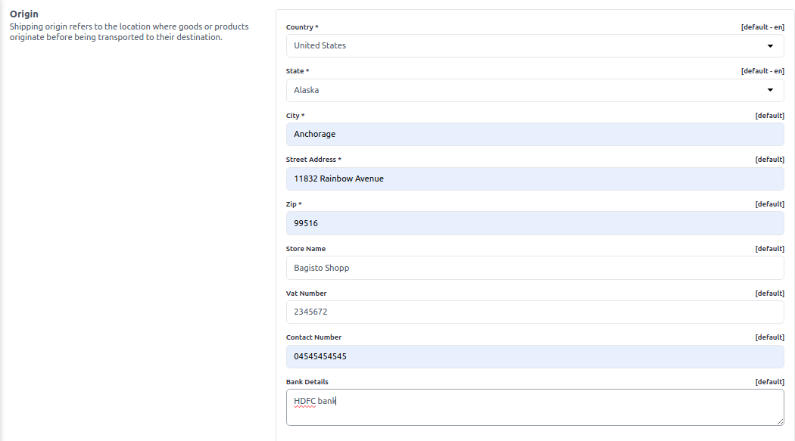

## Shipping Methods

To deliver the products there are two types of shipping methods.

To add go to the Admin Panel and click on **Configure >> Shipping Methods** 

**1) Free Shipping** "Free shipping" refers to a shipping method where the cost of shipping is waived, and the seller covers the shipping expenses for delivering goods to the buyer.

**2)Flat Rate Shipping** Flat rate shipping is a shipping method where a fixed fee is charged for shipping, regardless of the weight, size, or distance of the package. This simplifies shipping costs and can be advantageous for both buyers and sellers.

 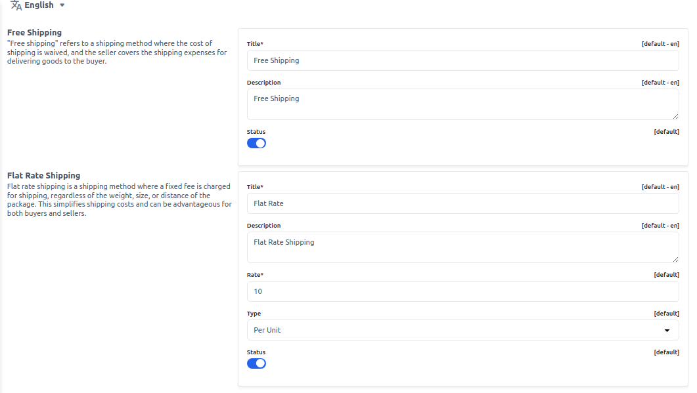

After clicking on the **Save Configuration** button. 

## Payment Methods

A payment method refers to the various options available for customers to make payments when purchasing a product or service. Whether in a physical or online store, payment methods cover a range of choices. Commonly accepted payment methods include cash, credit cards, debit cards, gift cards, and mobile payments.

To add go to the Admin Panel and click on **Configure >> Payment Method** 

### Paypal 

PayPal Smart Button: Simplifies online payments with customizable buttons for secure, multi-method transactions on websites and apps.

 

### Cash On Delivery

Payment method where customers pay in cash upon receiving goods or services at their doorstep.

 

### Money Transfer

Transfer of funds from one person or account to another, often electronically, for various purposes such as transactions or remittances.

 

### PayPal Standard 

PayPal Standard is a basic PayPal payment option for online businesses, enabling customers to pay using their PayPal accounts or credit/debit cards.

 

After clicking on the **Save Configuration** button.  

## Order Settings

To add go to the Admin Panel and click on **Configure >> Order Settings** 

**Order Number Settings:-** Unique identifier assigned to a specific customer order, aiding tracking, communication, and reference throughout the purchasing process.

**Minimum Order Settings:-** Configured criteria specifying the lowest required quantity or value for an order to be processed or qualify for benefits.

 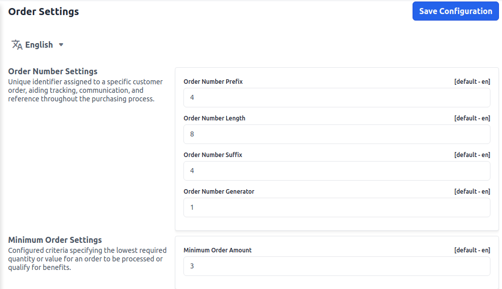

After clicking on the **Save Configuration** button. 

## Invoice Settings

To add go to the Admin Panel and click on **Configure >> Invoice Settings** 

**1.Invoice Number Settings** Configuration of rules or parameters for generating and assigning unique identification numbers to invoices for organizational and tracking purposes.

 

**2. Payment Terms** Agreed-upon conditions dictating when and how payment for goods or services should be made by the buyer to the seller.

 

**3.Invoice Slip Design** Visual layout and formatting of an invoice slip, including company branding, itemization, pricing, and payment details for professional presentation.

 

**4.Invoice Reminders** Automated notifications or communications sent to customers to remind them of upcoming or overdue payments for invoices.

 

After clicking on the **Save Configuration** button. 

## Pricing

Details about the cost of goods or services, including base price, discounts, taxes, and additional charges information.

To add go to the Admin Panel and click on **Configure >> Pricing** 

 

After clicking on the **Save Configuration** button. 