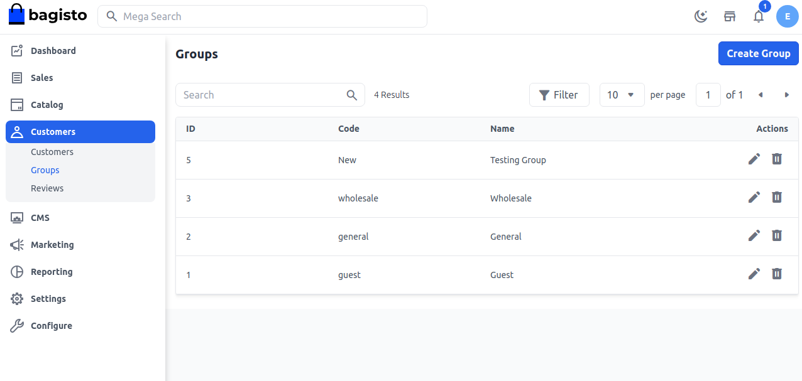
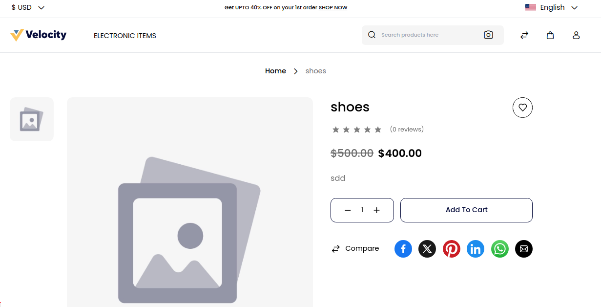

# Cusetomer Groups

Customer groups allow you to organize your customers, give them discounts, and restrict access to specific products or categories. With Customer Groups, you can: set up a loyalty group — give access to specific products or categories at discounted rates to select customers.

Customer groups determine which discounts are available and the tax class that is associated with the group. The default customer groups are General, Guest, and Wholesale.

### Wholesale Group

Wholesale customers usually have access to products or bundles of products not available to retail customers, and they often have a discount on the products they buy. Both of these can be set up by using the Customer Groups feature.

To restrict wholesale products from retail customers, you will first need to create a category specifically for those products. Then, you will need to segment your customers, so that only wholesale customers can view those products.

### Guest Group 

The Guest group is the only one that can apply to guests and cannot be edited or deleted. A non-logged-in group also falls under this guest group

### General Group 

The general customer group refers to customers who are not defined as Professional Customers and don't want the order products in bulk.

### To create a new customer group in Bagisto follow the below steps:

**Step 1**: Login to admin panel of Bagisto and go to **Customers** >> **Groups**.By default there are three customer groups to create a new group click on the **Create Group** button as shown below. 

 

**Step 2**: Next you will get a form to create a new group fill in the group **Code** and **Name** and then click the **Save Group** button as shown in the below image.

 

**Step 3**: Now you will able to see the new customer group is registered successfully.

 

So by the above steps, you can easily create a new customer group from the admin panel in Bagisto. 

### To create a Customer Group Price

**Step 1**: First create the customer group and assign the group to the customer or by default there is a group like “General”,” Wholesale”, or” Guest ”.

**Step 2**: Login to admin panel of Bagisto and go to **Catalog** >> **Products**.Create a new product and go to the product edit page and you will able to see the **Customer Group Price** section as shown in the below image.

 

**Step 2**: Now click on **Add New** and add the below fields.
 
**A) Discounted Price:** In Discounted price. We will have to set a percentage which will be discounted on the price of the product after the offer.

**B) Fixed Price:** In this, we will have to set a fixed price on the product after the offer.

**C) Quantity:** In this, we will have to set the minimum quantity of the product to purchase in order to avail of the offer.

**D) Customer Group:** In this, we can create a group that we can assign to the customer i.e. prime membership group,  guest group, wholesale group, general group.

**( Note-We can create a group according to our requirement.)**

**Fixed Price**
Here I have set the fixed price of the product in the Guest Customer group with a minimum quantity of 1. It means if you purchase 1 piece of this product of costs 500$. But if you are a guest user then the cost of the product for you will be $400.

So now click on the **Save** button as shown below.

  

Now save the product now you can see the price changed according to the group.

As I have set for the guest group and the fixed price here it is showing the pricing according to the guest group as shown below. 

  