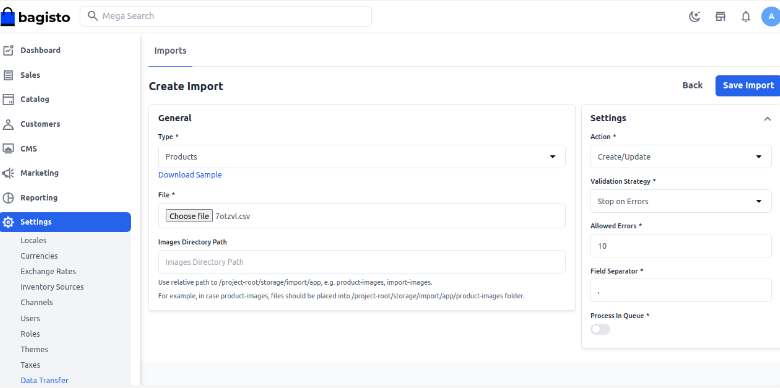

# Bulk Import

Bulk import is a feature that allows users to import large quantities of data into a system quickly and efficiently. It simplifies the process and saves time by not having to add each piece of information one by one. The feature works differently for each system and has a vast variety of use cases across many industries as well as Bagisto.

### Steps to add Bulk Import in Bagisto2.1.0

**Step 1:** Go to the Admin panel of Bagisto click on **Settings >> Data Transfer** and click on **Create Import** button.

**Step 2:** Under general configurations select the below fields:

**1) Type** – Kindly select the type i.e. (Products, Customers, Tax rates) which you want to import.

**2) File** – Choose the file in your desired format (CSV, XLS, XLSX), and kindly make sure you have all the required fields in the file.

**Note** - While Import the product data **Simple, Configurable, Virtual, Bundled & Grouped product types** can be imported except **Downloadable products**.

**3) Download Sample** – You can also download the sample files of types (Products, Customers, Tax Rates). Kindly make sure the file you are uploading is similar to this sample file.

**4) Image Directory Path** – Use relative path to /project-root/storage/import/app, e.g. product-images, import-images.

**5) Action** – Kindly select from the settings configuration that you want to Create/Update or Delete the records.

**6) Validation Strategy** – This unique feature allows you to **Skip the Errors** or to **Stop on Errors** while Importing the data.

**7) Allowed Errors** – This feature allows you how much quantity of errors will get neglected while importing the data.

**8) Field Separator** – This feature allows you to set the fields.

**9) Process in Queue** – This feature allows you to run your import process in a queue.

So now click on the **Save Import** Button.

**Step 3:** Now the import process will get started and after it is completed the product import process will be done.

**Step 4:** Now you will able see to all the products under the **Catalog >> Products** section as shown in the given image.

By the above steps, you can easily create a **Bulk Import** in Bagisto 2.1.0