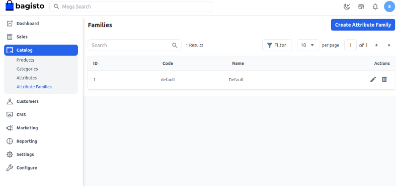
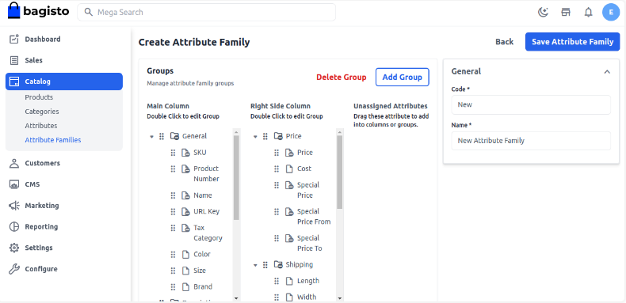
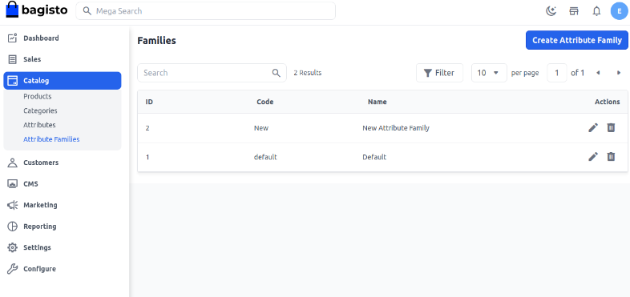
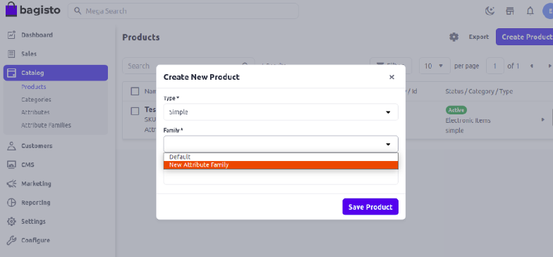

# إنشاء عائلة السمات

باستخدام عائلات السمات، يمكنك استيراد جميع المعلومات المطلوبة عن المنتج في خطوة واحدة. يمكن تحديدها كقائمة من السمات المرتبطة بمنتج فريد. هنا قمنا بإدراج الدليل حول عائلات سمات المنتج في Bagisto.

### إنشاء عائلة سمات في Bagisto 2.2.0

**الخطوة 1**: في لوحة تحكم المسؤول، انقر على **الكتالوج** >> **عائلات السمات** >> **إنشاء عائلة سمات**.

**الخطوة 2**: أدخل **رمز عائلة السمة** و**الاسم** كما هو موضح في الصورة أدناه.

الآن بعد إنشاء العائلة، احفظ عائلة السمة الجديدة كما هو موضح في الصورة أدناه.

الآن بعد إنشاء عائلة السمات الجديدة، يمكنك تعديلها من خلال **الإجراء**. أضف **السمات** المطلوبة لهذه العائلة بناءً على متطلباتك الخاصة. بعد ذلك، للتحقق من الإخراج أثناء عملية إنشاء المنتج، ستتمكن من رؤية عائلة السمات الجديدة. الآن ستكون جميع السمات مرئية في صفحة المنتج التي تنتمي إلى هذه العائلات.

باتباع الخطوات أعلاه، يمكنك بسهولة إنشاء عائلات السمات في Bagisto 2.2.0.