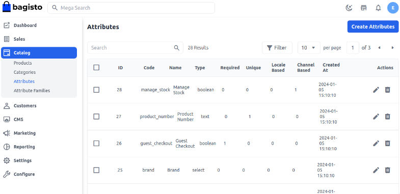
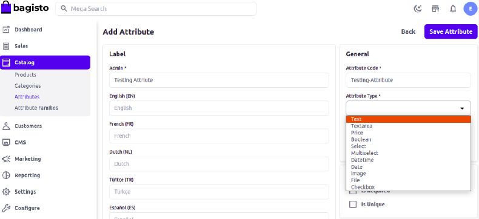
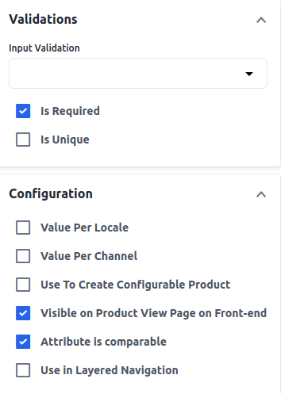
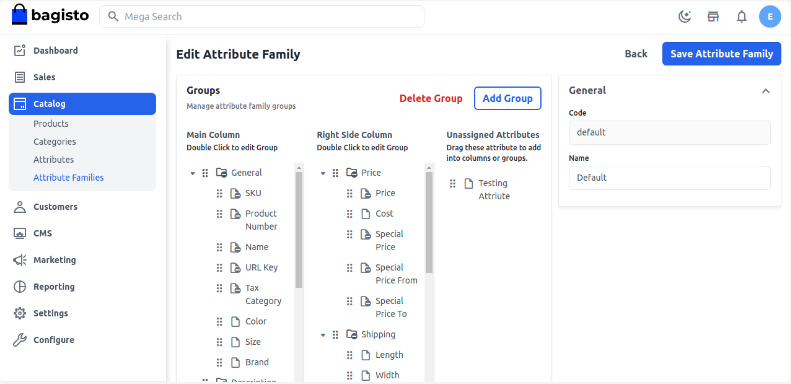
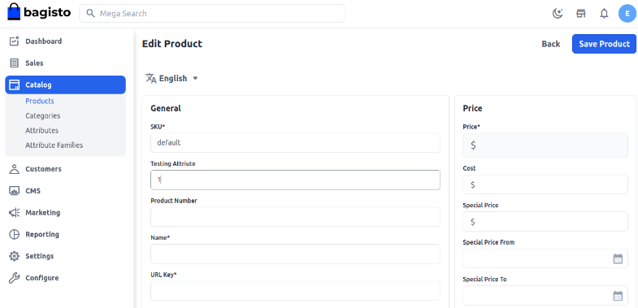

# إنشاء سمة المنتج

السمة هي مواصفة أو خاصية لمنتج، على سبيل المثال، اللون، الحجم، والنمط هي سمات للتي شيرت. يمكنك أيضًا إنشاء العديد من السمات لمنتج واحد. تلعب سمة المنتج دورًا رئيسيًا في قرار الشراء للعميل.

### كيفية إنشاء سمة منتج في Bagisto 2.2.0

لإنشاء سمات Bagisto، افتح لوحة التحكم ثم اتبع الخطوات أدناه.

### إضافة سمات

انقر على **الكتالوج** >> **السمات** >> **إنشاء سمات** كما هو موضح في الصورة أدناه.

### أنواع السمات

أدخل **التسمية**، **رمز السمة**، وحدد **نوع السمة**.

**رمز السمة**: أدخل رمز السمة لتحديد السمة.

**نوع السمة**: هناك أنواع مختلفة من السمات المتاحة في Bagisto مثل النص، منطقة النص، السعر، البولياني، التحديد، التحديد المتعدد، تاريخ ووقت، والتاريخ.

الآن أضف التحقق والتكوين كما هو موضح في الصورة أدناه وفقًا لمتطلباتك.

لذا **احفظ السمة** ثم انتقل إلى **عائلة السمة** من **الكتالوج >> عائلات السمات** وقم بتعيينها من السمات غير المعينة عن طريق السحب والإفلات في المكان المطلوب كما هو موضح في الصورة أدناه.

الآن، **احفظ عائلة السمة** وتحقق من الإخراج أثناء إنشاء المنتجات في صفحة تحرير المنتج كما هو موضح في الصورة أدناه.

باتباع الخطوات أعلاه، يمكنك بسهولة إنشاء سمة منتج في Bagisto 2.2.0.