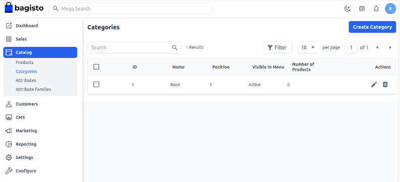
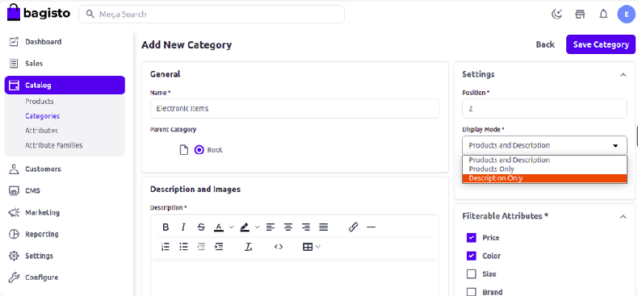
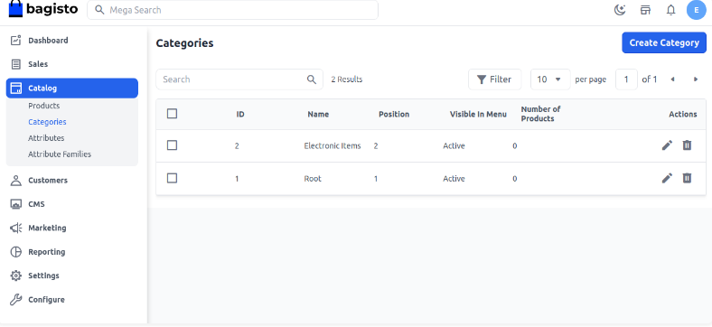
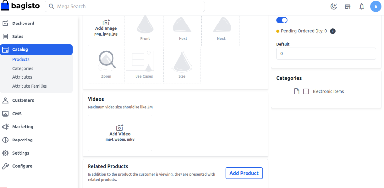
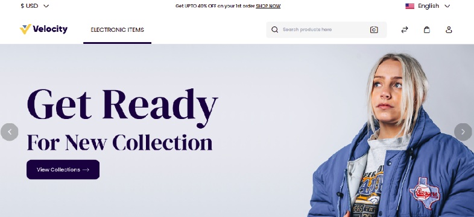

# كيفية إنشاء فئات في Bagisto 2.2.0

الفئة هي هيكل الكتالوج الخاص بك. من خلال إنشاء فئة، يمكن للعملاء العثور بسهولة على المنتج المحدد بين العديد من المنتجات في موقع التجارة الإلكترونية الخاص بك. تُستخدم الفئة لترتيب موقعك بشكل هرمي. هنا قمنا بإدراج خطوات إنشاء فئة جديدة وفئة رئيسية في Bagisto.

يأتي Bagisto مع فئة رئيسية افتراضية، وهي "Root"، ولكن يمكنك أيضًا إنشاء فئة رئيسية خاصة بك. الفئة الرئيسية غير مرئية في الواجهة الأمامية لأنها تعمل كحاوية تحتوي على الفئات التي ستظهر على الموقع.

### خطوات إنشاء فئة جديدة في Bagisto 2.2.0

1. انقر على **الكتالوج >> الفئات >> إنشاء فئة** كما هو موضح في الصورة أدناه.

   

2. أدخل القيم العامة مثل الاسم، والموقع، والوصف، وأضف الصور.

3. **وضع العرض** - وضع العرض يتعلق بالتفاصيل التي تظهر على صفحة الفئة. هناك ثلاثة خيارات:
   - المنتج والوصف
   - المنتج
   - الوصف

   - **المنتج والوصف:** عندما تضبط وضع العرض على "المنتج والوصف"، سيكون كل من المنتج والوصف عن الفئة مرئيين في الواجهة الأمامية كما هو موضح في الصورة أدناه.

   - **الوصف:** عندما تضبط وضع العرض على "الوصف"، سيكون الوصف فقط مرئيًا في الواجهة الأمامية.

   - **المنتج:** عندما تضبط وضع العرض على "المنتج"، سيكون المنتج مرئيًا في الواجهة الأمامية.

      

4. احفظ الفئة، وسيتم إنشاء فئة جديدة باسم "الأجهزة الإلكترونية" كما هو موضح في الصورة أدناه.

      

5. الآن تحقق من صفحة تحرير المنتج أثناء إنشاء منتج، وستتمكن من رؤية فئتنا الجديدة هناك.

      

### الفئة في الواجهة الأمامية

باتباع الخطوات أعلاه، يمكنك بسهولة إنشاء فئة جديدة.

