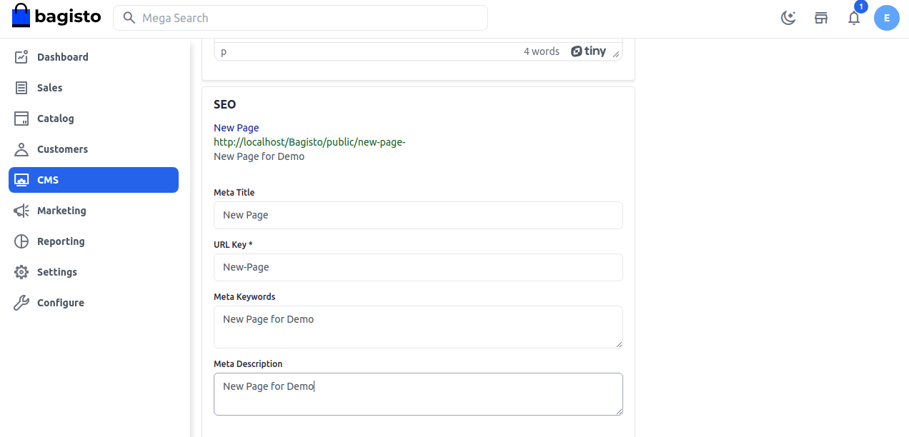

# صفحات CMS

بمساعدة نظام إدارة المحتوى (CMS)، يمكنك إنشاء صفحة جديدة وتحرير الصفحة لمتجر Bagisto الخاص بك. يعد نظام إدارة المحتوى مفيدًا أيضًا للعملاء أثناء شراء المنتج للتحقق من سياسة الاسترجاع والاسترداد والعديد من الأمور الأخرى.

### لإنشاء صفحة CMS من لوحة التحكم، اتبع الخطوات التالية:

**إضافة صفحة جديدة**

**الخطوة 1:** في الشريط الجانبي للإدارة، انقر على **CMS >> صفحة**. بشكل افتراضي، توجد صفحات CMS هنا، لإنشاء صفحة CMS جديدة انقر على زر **إنشاء صفحة** كما هو موضح أدناه.

  
**الخطوة 2:** أضف **عنوان** الصفحة واختر القنوات تحت القسم العام كما هو موضح في الصورة أدناه.

  
**الخطوة 3:** أضف **المحتوى** لصفحة CMS تحت **الوصف**.

  
**الخطوة 4:** أضف الحقول التالية تحت **تحسين محركات البحث (SEO)**

1. **وصف ميتا**  
   أدخل الوصف حتى تظهر **صفحة CMS** بسهولة في قوائم محركات البحث.

2. **عنوان ميتا**  
   قدم العنوان الرئيسي لصفحة **CMS** الذي ستعرف به صفحتك.

3. **كلمة مفتاحية ميتا**  
   يجب تقديم الكلمة المفتاحية للصفحة لتحسين ظهورها في محركات البحث لكلمات معينة.

4. **مفتاح URL**  
   مفتاح URL هو الجزء من عنوان URL الثابت الذي يصف الصفحة أو المنتج أو الفئة.

  
بهذا، تم إنشاء صفحة CMS جديدة بنجاح باسم **صفحة جديدة** كما هو موضح في الصورة أدناه.

  
بهذا يمكنك بسهولة إنشاء صفحات CMS في Bagisto.