# إعدادات او التكوين

بشكل عام، الإعدادات او التكوين هي ترتيب - أو عملية ترتيب - الأجزاء التي تشكل الكل.

كيف يتم ترتيب أجزاء شيء ما، أو مجموعة من الأشياء.

## الذكاء الاصطناعي السحري

لإضافة الذكاء الاصطناعي السحري، اذهب إلى لوحة الإدارة وانتقل إلى **تكوين >> عام >> الذكاء الاصطناعي السحري** كما هو موضح في الصورة أدناه.

 

1) إذا كنت ترغب في تفعيله لـ **توليد المحتوى**، يرجى تفعيله من هنا.

 

2) يرجى تفعيله لـ **توليد الصور** من هنا.

3) لـ **ترجمة المراجعات**، أضف النموذج وقم بتفعيله كما هو موضح في الصورة أدناه.

4) لـ **رسالة الخروج المخصصة**، قم بتفعيلها وأضف النموذج.

## وحدة الوزن

**1)** لإضافة وحدة الوزن، اذهب إلى لوحة الإدارة وانتقل إلى **تكوين >> عام**. ثم اختر **وحدة الوزن** من القائمة المنسدلة **رطل أو كيلوجرام** حسب احتياجك، وانقر على زر **حفظ التكوين** كما هو موضح في الصورة أدناه.

 

## الخيارات القابلة للتكوين.

تشير الإعدادات إلى الخيارات القابلة للتكوين التي تتحكم في كيفية تصرف نظام أو تطبيق أو جهاز، مخصصة وفقًا لتفضيلات ومتطلبات المستخدم.

**1)** الآن لإضافة وحدة الوزن، اذهب إلى لوحة الإدارة وانتقل إلى **تكوين >> محتوى**. ثم ستتمكن من رؤية الخيارات أدناه.

**خيارات المقارنة** - من خلال هذا، يمكنك بسهولة مقارنة منتجاتك.

**خيار قائمة الرغبات** - يساعد ذلك في إضافة وظيفة قائمة الرغبات.

**خيار البحث عن الصور** - يساعد هذا الخيار في البحث عن صورتك.

 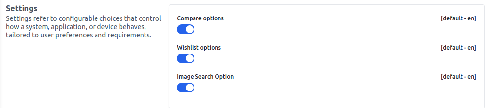

بعد النقر على زر **حفظ التكوين**.

## البرامج النصية المخصصة

البرامج النصية المخصصة هي قطع شخصية من الشيفرة البرمجية التي تم إنشاؤها لإضافة وظائف أو ميزات محددة إلى البرنامج، مما يعزز قدراته بشكل فريد.

هنا، في هذا القسم المحدد، يمكن لمشرف النظام كتابة الشيفرة. وفي النهاية، سيتم إضافة الشيفرة تلقائيًا إلى الملف الرئيسي.

**1)** الآن لإضافة **البرامج النصية المخصصة**، اذهب إلى لوحة الإدارة وانتقل إلى **تكوين >> محتوى**. ثم ستتمكن من رؤية الخيارات أدناه.

### CSS مخصص

لقد استخدمنا لون خلفية **أزرق فاتح** وحفظنا التكوينات.

 

الآن تغير لون خلفية المتجر كما هو موضح في الصورة أدناه.

 

### JS مخصص

يمكنك أيضًا تطبيق جافا سكريبت وفقًا لاحتياجاتك، وانقر على زر **حفظ التكوين**.

 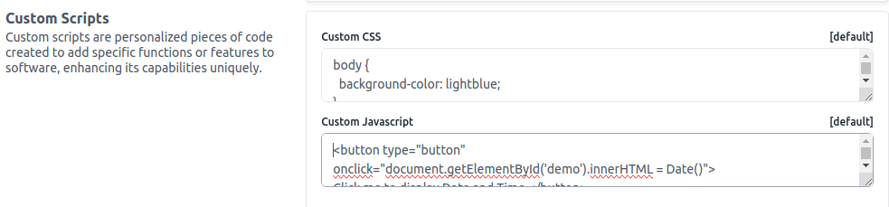

بعد النقر على زر **حفظ التكوين**.

## التصميم 

شعار الإدارة هو الصورة أو الرمز المميز الذي يمثل واجهة الإدارة لنظام أو موقع ويب، وغالبًا ما يكون قابلًا للتخصيص.

لإضافة **تصميمات** مثل **شعار الإدارة، والرمز المفضل**، اذهب إلى لوحة الإدارة وانقر على **تكوين >> التصميم** ويمكنك بسهولة تحديث صورة شعار جديدة ورمز مفضل من هنا. انقر على خيار **اختيار الملفات** لاختيار صورة ثم انقر على زر **حفظ التكوين**.

 

تم تحديث صور **شعار الإدارة** و**الرمز المفضل**.

 

## الطلبات المتأخرة

الطلب المتأخر هو طلب لسلعة أو خدمة لا يمكن تلبيته على الفور بسبب نقص في العرض المتاح. تعطي الطلبات المتأخرة نظرة على إدارة مخزون الشركة.

يمكن إدارة الطلب المتأخر بشكل جيد مع فترة انتظار قصيرة بشكل إيجابي، ولكن الطلب المتأخر الكبير مع فترات انتظار أطول قد يكون مشكلة.

يمكنك بسهولة إدارة **الطلبات المتأخرة** من خلال الذهاب إلى لوحة الإدارة والنقر على **تكوين >> المخزون**.

يوجد خيار **لتمكين أو تعطيل** الطلب المتأخر ثم انقر على **حفظ التكوين** كما هو موضح أدناه.

 

**ملاحظة:** إذا كان المنتج غير متوفر، يمكن للعميل أيضًا تقديم طلب بعد تمكين خيار الطلب المتأخر.

 

في الصورة أعلاه، هذه المنتجات **غير متوفرة** ولكن يمكنك لا تزال إضافة المنتج إلى السلة و**تقديم الطلب**.

 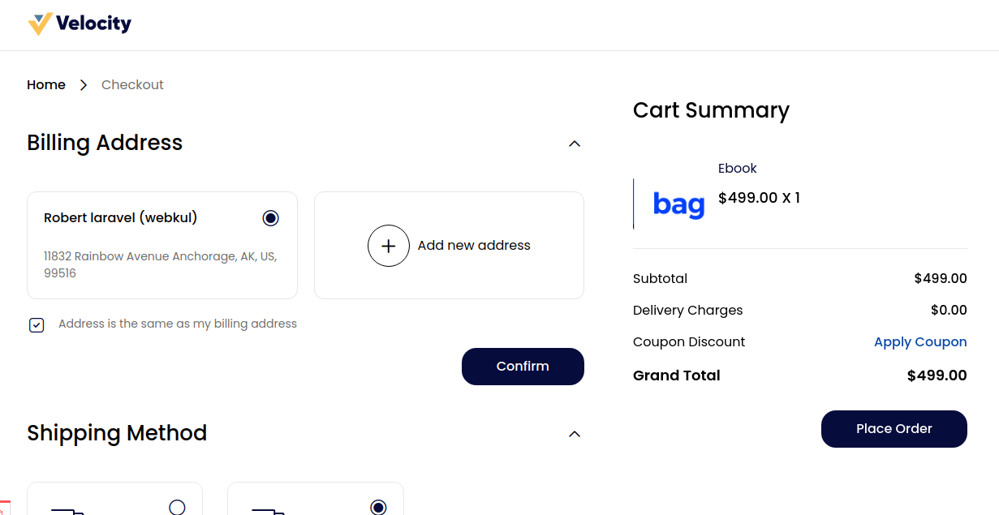

 
## الدفع كضيف

يسمح الدفع كضيف للعملاء بشراء المنتجات دون إنشاء حساب، مما يسهل عملية الشراء لراحة وسرعة أكبر في المعاملات.

لإدارة الدفع كضيف، اذهب إلى لوحة الإدارة وانقر على **تكوين >> المنتجات**. يمكنك رؤية خيار **تمكين أو تعطيل** الدفع كضيف ثم انقر على زر **حفظ التكوين**.

 

## صفحة عرض المنتج

تتضمن إعدادات صفحة عرض المنتج تعديل التخطيط والعناصر على صفحة عرض المنتج، مما يعزز تجربة المستخدم وعرض المعلومات.

لإضافة ذلك، اذهب إلى لوحة الإدارة وانقر على **تكوين >> المنتجات**.

 

بعد النقر على زر **حفظ التكوين**.

## صفحة عرض السلة

تتضمن إعدادات صفحة عرض السلة ترتيب العناصر والتفاصيل والخيارات على صفحة السلة، مما يحسن تفاعل المستخدم وتدفق الشراء.

لإضافة ذلك، اذهب إلى لوحة الإدارة وانقر على **تكوين >> المنتجات**.

 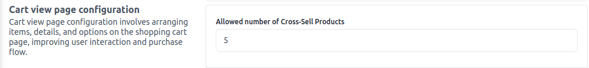

بعد النقر على زر **حفظ التكوين**.

## واجهة المتجر

واجهة المتجر هي الواجهة الموجهة للعميل في متجر عبر الإنترنت، تعرض المنتجات والفئات والتنقل لتجربة تسوق سلسة.

لإضافة ذلك، اذهب إلى لوحة الإدارة وانقر على **تكوين >> المنتجات >> واجهة المتجر**.

**1. وضع البحث:** اختر وضع البحث من **قائمة منسدلة أو Elasticsearch** حسب احتياجاتك.

**2. وضع القائمة الافتراضي:** يمكنك إدارة الشكل الذي ستظهر فيه منتجاتك على واجهة المتجر، اختر من القائمة المنسدلة **شبكة أو قائمة**.

**3. المنتجات في الصفحة:** يمكنك إدخال الكمية التي ستظهر من المنتجات في كل صفحة على واجهة المتجر.

**4. ترتيب حسب:** اختر خيار ترتيب من القائمة المنسدلة حسب احتياجاتك.

**5. منتجات الشراء الآن:** اختر من خيار **تمكين/تعطيل** حسب الحاجة. بعد تمكينه، ستظهر على صفحة تفاصيل المنتج كما هو موضح في الصورة أدناه.

 

 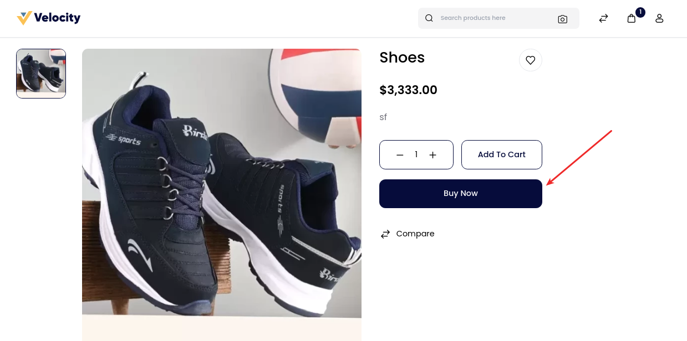

بعد النقر على زر **حفظ التكوين**.

## حجم الصورة

واجهة المتجر هي الواجهة الموجهة للعميل في متجر عبر الإنترنت، تعرض المنتجات والفئات والتنقل لتجربة تسوق سلسة.

لإضافة ذلك، اذهب إلى لوحة الإدارة وانقر على **تكوين >> المنتجات**.

### الصورة الصغيرة

اختر **الارتفاع والعرض** للصور الصغيرة.

### الصورة المتوسطة

اختر **الارتفاع والعرض** للصور المتوسطة.

### الصورة الكبيرة

اختر **الارتفاع والعرض** للصور الكبيرة.

 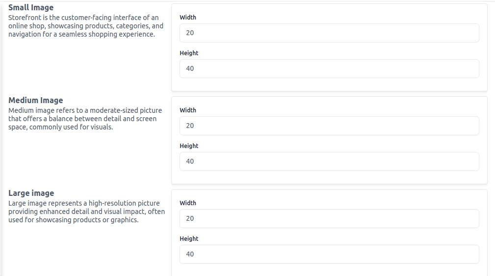

بعد النقر على زر **حفظ التكوين**.

## المراجعة

تقييم أو تقدير لشيء ما، غالبًا ما يتضمن آراء وتعليقات.

لإضافة ذلك، اذهب إلى لوحة الإدارة وانقر على **تكوين >> المنتجات >> المراجعة**.

 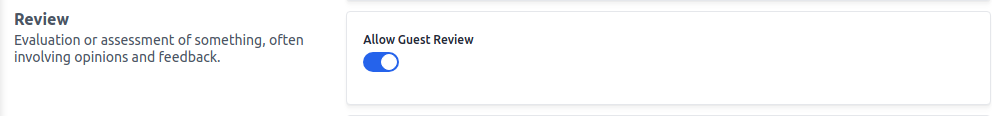

بعد النقر على زر **حفظ التكوين**.

## السمة

خاصية أو ميزة تحدد كائنًا ما، تؤثر على سلوكه أو مظهره أو وظيفته.

يمكنك بسهولة السماح بحجم تحميل **الصورة والملف** (بالكيلوبايت) من هنا.

لإضافة ذلك، اذهب إلى لوحة الإدارة وانقر على **تكوين >> المنتجات >> السمة**.

 

بعد النقر على زر **حفظ التكوين**.

## المشاركة الاجتماعية

مشاركة الأشياء من موقع ويب مع الأصدقاء على منصات التواصل الاجتماعي مثل فيسبوك، تويتر، أو إنستغرام.

لإضافة ذلك، اذهب إلى لوحة الإدارة وانقر على **تكوين >> المنتجات >> المشاركة الاجتماعية**.

 

بعد النقر على زر **حفظ التكوين**.

### الواجهة الأمامية:-

جميع الرموز التي قمت بتمكينها من لوحة الإدارة تظهر كما هو موضح في الصورة أدناه.

## مقتطفات غنية

المقتطفات الغنية (المعروفة أيضًا باسم "نتائج غنية") هي نتائج البحث العادية من جوجل مع بيانات إضافية معروضة. تُستخرج هذه البيانات الإضافية عادةً من البيانات المنظمة الموجودة في كود HTML للصفحة.

قم بتعيين إعدادات المنتجات والفئات. لإضافة ذلك، انقر على لوحة الإدارة على **تكوين >> مقتطفات غنية**.

### المنتجات

العناصر المتاحة للشراء أو الاستخدام، المعروضة من قبل عمل أو بائع. اختر خيار **تمكين/تعطيل** وانقر على زر **حفظ التكوين**.

 

### الفئات

تشير "الفئات" إلى مجموعات أو تصنيفات تساعد في تنظيم وتجميع المنتجات أو العناصر المماثلة لتسهيل التصفح والتنقل.

اختر خيار **تمكين/تعطيل** وانقر على زر **حفظ التكوين**.

 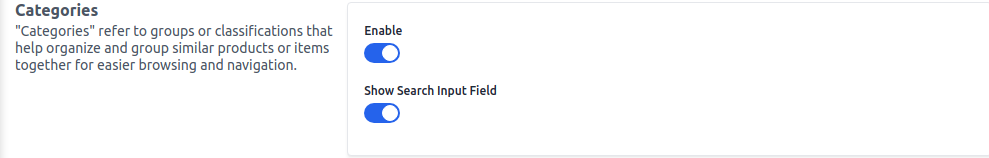

## العنوان

لإضافة عنوان في لوحة الإدارة، اذهب إلى **تكوين >> العنوان** وادارة **المتطلبات والمعلومات** ثم انقر على زر **حفظ التكوين**.

 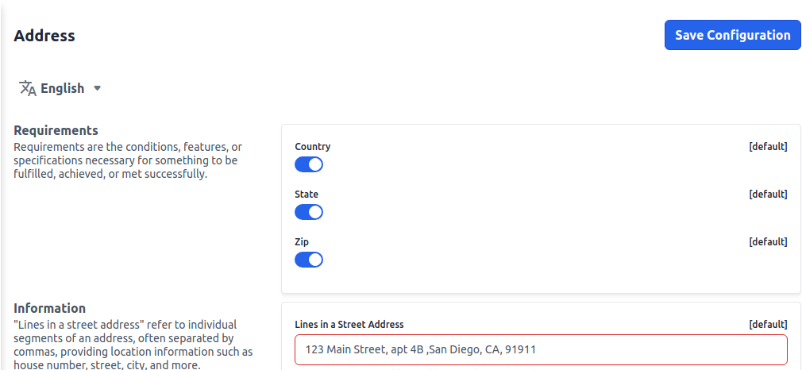

## كابتشا

"خريطة الموقع: خريطة تخطيط الموقع لمحركات البحث. المفتاح السري: رمز أمان لتشفير البيانات، المصادقة، أو حماية الوصول لواجهة برمجة التطبيقات."

في لوحة الإدارة، اذهب إلى **تكوين >> كابتشا** وأضف **مفتاح الموقع والمفتاح السري** وقم بتمكين/تعطيل **الحالة** حسب متطلباتك.

 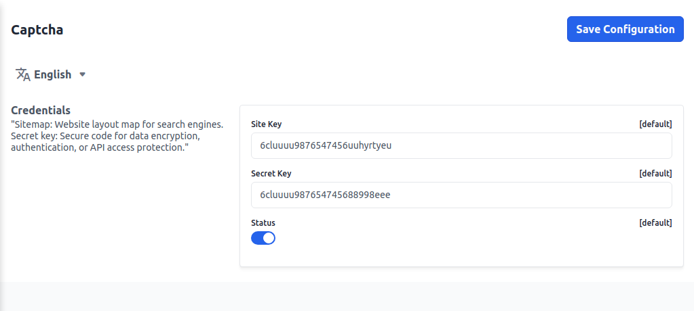

بعد النقر على زر **حفظ التكوين**.

## الإعدادات

قم بتعيين اشتراكات النشرة الإخبارية، التحقق من البريد الإلكتروني، وتسجيل الدخول عبر وسائل التواصل الاجتماعي.
لإضافة ذلك، اذهب إلى لوحة الإدارة وانقر على **تكوين >> الإعدادات**.

### اشتراك النشرة الإخبارية

"معلومات النشرة الإخبارية" تحتوي على تحديثات، عروض، أو محتوى يتم مشاركته بانتظام عبر البريد الإلكتروني للمشتركين، مما يبقيهم على اطلاع ومشتركين.

### التحقق من البريد الإلكتروني

"التحقق من البريد الإلكتروني" يؤكد صحة عنوان البريد الإلكتروني، غالبًا عن طريق إرسال رابط تأكيد، مما يعزز أمان الحساب وموثوقية التواصل.

### تسجيل الدخول عبر وسائل التواصل الاجتماعي

"تسجيل الدخول عبر وسائل التواصل الاجتماعي" يمكّن المستخدمين من الوصول إلى المواقع باستخدام حساباتهم على وسائل التواصل الاجتماعي، مما يسهل عمليات التسجيل وتسجيل الدخول للراحة.

بعد النقر على زر **حفظ التكوين**.

 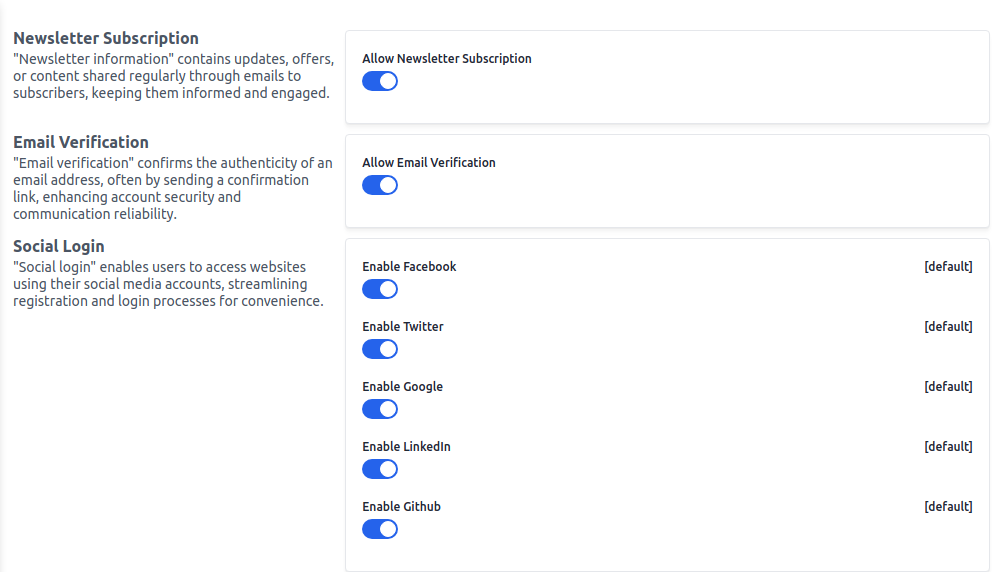

## إعدادات البريد الإلكتروني

قم بتعيين اسم مرسل البريد، عنوان بريد المتجر، اسم المدير، وعنوان بريد المدير.

لإضافة ذلك، اذهب إلى لوحة الإدارة وانقر على **تكوين >> إعدادات البريد الإلكتروني**.

 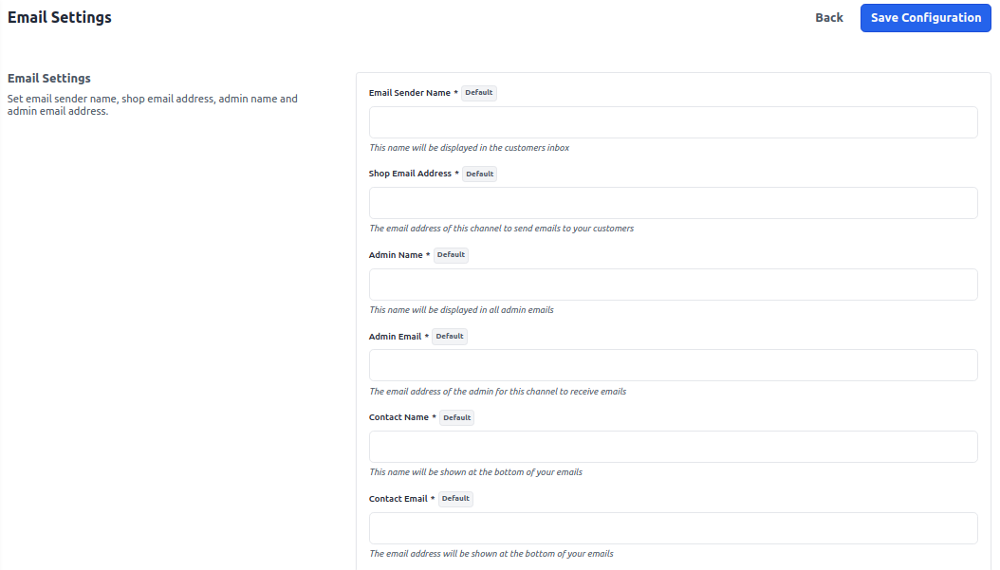

بعد النقر على زر **حفظ التكوين**.

## الضرائب

**أ) فئات الضرائب -** فئات الضرائب هي تصنيفات لأنواع مختلفة من الضرائب، مثل ضريبة المبيعات، ضريبة القيمة المضافة، أو ضريبة الاستهلاك، تُستخدم لتصنيف وتطبيق معدلات الضرائب على المنتجات أو الخدمات.

**ب) إعدادات الحساب -** تفاصيل حول تكلفة السلع أو الخدمات، بما في ذلك السعر الأساسي، الخصومات، الضرائب، ومعلومات الرسوم الإضافية.

**ج) حساب وجهة الافتراضية -** تحديد تلقائي لوجهة قياسية أو أولية بناءً على عوامل أو إعدادات محددة مسبقًا.

**د) إعدادات عرض سلة التسوق -** تعيين عرض الضرائب في سلة التسوق من خلال عرض الأسعار، عرض المجموع الفرعي، وعرض مبلغ الشحن.

 

## الدفع

إعدادات الدفع المدرجة أدناه.

### سلة التسوق

قم بتمكين الدفع للزوار، صفحة السلة، المنتجات المتقاطعة، وتقدير الشحن لتعزيز راحة المستخدم وتسهيل عملية التسوق لزيادة المبيعات.

 

### سلة التسوق الخاصة بي

قم بتمكين إعدادات "سلة التسوق الخاصة بي" لعرض ملخص كميات العناصر وإظهار العدد الإجمالي للعناصر في السلة لتسهيل التتبع.

  

### سلة التسوق الصغيرة

قم بتمكين إعدادات سلة التسوق الصغيرة لعرض السلة الصغيرة وإظهار معلومات عرض السلة الصغيرة للوصول السريع إلى تفاصيل السلة والعروض.

## الإشعارات

"الإشعار" هو رسالة أو تنبيه تُعلم المستخدمين بالأحداث، التحديثات، أو الإجراءات، مما يعزز تفاعل المستخدم ووعيه.

لإضافة ذلك، اذهب إلى لوحة الإدارة وانقر على **تكوين >> الإشعارات**.

 

بعد النقر على زر **حفظ التكوين**.

## الشحن

يشير أصل الشحن إلى الموقع الذي تنشأ منه السلع أو المنتجات قبل نقلها إلى وجهتها.

لإضافة ذلك، اذهب إلى لوحة الإدارة وانقر على **تكوين >> الشحن**.

 

## طرق الشحن

لتسليم المنتجات، هناك نوعان من طرق الشحن.

لإضافة ذلك، اذهب إلى لوحة الإدارة وانقر على **تكوين >> طرق الشحن**.

**1) الشحن المجاني** "الشحن المجاني" هو طريقة شحن يتم فيها التنازل عن تكلفة الشحن، ويغطي البائع نفقات الشحن لتسليم السلع للمشتري.

**2) الشحن بسعر ثابت** الشحن بسعر ثابت هو طريقة شحن يتم فيها فرض رسوم ثابتة للشحن، بغض النظر عن الوزن أو الحجم أو المسافة الخاصة بالشحنة. هذا يُبسط تكاليف الشحن ويمكن أن يكون مفيدًا لكل من المشترين والبائعين.

 

بعد النقر على زر **حفظ التكوين**.

## طرق الدفع

تشير طريقة الدفع إلى الخيارات المختلفة المتاحة للعملاء لإجراء المدفوعات عند شراء منتج أو خدمة. سواء في متجر فعلي أو عبر الإنترنت، تغطي طرق الدفع مجموعة من الخيارات. تشمل طرق الدفع المقبولة عادةً النقد، بطاقات الائتمان، بطاقات الخصم، بطاقات الهدايا، والمدفوعات المحمولة.

لإضافة ذلك، اذهب إلى لوحة الإدارة وانقر على **تكوين >> طريقة الدفع**.

### باي بال

زر باي بال الذكي: يبسط المدفوعات عبر الإنترنت مع أزرار قابلة للتخصيص لمعاملات آمنة ومتعددة الطرق على المواقع والتطبيقات.

 

### الدفع عند الاستلام

طريقة الدفع حيث يدفع العملاء نقدًا عند استلام السلع أو الخدمات عند باب منزلهم.

 

### تحويل الأموال

تحويل الأموال من شخص أو حساب إلى آخر، غالبًا إلكترونيًا، لأغراض متنوعة مثل المعاملات أو التحويلات.

 

### باي بال ستاندرد

باي بال ستاندرد هو خيار دفع أساسي من باي بال للأعمال التجارية عبر الإنترنت، يمكّن العملاء من الدفع باستخدام حسابات باي بال أو بطاقات الائتمان/الخصم الخاصة بهم.

 

بعد النقر على زر **حفظ التكوين**.

## إعدادات الطلب

لإضافة ذلك، اذهب إلى لوحة الإدارة وانقر على **تكوين >> إعدادات الطلب**.

**إعدادات رقم الطلب:-** معرف فريد مُعين لطلب عميل محدد، يساعد في التتبع، التواصل، والمرجعية طوال عملية الشراء.

**إعدادات الحد الأدنى للطلب:-** معايير مُعدة تحدد أقل كمية أو قيمة مطلوبة لمعالجة الطلب أو التأهل للحصول على فوائد.

في قسم الطلب، تمت إضافة إعداد تكوين جديد ليشمل الطلب مبلغ الخصم، يشمل الضريبة على المبلغ، والوصف في صفحة السلة.

 

**السماح بإعادة الطلب:-** تمكين أو تعطيل ميزة إعادة الطلب لمستخدمي الإدارة.

 
بعد النقر على زر **حفظ التكوين**.
## إعدادات الفاتورة

لإضافة ذلك، اذهب إلى لوحة الإدارة وانقر على **تكوين >> إعدادات الفاتورة**.

**1. إعدادات رقم الفاتورة** تكوين القواعد أو المعايير لإنشاء وتعيين أرقام تعريف فريدة للفواتير لأغراض تنظيمية وتتبع.

 

**2. شروط الدفع** الشروط المتفق عليها التي تحدد متى وكيف يجب على المشتري دفع ثمن السلع أو الخدمات للبائع.

 

**3. تصميم فاتورة** التخطيط المرئي وتنسيق فاتورة، بما في ذلك علامة الشركة، تفصيل العناصر، الأسعار، وتفاصيل الدفع للعرض الاحترافي.

 

**4. تذكيرات الفاتورة** إشعارات أو اتصالات تلقائية تُرسل للعملاء لتذكيرهم بالمدفوعات القادمة أو المتأخرة للفواتير.

 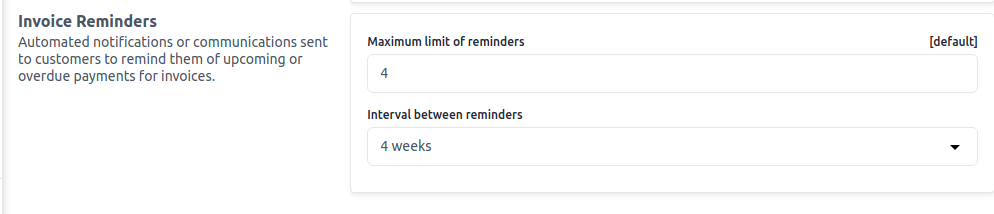

بعد النقر على زر **حفظ التكوين**.

## التسعير

تفاصيل حول تكلفة السلع أو الخدمات، بما في ذلك السعر الأساسي، الخصومات، الضرائب، ومعلومات الرسوم الإضافية.

لإضافة ذلك، اذهب إلى لوحة الإدارة وانقر على **تكوين >> التسعير**.

 

بعد النقر على زر **حفظ التكوين**.