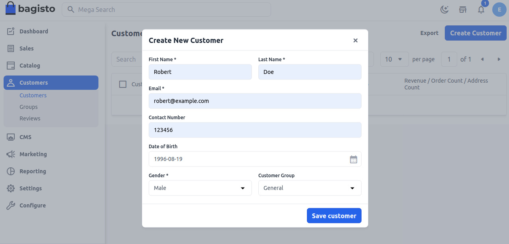

# إنشاء عميل

يمكن للزوار في موقعك فتح حساب لإدارة مشترياتهم وأنشطتهم. عادةً ما يقوم العملاء بإنشاء حساباتهم بأنفسهم في المتجر. ومع ذلك، يمكنك أيضًا إنشاء حسابات عملاء مباشرة من الإدارة، وهو مفيد لمساعدة العملاء عبر الهاتف.

### لإنشاء عميل من لوحة الإدارة، اتبع الخطوات أدناه:

**الخطوة 1**: تسجيل الدخول إلى لوحة إدارة Bagisto وانتقل إلى **العملاء** >> **العملاء** ثم انقر على زر **إنشاء عميل**.

 

**الخطوة 2**: بعد ذلك، ستظهر لك نموذج لإنشاء عميل، قم بملء الحقول الضرورية لإنشاء عميل كما هو موضح في الصورة أدناه.

 

**الخطوة 3**: الآن ستتمكن من رؤية أن العميل الجديد تم تسجيله بنجاح.

 

لذا من خلال الخطوات أعلاه، يمكنك بسهولة إنشاء عميل من لوحة الإدارة في Bagisto.