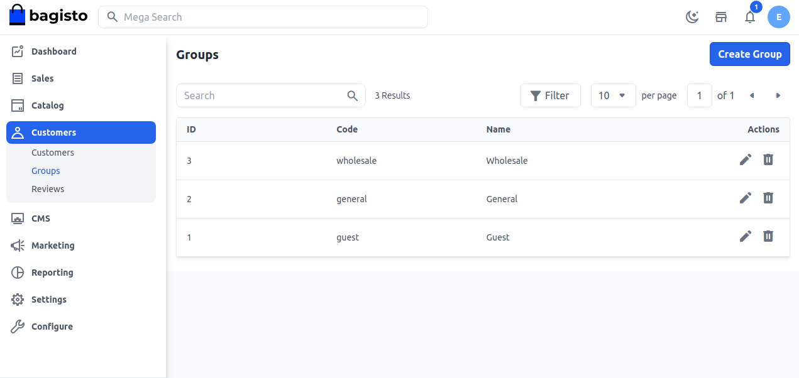
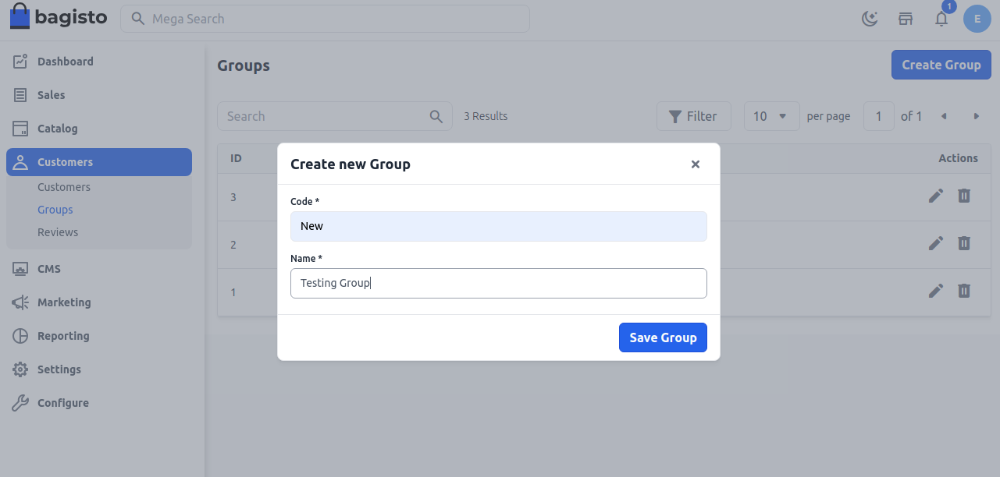
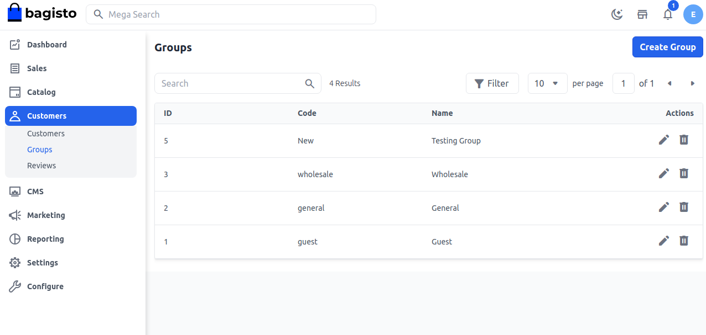
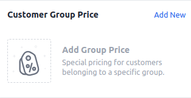
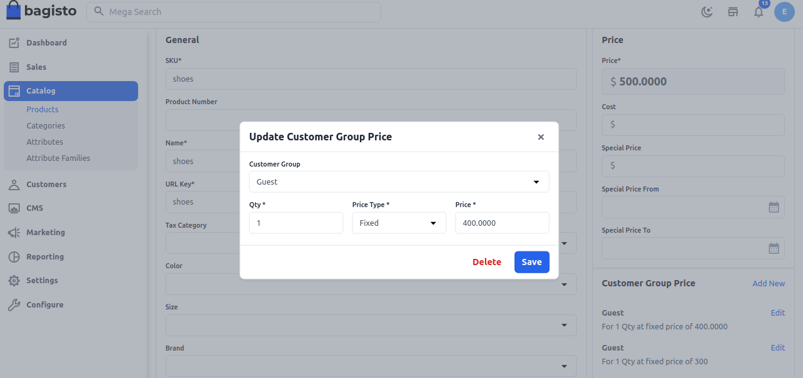
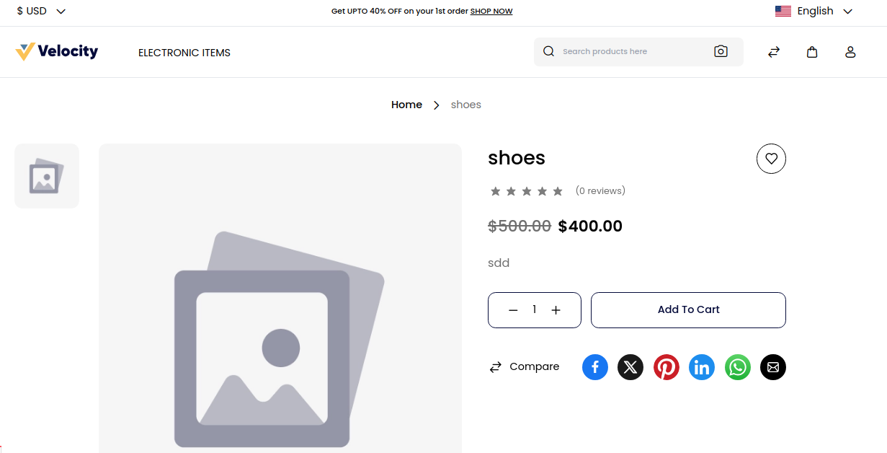

# مجموعات العملاء

تسمح لك مجموعات العملاء بتنظيم عملائك، ومنحهم خصومات، وتقييد الوصول إلى منتجات أو فئات محددة. مع مجموعات العملاء، يمكنك: إعداد مجموعة ولاء — منح الوصول إلى منتجات أو فئات معينة بأسعار مخفضة لعملاء محددين.

تحدد مجموعات العملاء الخصومات المتاحة وفئة الضرائب المرتبطة بالمجموعة. المجموعات الافتراضية للعملاء هي عامة، ضيف، وجملة.

### مجموعة الجملة

عادةً ما يكون لدى عملاء الجملة وصول إلى منتجات أو حزم من المنتجات غير المتاحة للعملاء التجزئة، وغالبًا ما يحصلون على خصم على المنتجات التي يشترونها. يمكن إعداد كلا الأمرين باستخدام ميزة مجموعات العملاء.

لتقييد منتجات الجملة عن عملاء التجزئة، ستحتاج أولاً إلى إنشاء فئة مخصصة لتلك المنتجات. ثم، ستحتاج إلى تقسيم عملائك، بحيث يتمكن عملاء الجملة فقط من مشاهدة تلك المنتجات.

### مجموعة الضيف

مجموعة الضيف هي الوحيدة التي يمكن أن تنطبق على الضيوف ولا يمكن تعديلها أو حذفها. وتعتبر المجموعة غير المسجلة أيضًا جزءًا من مجموعة الضيف.

### المجموعة العامة

تشير مجموعة العملاء العامة إلى العملاء الذين لا يُعرفون كعملاء محترفين ولا يرغبون في طلب المنتجات بكميات كبيرة.

### لإنشاء مجموعة عملاء جديدة في Bagisto، اتبع الخطوات أدناه:

**الخطوة 1**: تسجيل الدخول إلى لوحة إدارة Bagisto وانتقل إلى **العملاء** >> **المجموعات**. بشكل افتراضي، هناك ثلاث مجموعات عملاء، لإنشاء مجموعة جديدة انقر على زر **إنشاء مجموعة** كما هو موضح أدناه.

 

**الخطوة 2**: بعد ذلك، ستظهر لك نموذج لإنشاء مجموعة جديدة، قم بملء **الكود** و**الاسم** للمجموعة ثم انقر على زر **حفظ المجموعة** كما هو موضح في الصورة أدناه.

 

**الخطوة 3**: الآن ستتمكن من رؤية أن مجموعة العملاء الجديدة تم تسجيلها بنجاح.

 

لذا من خلال الخطوات أعلاه، يمكنك بسهولة إنشاء مجموعة عملاء جديدة من لوحة الإدارة في Bagisto.

### لإنشاء سعر لمجموعة العملاء

**الخطوة 1**: أولاً، قم بإنشاء مجموعة العملاء وتعيين المجموعة للعميل أو بشكل افتراضي هناك مجموعة مثل "عامة"، "جملة"، أو "ضيف".

**الخطوة 2**: تسجيل الدخول إلى لوحة إدارة Bagisto وانتقل إلى **الكتالوج** >> **المنتجات**. أنشئ منتجًا جديدًا وانتقل إلى صفحة تعديل المنتج وستتمكن من رؤية قسم **سعر مجموعة العملاء** كما هو موضح في الصورة أدناه.

 

**الخطوة 3**: الآن انقر على **إضافة جديدة** وأضف الحقول أدناه.

**أ) السعر المخفض:** في السعر المخفض، سنحتاج إلى تحديد نسبة مئوية سيتم خصمها من سعر المنتج بعد العرض.

**ب) السعر الثابت:** في هذا، سنحتاج إلى تحديد سعر ثابت على المنتج بعد العرض.

**ج) الكمية:** في هذا، سنحتاج إلى تحديد الحد الأدنى من الكمية المطلوبة من المنتج للشراء للاستفادة من العرض.

**د) مجموعة العملاء:** في هذا، يمكننا إنشاء مجموعة يمكن تعيينها للعميل مثل مجموعة العضوية المميزة، مجموعة الضيف، مجموعة الجملة، المجموعة العامة.

**(ملاحظة - يمكننا إنشاء مجموعة وفقًا لمتطلباتنا.)**

**السعر الثابت**
هنا قمت بتحديد السعر الثابت للمنتج في مجموعة عملاء الضيف مع حد أدنى للكمية هو 1. يعني إذا اشتريت قطعة واحدة من هذا المنتج التي تكلف 500$. ولكن إذا كنت مستخدم ضيف، فسوف يكون سعر المنتج بالنسبة لك $400.

لذا الآن انقر على زر **حفظ** كما هو موضح أدناه.

  

الآن احفظ المنتج، وسترى أن السعر قد تغير وفقًا للمجموعة.

كما قمت بتحديد السعر لمجموعة الضيف، وهنا يظهر السعر وفقًا لمجموعة الضيف كما هو موضح أدناه.

  