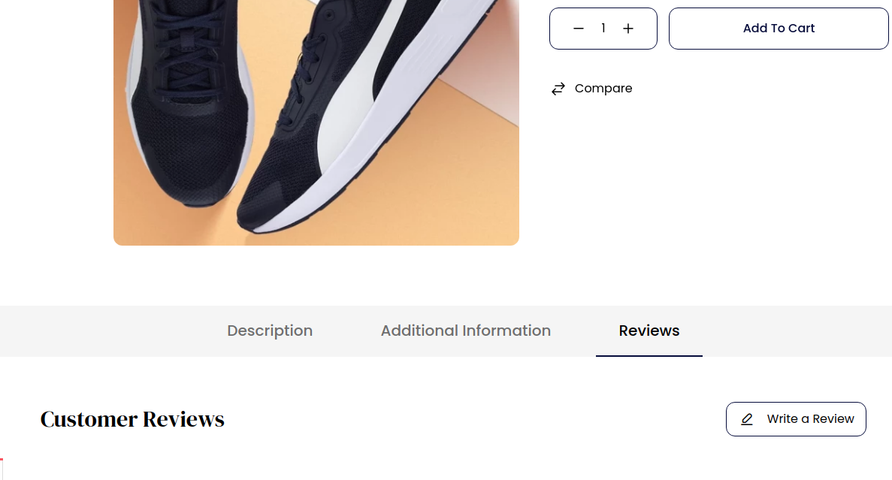
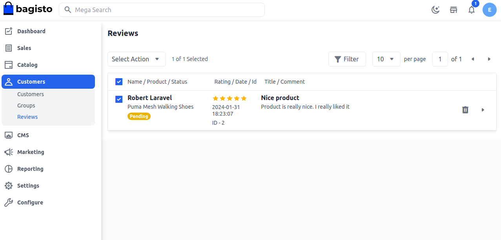

# تقييمات العملاء

تعتبر تقييمات العملاء جانبًا مهمًا من الأعمال التجارية الإلكترونية. وكمالك عمل تجاري إلكتروني، يجب أن تكون جزءًا أساسيًا من استراتيجية التسويق عبر الإنترنت الخاصة بك. تخلق التقييمات مصداقية لمنتجاتك، وزيادة المصداقية تعني زيادة المبيعات.

تساعد تقييمات العملاء الآخرين في اختيار المنتج. تقييم العميل هو تقييم منتج أو خدمة قام بشرائها واستخدامها أو لديه تجربة معها. تعتبر تقييمات العملاء نوعًا من التغذية الراجعة من العملاء حول التجارة الإلكترونية ومواقع التسوق عبر الإنترنت.

### لإضافة تقييمات في Bagisto، اتبع الخطوات أدناه:

**الخطوة 1**: بعد تسجيل الدخول كعميل، انتقل إلى صفحة تفاصيل المنتج في الواجهة الأمامية للموقع وستتمكن من رؤية قسم **التقييم** كما هو موضح في الصورة أدناه.

 

**الخطوة 2**: بعد ذلك، انقر على زر **كتابة تقييم** واملأ **تقييم النجوم**، أضف **العنوان** واترك التعليق مع مرفق، ثم انقر على **إرسال التقييم** كما هو موضح في الصورة أدناه.

 

**الخطوة 3**: الآن بعد إضافة التقييم، افتح **لوحة الإدارة** في Bagisto وافتح **العملاء** >> **التقييمات** وستظهر التقييمات التي قدمها العملاء كما هو موضح في الصورة أدناه.

  

**الخطوة 4**: بعد ذلك، يمكنك أيضًا تغيير **حالة** التقييم من **معلق** إلى **موافق** و**غير موافق**، ثم انقر على زر **حفظ** كما هو موضح أدناه.

**الخطوة 5**: سيتم توجيهك إلى شبكة التقييمات وستتمكن من رؤية أن سجلًا جديدًا قد تم تسجيله بنجاح.

لذا من خلال هذا، يمكنك بسهولة إضافة **تقييمات** في Bagisto.