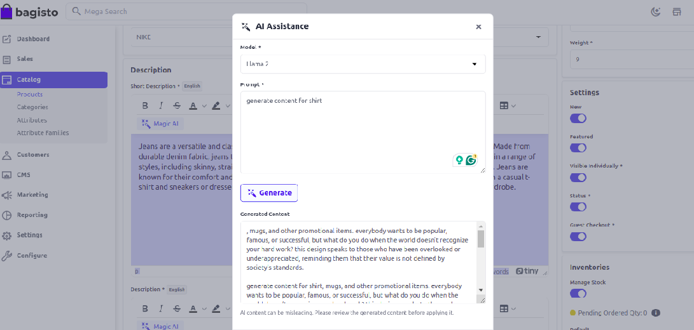
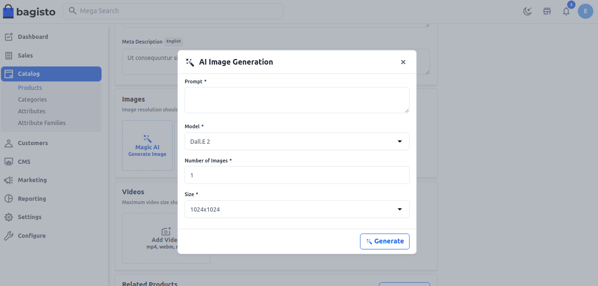
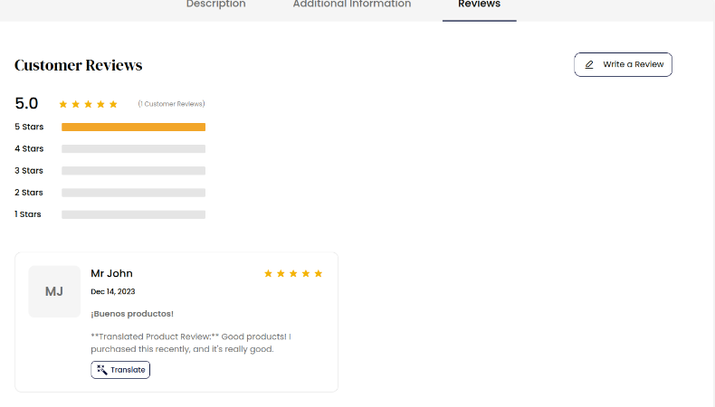
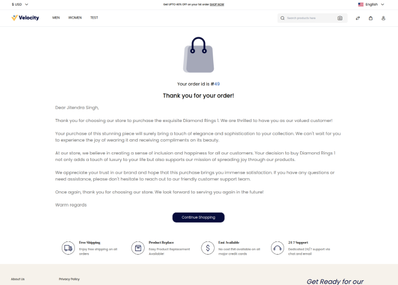

# الذكاء الاصطناعي السحري

الذكاء الاصطناعي السحري هو الأداة المثالية للمحترفين في مجالات متنوعة الذين يتطلعون إلى تعزيز كفاءتهم. بعض حالات الاستخدام تشمل: تسريع مهام إدخال البيانات لفرق المبيعات ودعم العملاء.

يمتلك Bagisto 2.2.0 تكاملًا مع الذكاء الاصطناعي السحري، مستخدمًا الذكاء الاصطناعي لتبسيط إدارة التجارة الإلكترونية.

يمكنك إدارة إعدادات الذكاء الاصطناعي السحري من [هنا](../configure/configurations.html#magic-ai)

## إنشاء المحتوى

مع الذكاء الاصطناعي السحري، يمكن لمالكي المتاجر بسهولة إنشاء محتوى جذاب لـ **المنتجات، الفئات، ونظام إدارة المحتوى (CMS)**.

### في Bagisto 2.2.0، يوفر دعمًا أصليًا لمجموعة متنوعة من نماذج اللغة الكبيرة.

**أ) للمحتوى** – OpenAI gpt-3.5-turbo، Llama 2، Mistral، Dolphin Phi، Phi-2، Starling، Llama 2 Uncensored، Llama 2 13B، Llama 2 70B، Orca Mini، Vicuna، LLaVA.

ودع وداعًا لإنشاء المحتوى اليدوي المرهق حيث يقوم الذكاء الاصطناعي السحري بإنشاء أوصاف مثيرة وفريدة، مما يوفر لك الوقت والجهد الثمينين.

## إنشاء الصور

عزز الجاذبية البصرية لمتجرك مع قدرات إنشاء الصور من الذكاء الاصطناعي السحري.

**ب) للصور** – Dall.E 2، Dall.E 3

يمكن للمسؤولين الآن إنشاء صور رائعة للمنتجات، مما يضمن تقديمًا بصريًا جذابًا ومتسقًا عبر كامل كتالوج المنتجات.

 

## ترجمة المراجعات

في Bagisto 2.2.0، نحن ندرك أهمية تلبية احتياجات جمهور عالمي.

تتضمن النسخة الجديدة ميزة ترجمة المراجعات، مما يسمح لمالكي المتاجر وعملائهم بترجمة المراجعات إلى عدة لغات تلقائيًا.

 

اجسر الفجوات اللغوية وتواصل مع قاعدة عملاء متنوعة بسهولة.

## رسائل الدفع الشخصية

أنشئ تجربة تسوق أكثر تخصيصًا وجاذبية مع رسائل الدفع الشخصية في Bagisto 2.2.0.

 
