# الاتصالات

الاتصال المستمر مع العميل، خاصة بعد أن قام بعملية شراء، حول حالة طلبه، وحالة التوصيل، وضمان المنتج، وكيفية استخدام مقاطع الفيديو التوضيحية، والعروض والخصومات الجارية أو القادمة، ومشاركة عروض المنتجات المتقاطعة المخصصة، أثبتت أنها استراتيجية جيدة.

## قوالب البريد الإلكتروني
كما نعلم جميعًا، يرغب الجميع في بعض التخصيص وفقًا لذوقهم الخاص، لذا فإن معرفة كيفية تغيير قالب البريد الإلكتروني مفيد أيضًا لبعض المستخدمين.

### الخطوة 1:

**إضافة قالب بريد إلكتروني جديد**

في لوحة الإدارة، انتقل إلى **التسويق >> الاتصالات >> قوالب البريد الإلكتروني** وانقر على **إنشاء قالب** كما هو موضح في الصورة أدناه.

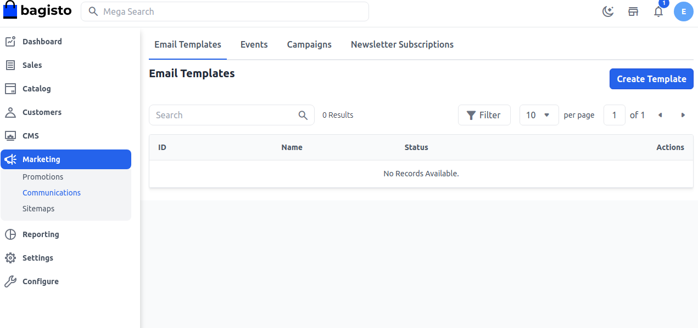

### الخطوة 2:

أضف **الاسم** و**الحالة** كفعلية، غير فعالة، أو مسودة لقالب البريد الإلكتروني كما هو موضح في الصورة أدناه.

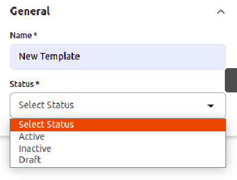

### الخطوة 3:

أضف المحتوى ببساطة عن طريق النسخ واللصق، يمكنك أيضًا تطبيق رابط بعد النقر بزر الفأرة الأيمن على المحتوى وإضافة **رابط URL، النص للعرض، العنوان، فتح الرابط في** كما هو موضح في الصورة أدناه.

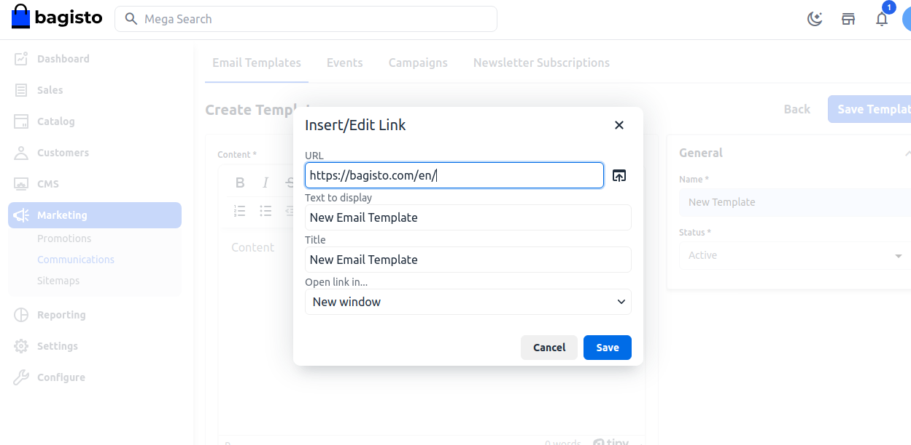

الآن ستتمكن من رؤية **قالب البريد الإلكتروني** الجديد كما هو موضح أدناه.

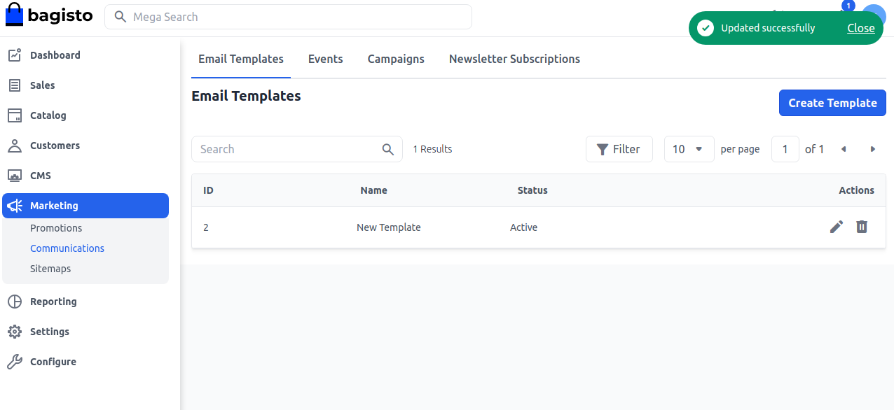

بهذا، يمكنك بسهولة إنشاء **قالب بريد إلكتروني** واستخدامه في الرسائل في Bagisto.

## الأحداث

معامل الحدث هو قطعة إضافية من البيانات حول تفاعل المستخدم على موقع الويب و/أو التطبيق، مما يوفر سياقًا وتفاصيل قيمة حول التفاعل. على سبيل المثال: أعياد الميلاد، الذكريات، حفلات استقبال المواليد، إلخ.

### الخطوة 1:
**إضافة حدث**

في لوحة الإدارة، انتقل إلى **التسويق >> الاتصالات >> الأحداث** وانقر على **إنشاء حدث** كما هو موضح في الصورة أدناه.

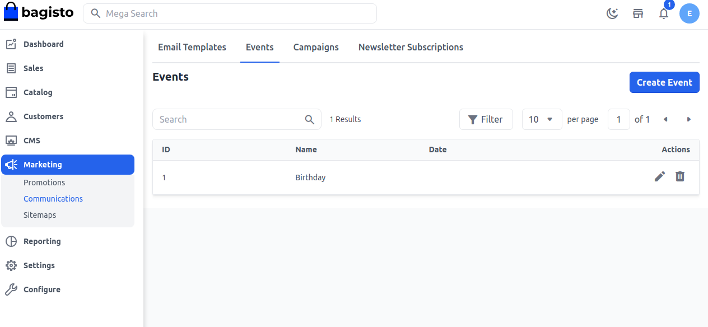

### الخطوة 2:

الآن أضف **اسم الحدث، الوصف، التاريخ** كما هو موضح في الصورة أدناه.

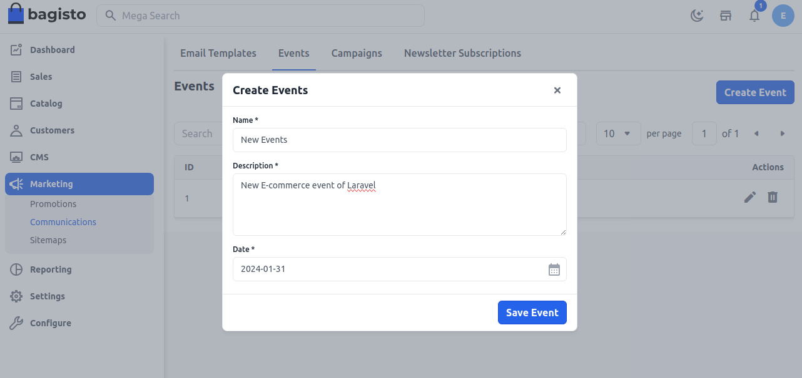

### الخطوة 3:

الآن ستتمكن من رؤية **الحدث** الجديد كما هو موضح أدناه.

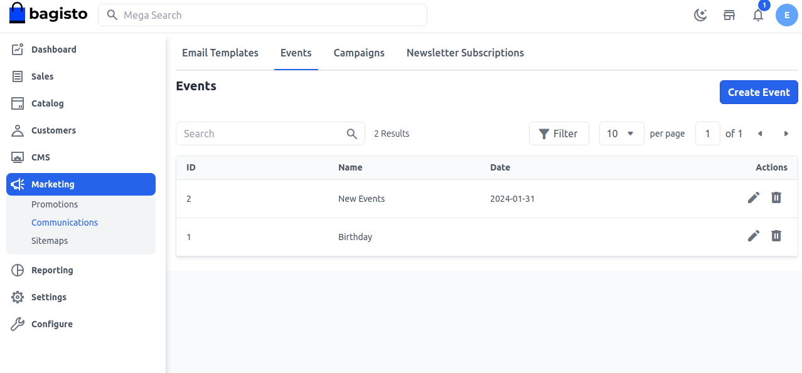

بهذا، يمكنك بسهولة إنشاء **أحداث** في Bagisto.

## الحملات

تهدف حملات تسويق التجارة الإلكترونية إلى جذب الزوار وزيادة المبيعات. يمكن أن تساعدك على الوصول إلى العديد من العملاء المحتملين، والحفاظ على تفاعل العملاء الحاليين، وبناء ولاء العلامة التجارية.

**إضافة الحملات**

في لوحة الإدارة، انتقل إلى **التسويق >> الاتصالات >> الحملات** وانقر على **إنشاء حملة** كما هو موضح في الصورة أدناه.

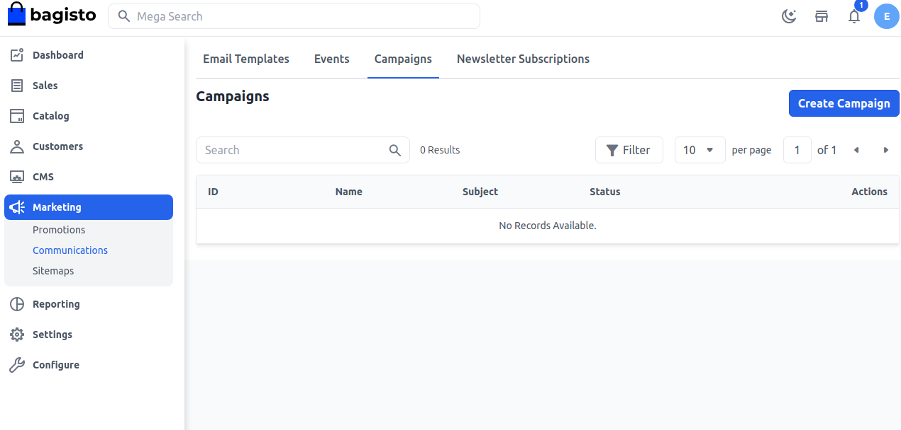

### املأ الحقول اللازمة.

**1. الاسم** أضف اسم الحملة.

**2. الموضوع** أضف الموضوع وفقًا لمتطلباتك.

**3. الأحداث** اختر الحدث الذي تريد تطبيق الحملة عليه، يمكنك أيضًا إضافة أحداثك إلى هذا.

**4. قالب البريد الإلكتروني** اختر قالب البريد الإلكتروني الذي تريد تطبيقه لإرسال الرسائل للحملة.

**5. القناة** اختر القناة.

**6. مجموعة العملاء** اختر مجموعة العملاء التي تريد تطبيق الحملة عليها.

**7. الحالة** اختر الحالة نعم/لا.

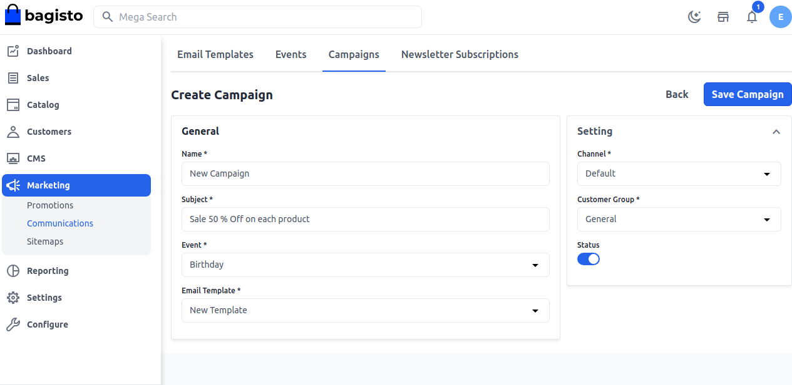

### الخطوة 4:

الآن ستتمكن من رؤية **الحملة** الجديدة كما هو موضح أدناه.

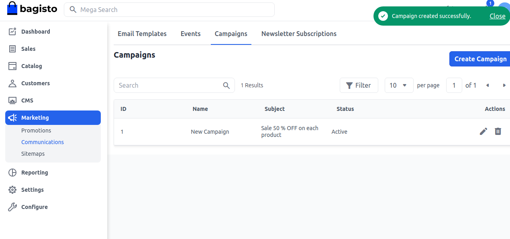

بهذا، يمكنك بسهولة إنشاء **حملات** في Bagisto.

## اشتراكات النشرة الإخبارية

تعد اشتراكات النشرة الإخبارية في Bagisto فرصة لمالكي المتاجر للسماح لعملائهم باستقبال نشرة إخبارية مثيرة من موقع Bagisto الخاص بك.

يعد التسويق عبر البريد الإلكتروني أحد أقوى الأدوات لموقعك.

تتيح لك هذه الميزة التواصل مع عملائك بشكل جماعي حول العروض القادمة لمتاجرك مثل مبيعات الجمعة السوداء، ومبيعات عيد الميلاد، وعروض رأس السنة الجديدة.

### إعدادات الإدارة

**الخطوة 1)** أولاً، يمكن للمسؤول الانتقال إلى **الإعدادات >> العملاء >> الإعدادات**

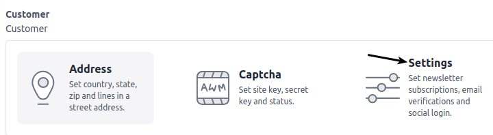

**الخطوة 2)** الآن قم بتمكين **اشتراك النشرة الإخبارية** وانقر على زر **حفظ الإعدادات** كما هو موضح في الصورة أدناه.

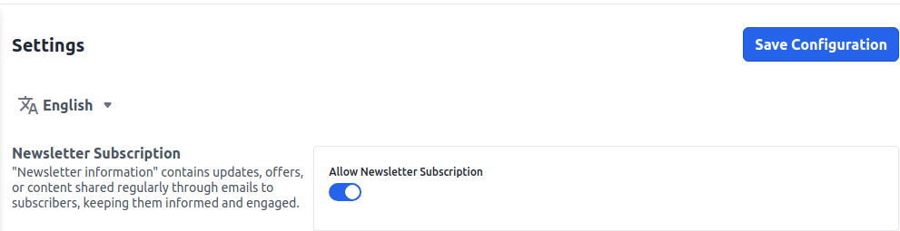

### اشتراكات النشرة الإخبارية

هنا يمكن للمسؤول رؤية جميع عملائهم الذين اشتركوا في النشرة الإخبارية.

أيضًا، يمكن للمسؤول الانتقال إلى **التسويق >> الاتصالات >> اشتراكات النشرة الإخبارية** كما هو موضح في الصورة أدناه.

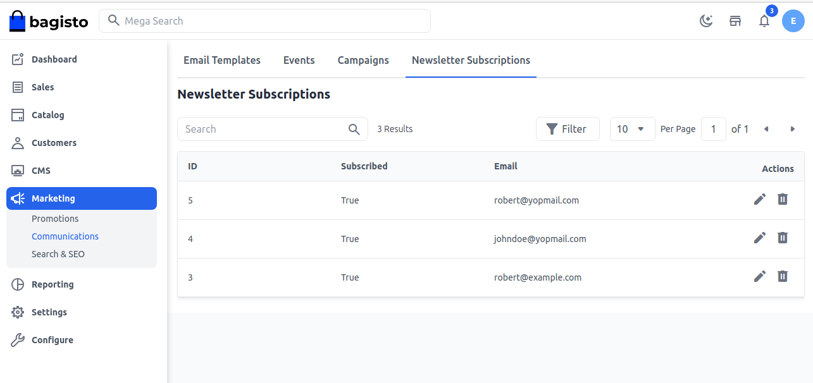
