# الترويجات

الترويج هو عندما تقدم خصومات وعروض للمشترين عبر الإنترنت لجذب عملاء جدد وزيادة الإيرادات. والأهم من ذلك، أن هذه الترويجات يمكن أن تحول الزوار الجدد إلى عملاء مخلصين وشراء متكرر.

## قواعد السلة

إنها طبيعة الإنسان أن يجذب الجميع العروض والخصومات أثناء التسوق. يتم تطبيق قاعدة السلة على المنتجات في عربة التسوق. هنا سنتحدث عن كيفية إعداد قواعد السلة في Bagisto.

باستخدامها، يمكنك تحديد خصم واحد أو أكثر على نفس المنتج. اتبع الخطوات أدناه "كيفية إعداد قواعد السلة في Bagisto".

### الخطوة 1: إضافة قاعدة سلة جديدة

1. في لوحة الإدارة، انتقل إلى **التسويق >> الترويجات >> قواعد السلة** وانقر على إنشاء **قاعدة سلة** كما هو موضح في الصورة أدناه.

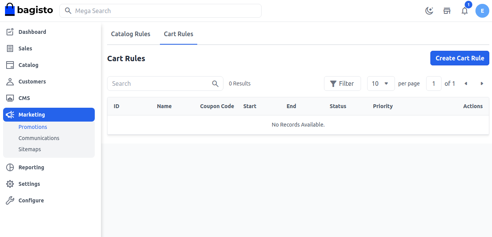

### قم بإدخال ما يلي في قسم معلومات القاعدة

**1. الاسم:** أدخل اسم قاعدة السلة الجديدة. (فقط للرجوع الداخلي)

**2. الوصف:** أدخل وصف القاعدة. (فقط للرجوع الداخلي)

**3. الحالة:** حدد حالة قاعدة السلة لتكون نشطة.

**4. القنوات:** اختر القناة التي سيتم تطبيق قاعدة السلة عليها.

**5. مجموعة العملاء:** اختر مجموعة العملاء التي سيتم تطبيق قاعدة السلة عليها.

**6. نوع القسيمة:** اختر نوع القسيمة مع أو بدون القسيمة. إذا كنت تريد تطبيق قاعدة السلة على جميع العربات، حدد "لا قسيمة".

### إذا كنت ترغب في استخدام قسيمة، اختر "قسيمة محددة" وأدخل المعلومات في الحقول التالية.

**1. توليد القسيمة تلقائيًا:** حدد نعم/لا. إذا اخترت لا، فقم بالخطوة التالية. إذا حددت "نعم"، سيتم إنشاء قسيمة تلقائيًا.

**2. رمز القسيمة:** أدخل رمز القسيمة، الذي يتم إدخاله أثناء عملية الدفع للحصول على خصم.

**3. الاستخدامات لكل قسيمة:** لتحديد عدد المرات التي يمكن استخدام القسيمة فيها. اتركه فارغًا إذا لم يكن هناك حد.

**4. الاستخدامات لكل عميل:** لتحديد عدد المرات التي يمكن استخدام قاعدة السلة لنفس العميل. اتركه فارغًا إذا لم يكن هناك حد.

**5. من وإلى التواريخ:** حدد نطاق التواريخ، عندما ستؤثر قاعدة السلة. إذا لم تحدد التواريخ، ستطبق القاعدة بمجرد حفظها.

**6. الأولوية:** أدخل أولوية هذه القاعدة.

**ملاحظة:** الأولوية مهمة عندما تلتقي المنتجات بالشروط المحددة لأكثر من قاعدة سلة واحدة. الأولوية الأعلى هي 0. لذلك عندما توجد أكثر من شرط، سيتم تطبيق الأولوية الأعلى أولاً.

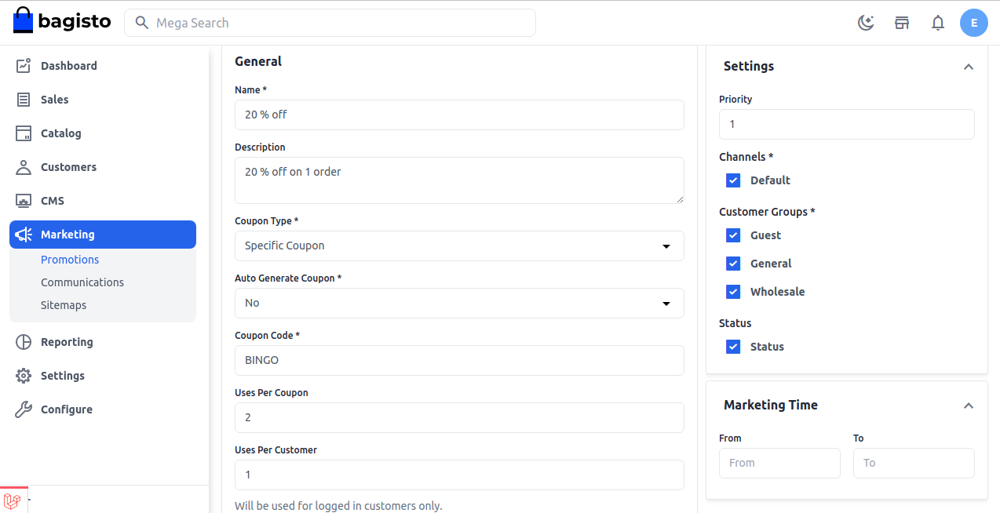

### الخطوة 2: تحديد الشروط

تستند الشروط في قاعدة السلة إلى سمات السلة، وسمة عنصر السلة، وسمة المنتج. إذا كنت تريد تطبيق القاعدة على جميع المنتجات، فلا تحدد أي شرط. حدد نوع الشرط ليكون جميع الشروط صحيحة أو أي شرط صحيح.

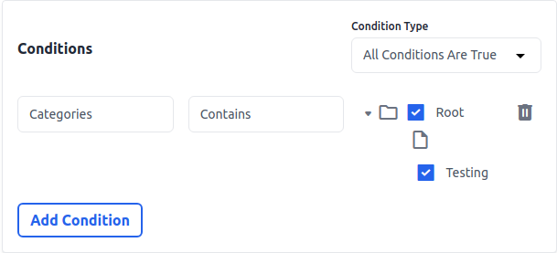

ثم انقر على إضافة شرط لتحديد الشروط. تحت قائمة سمات المنتج، اختر السمة التي تريد تحديدها للشرط.

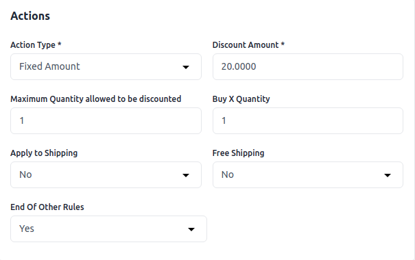

على سبيل المثال، إذا اخترت الفئات، فيجب عليك اختيار "يحتوي على/لا يحتوي على" واختيار الفئة كما هو موضح في الصورة أدناه.

إذا كنت ترغب في حذف أي شرط، فانقر على رمز الحذف.

### الخطوة 3: تحديد الإجراءات

في قسم الإجراءات، يجب علينا تحديد الإجراءات مثل كيفية تطبيق القاعدة على المنتج.

**1. نوع الإجراءات:** يمكنك تطبيق خصم على أساس النسبة المئوية أو على أساس مبلغ ثابت.

**2. مبلغ الخصم:** أدخل مبلغ الخصم.

**3. إنهاء القواعد الأخرى:** لإيقاف تطبيق القواعد الأخرى بعد تطبيق هذه القاعدة، حدد "نعم". سيعمل هذا لتطبيق خصومات متعددة على نفس المنتج.

**4. تطبيق على الشحن:** أضف نعم/لا وفقًا لمتطلباتك إذا كنت تريد تطبيق الشحن أم لا.

**5. شراء X كمية:** عدد الكميات التي تريد إضافتها.

**6. الشحن المجاني:** أضف نعم/لا وفقًا لمتطلباتك إذا كنت تريد تطبيق الشحن المجاني أم لا.

**7. الحد الأقصى للكمية المسموح بها للخصم:** أضف عدد الكمية التي تريد تطبيق الخصم عليها.

بعد النقر على زر **حفظ قاعدة السلة** 

الآن انسخ **رمز القسيمة** كما هو موضح في الصورة أدناه.

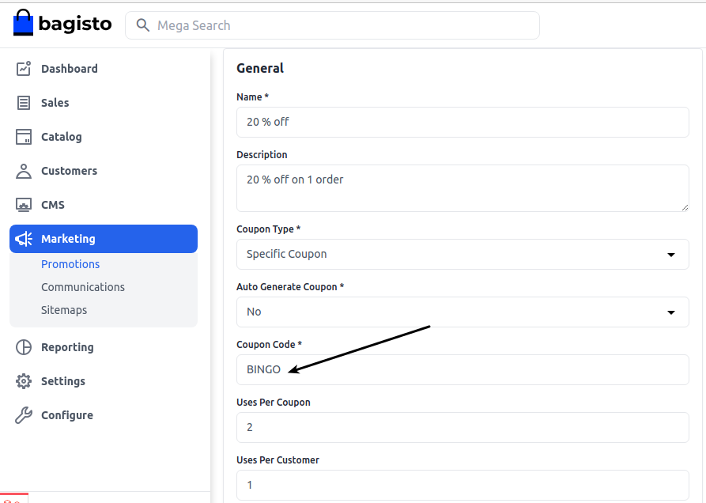

### الواجهة الأمامية:-

على **صفحة الدفع** أثناء تقديم الطلب انقر على **تطبيق القسيمة** كما هو موضح في الصورة أدناه.

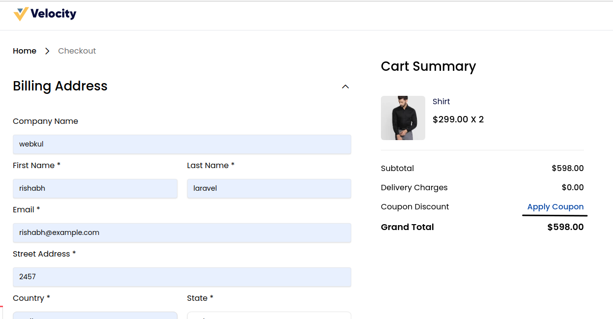

بعد إضافة رمز القسيمة، انقر على زر **تطبيق** كما هو موضح أدناه.

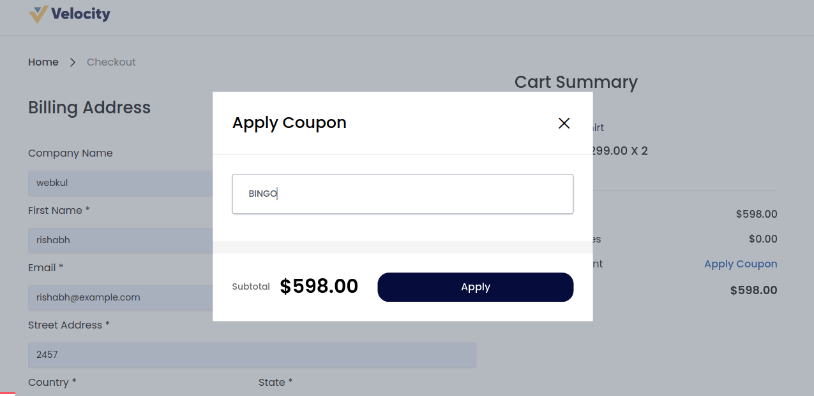

الآن تم تطبيق **القسيمة** بنجاح.

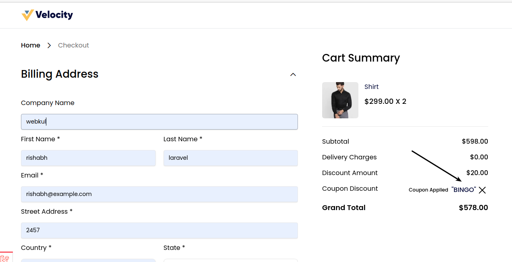

باتباع الخطوات أعلاه، يمكنك بسهولة إنشاء **قواعد سلة** في Bagisto.
## قواعد الكتالوج

قاعدة الكتالوج هي قاعدة خاصة تسمح للعميل بشراء المنتج بأسعار مخفضة تحددها الإدارة من الخلفية. هنا سنتحدث عن كيفية إعداد قواعد الكتالوج في Bagisto.

تُطبق قاعدة الكتالوج على المنتج قبل إضافته إلى عربة التسوق. اتبع الخطوات أدناه "كيفية إعداد قواعد الكتالوج في Bagisto".

### الخطوة 1: إضافة قاعدة كتالوج جديدة

a) في لوحة الإدارة، انتقل إلى **التسويق >> الترويجات >> قواعد الكتالوج**

b) في الزاوية العلوية اليمنى، انقر على زر **إنشاء قاعدة كتالوج** كما هو موضح أدناه.

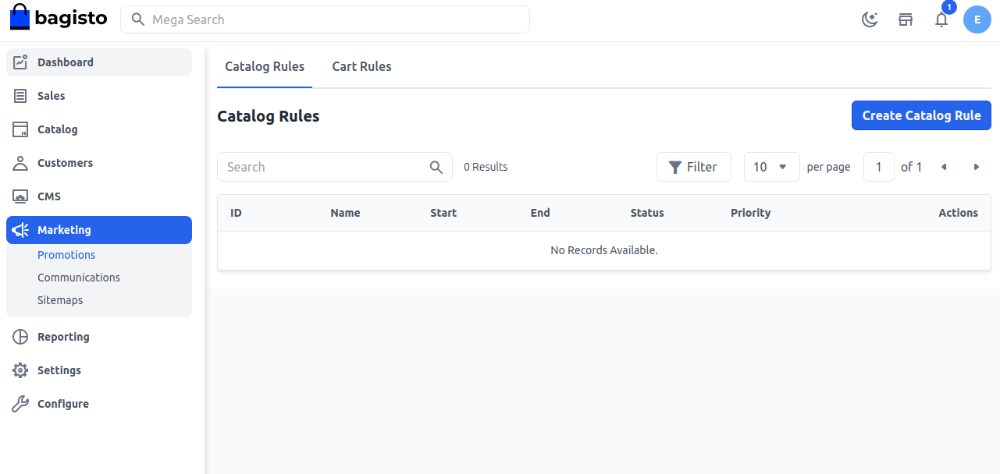

### قم بإدخال ما يلي في قسم معلومات القاعدة

**1. الاسم:** أدخل اسم قاعدة الكتالوج الجديدة. (فقط للرجوع الداخلي)

**2. الوصف:** أدخل وصف القاعدة. (فقط للرجوع الداخلي)

**3. الحالة:** حدد حالة قاعدة الكتالوج لتكون نشطة.

**4. القنوات:** اختر القناة التي سيتم تطبيق قاعدة الكتالوج عليها.

**5. مجموعة العملاء:** اختر مجموعة العملاء التي سيتم تطبيق قاعدة الكتالوج عليها.

**6. من وإلى التواريخ:** حدد نطاق التواريخ، عندما ستؤثر قاعدة الكتالوج. إذا لم تحدد التواريخ، ستطبق القاعدة بمجرد حفظها.

**7. الأولوية:** أدخل أولوية هذه القاعدة.

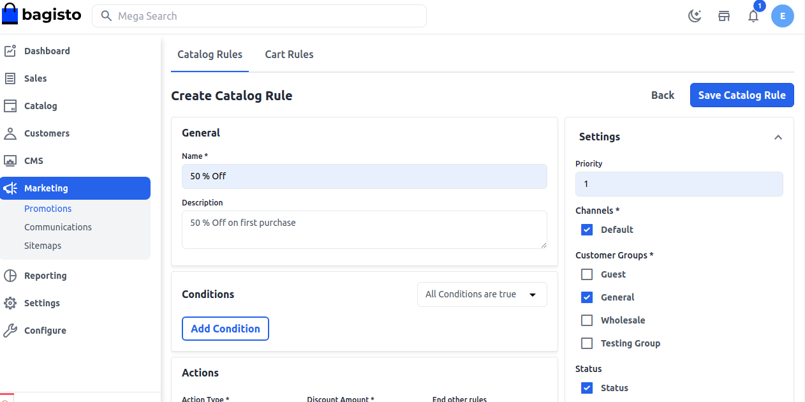

### الخطوة 2: تحديد الشروط

تستند جميع الشروط في قاعدة الكتالوج إلى سمة المنتج. إذا كنت تريد تطبيق القاعدة على جميع المنتجات، فلا تحدد أي شرط. حدد نوع الشرط ليكون جميع الشروط صحيحة أو أي شرط صحيح.

ثم انقر على إضافة شرط لتحديد الشروط. تحت قائمة سمات المنتج، اختر السمة التي تريد تحديدها للشرط.

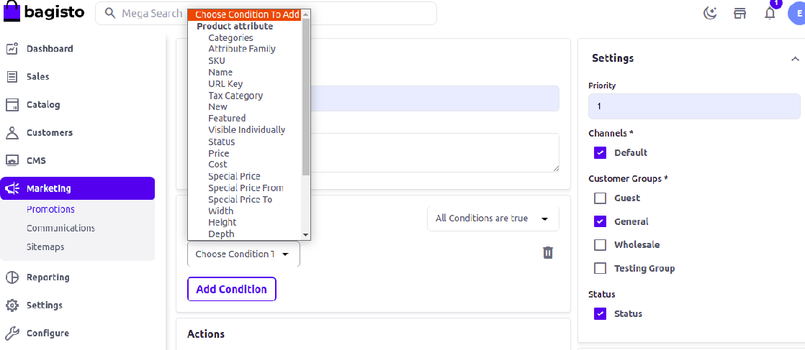

على سبيل المثال، إذا اخترت الفئات، فيجب عليك اختيار "يحتوي على/لا يحتوي على" واختيار الفئة كما هو موضح في الصورة أدناه.

إذا كنت ترغب في حذف أي شرط، فانقر على رمز الحذف.

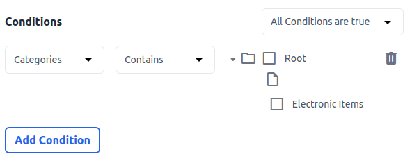

### الخطوة 3: تحديد الإجراءات

في قسم الإجراءات، يجب علينا تحديد الإجراءات مثل كيفية تطبيق القاعدة على المنتج.

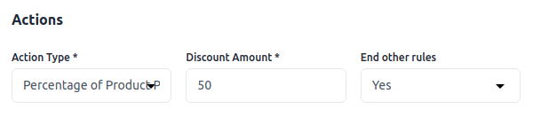

**1. نوع الإجراءات:** يمكنك تطبيق خصم على أساس النسبة المئوية أو على أساس مبلغ ثابت.

**2. مبلغ الخصم:** أدخل مبلغ الخصم.

**3. إنهاء القواعد الأخرى:** لإيقاف تطبيق القواعد الأخرى بعد تطبيق هذه القاعدة، حدد "نعم". سيعمل هذا لتطبيق خصومات متعددة على نفس المنتج.

**ملاحظة:** إذا كنت تريد تطبيق قواعد متعددة على المنتج، فحدد "لا". في هذه الحالة، ستطبق القاعدة التي لها أعلى أولوية أولاً.

الآن **احفظ قاعدة الكتالوج** وستتمكن من رؤية **قاعدة كتالوج** جديدة قد تم إنشاؤها بنجاح.

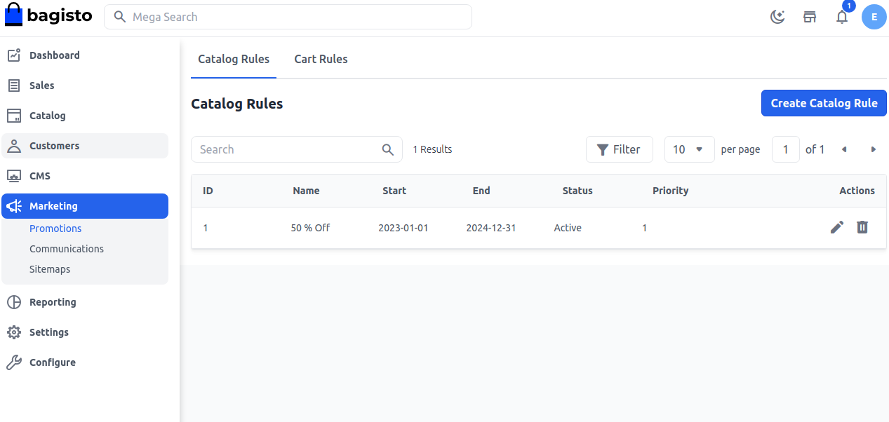

### الواجهة الأمامية:-

ستحصل على خصم 50% على المنتج بعد تطبيق قاعدة الكتالوج كما هو موضح أدناه.

بهذا، يمكنك بسهولة إنشاء **قاعدة كتالوج** في Bagisto.