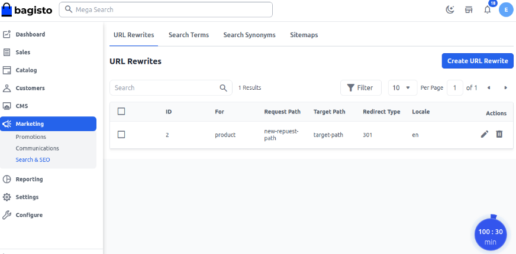
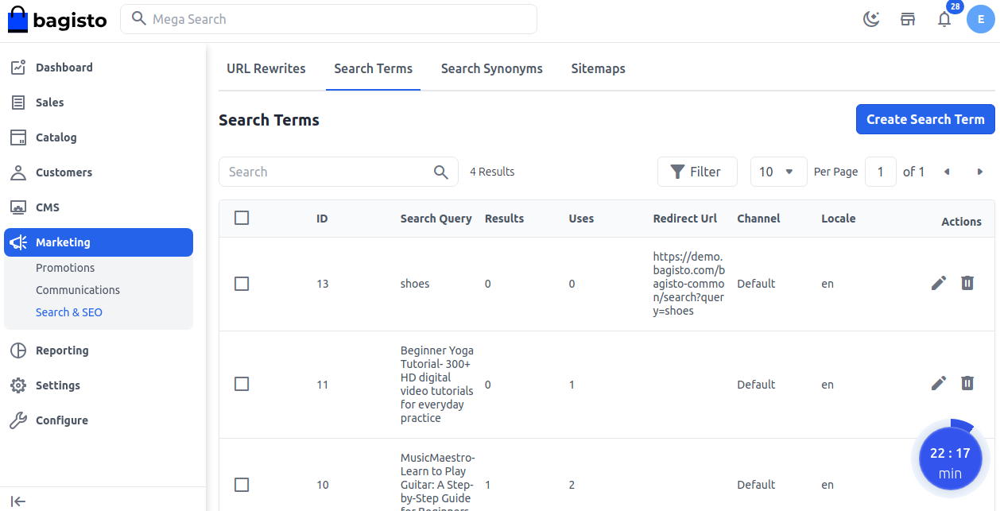
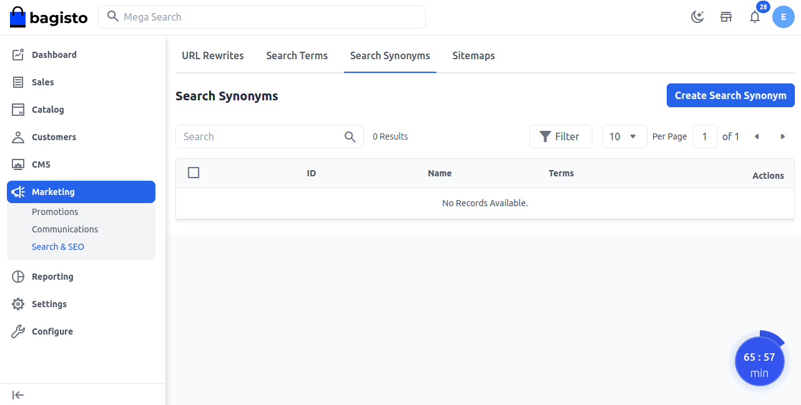
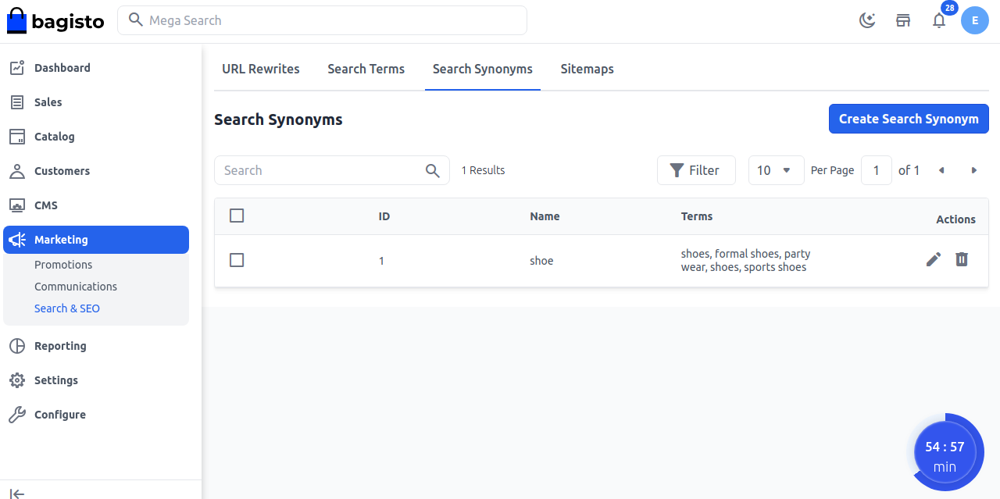
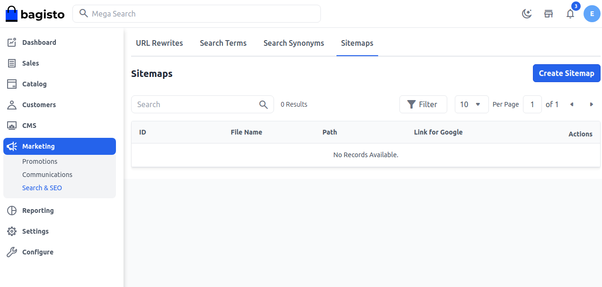

# البحث و SEO

تقدم Bagisto 2.2.0 أدوات تسويقية جديدة لزيادة رؤية متجرك وتحسين تجربة العملاء.

## إعادة كتابة عنوان URL

تتيح هذه الميزة للإدارة إدارة الأخطاء المتعلقة بعناوين URL للمنتجات والفئات وصفحات CMS.

إذا قام المدير بتعديل عنوان URL لأي سبب، تضمن هذه الوظيفة إعادة التوجيه بسلاسة إلى عنوان URL الجديد.

**الخطوة 1:** للتحقق من هذه الميزة، يحتاج المدير للنقر على **التسويق >> البحث و SEO >> إعادة كتابة عنوان URL**، ثم انقر على زر **إنشاء إعادة كتابة عنوان URL** كما هو موضح في الصورة أدناه.

**الخطوة 2:** أضف الحقول التالية:

**1) لـ** - اختر الغرض الذي تطبق عليه إعادة كتابة عنوان URL (منتج، فئة، صفحة CMS).

**2) مسار الطلب** - بالنسبة لمسار الطلب، استبدل الافتراضي بإدخال مفتاح URL واللاحقة (إن وجدت) لطلب المنتج الأصلي. هذا هو إعادة التوجيه من منتج حددته في خطوة التخطيط.

**3) مسار الهدف** - يعرض حقل مسار الهدف الإصدار النظامي للمسار، والذي لا يمكن تغييره. في البداية، يعرض حقل مسار إعادة التوجيه أيضًا مسار الهدف.

**4) نوع إعادة التوجيه** - حدد نوع إعادة التوجيه ليكون واحدًا من التالي:

A) مؤقت (302) - استخدم هذا للتغييرات المؤقتة، مع الحفاظ على قيمة SEO مع عنوان URL القديم.

B) دائم (301) - استخدم هذا للتغييرات الدائمة مع نقل قيمة SEO إلى عنوان URL الجديد.

**5) اللغة** - اختر اللغة التي تريد إعادة كتابة عنوان URL بها.

الآن انقر على زر **حفظ إعادة كتابة عنوان URL**.

**الخطوة 3:** الآن يتم إعادة توجيه عنوان URL الجديد وفقًا لمسار الهدف بشكل دائم.

## مصطلحات البحث

هذه هي الكلمات الرئيسية التي استخدمها عملاؤك في واجهة المتجر للبحث عن منتجاتهم.

**الخطوة 1:** لإنشاء مصطلح بحث جديد، يحتاج المدير للنقر على **التسويق >> البحث و SEO >> مصطلحات البحث**، ثم انقر على زر **إنشاء مصطلح بحث** كما هو موضح في الصورة أدناه.

**الخطوة 2:** أضف الحقول التالية لمصطلحات البحث:

**1) استعلام البحث** - اكتب استعلام اسم المنتج الذي سيبحث عنه العميل في واجهة المتجر.

**2) عنوان URL المعاد توجيهه** - أضف عنوان URL الذي سيتم إعادة توجيه مصطلح البحث إليه.

**3) القناة** - أضف القناة التي ستظهر فيها مصطلحات البحث.

**4) اللغة** - اختر اللغة التي تريد بها مصطلحات البحث.

الآن انقر على زر **حفظ مصطلح البحث**.

**الخطوة 3:** تم إنشاء حقل بحث جديد باسم **Adorable** بنجاح كما هو موضح في الصورة أدناه.

**الخطوة 4:** الواجهة الأمامية

الآن تحقق من النتيجة من خلال البحث عن مصطلح البحث الخاص بك.

## مرادفات البحث

مرادفات البحث هي تلك المصطلحات التي يبحث عنها العميل بدلاً من منتج معين. على سبيل المثال، إذا كان العميل يريد أحذية، يمكنه البحث عن "حذاء" ليشمل الأحذية الرسمية، رياضية، أحذية للحفلات، إلخ، وسيتم البحث عنها بسهولة.

**الخطوة 1:** لإنشاء مصطلح بحث جديد، يحتاج المدير للنقر على **التسويق >> البحث و SEO >> مرادفات البحث**، ثم انقر على زر **إنشاء مرادفات البحث** كما هو موضح في الصورة أدناه.

**الخطوة 2:** أدخل الحقول التالية:

**1) الاسم** - أدخل اسم المرادف.

**2) المصطلحات** - أدخل المصطلحات ذات الصلة التي تنتمي إلى الاسم.

الآن انقر على زر **حفظ مرادف البحث**.

**الخطوة 3:** تم إنشاء حقل مرادف جديد باسم **shoe** بنجاح كما هو موضح في الصورة أدناه.

**الخطوة 4:** الواجهة الأمامية

الآن تحقق من النتيجة من خلال البحث عن مرادف البحث الخاص بك، الذي يحتوي على جميع فئات الأحذية كما هو موضح في الصورة أدناه.

## خرائط الموقع

تقوم خرائط الموقع بإبلاغ محركات البحث عن الصفحات الموجودة على موقع الويب التي يجب زحفها، وقد تساعد محركات البحث في اكتشاف وفهرسة تلك الصفحات. بينما يمكن أن تكون خرائط الموقع ملف نصي بسيط يدرج عناوين URL لجميع الصفحات التي ترغب في فهرستها، يمكن أن تكون أيضًا مستند XML يحمل مزيدًا من المعلومات.

### الخطوة 1: إضافة خريطة موقع جديدة

1. في لوحة الإدارة، انتقل إلى **التسويق >> البحث و SEO >> خرائط الموقع**، ثم انقر على **إنشاء خريطة موقع** كما هو موضح في الصورة أدناه.

### الخطوة 2: إضافة خريطة موقع جديدة

أضف **اسم الملف** و **مسار الملف** ثم انقر على زر **حفظ خريطة الموقع**.

تأكد من أنك أنشأت **ملف XML** واذكر مساره المطلوب كما هو موضح أدناه.

### الخطوة 3: 

الآن ستتمكن من رؤية **خريطة الموقع** الجديدة كما هو موضح أدناه.

بهذا، يمكنك بسهولة إنشاء **خريطة موقع** في Bagisto 2.2.0