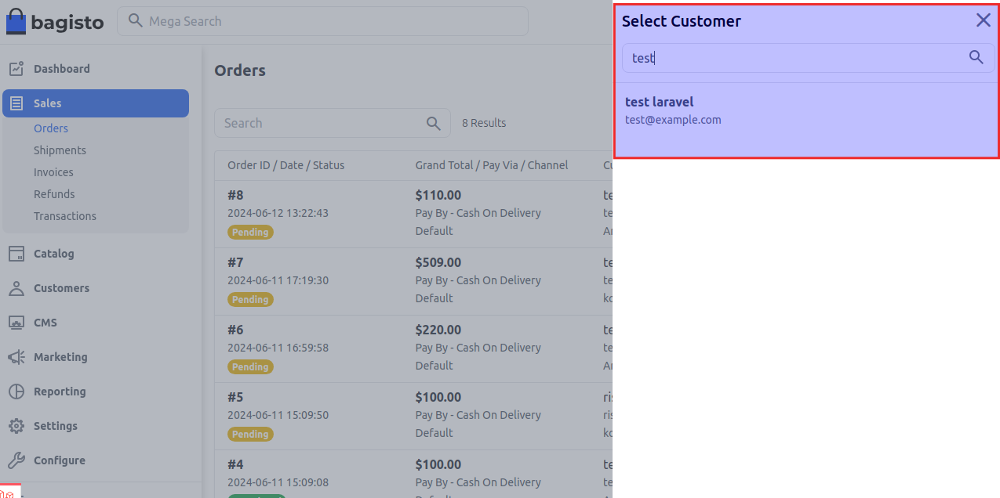
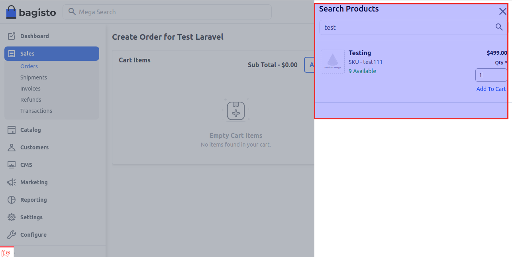
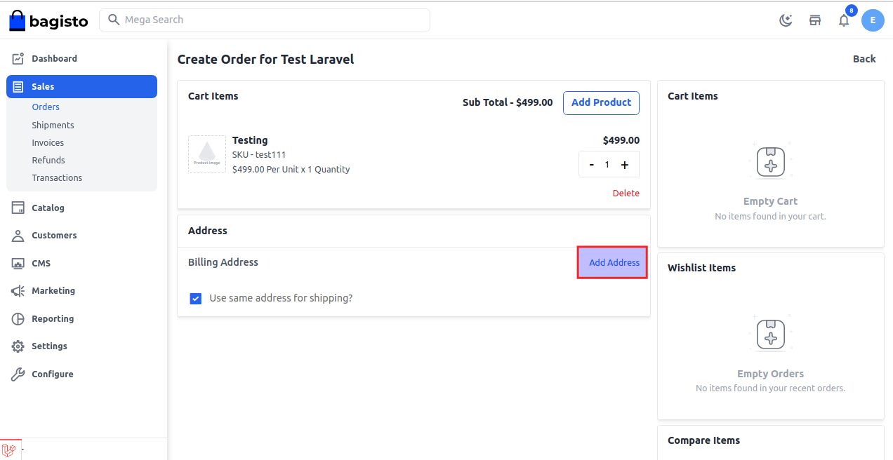
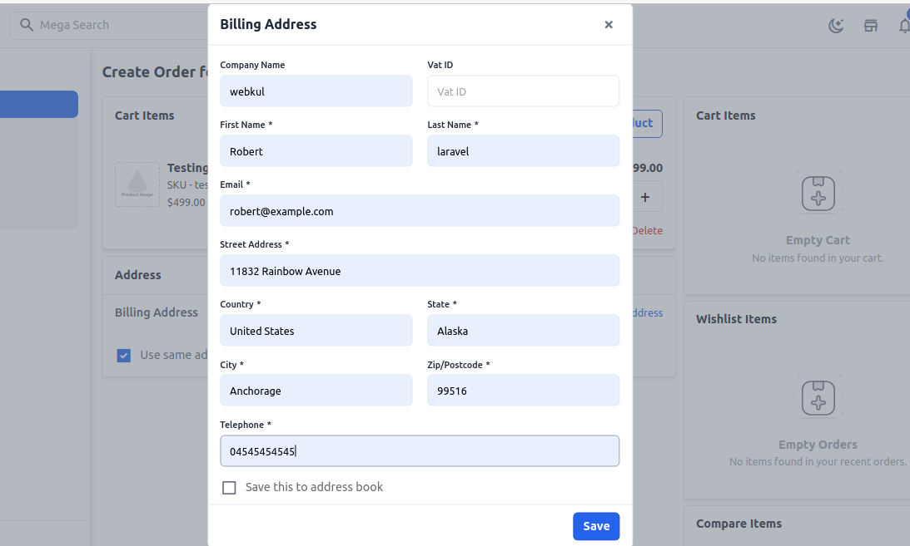
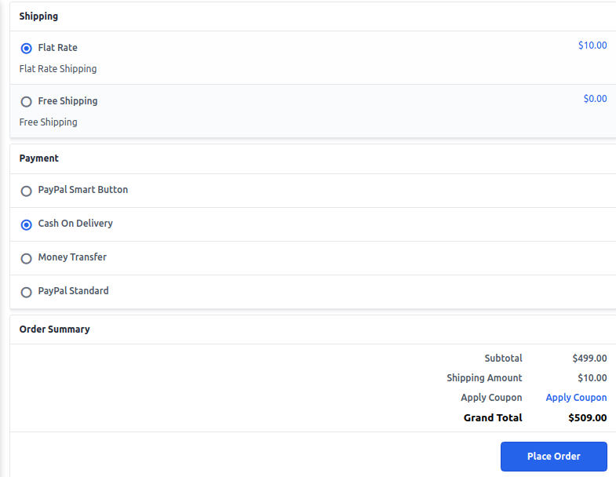
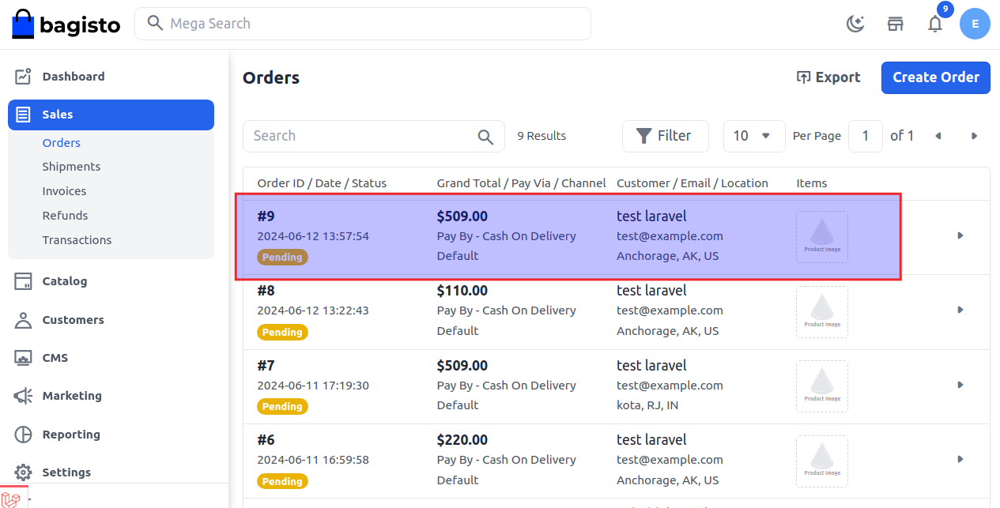

# طلب الإدارة

في بعض الأحيان، لا يستطيع العملاء تقديم الطلب، وفي هذه الحالة يتصلون بمالك المتجر لتقديم الطلب. لذا يمكن للإدارة تقديم الطلبات نيابة عن العملاء.

### كيفية إدارة طلبات الإدارة في Bagisto 2.2.0

**الخطوة 1** اذهب إلى لوحة إدارة Bagisto وانقر على **المبيعات >> الطلبات >> إنشاء طلب**، ثم ابحث واختر العميل كما هو موضح في الصورة أدناه.

**الخطوة 2** الآن انقر على **إضافة منتجات** وابحث عن المنتج الذي تريده وأدخل الكمية، ثم انقر على **إضافة إلى السلة** كما هو موضح في الصورة أدناه.

**الخطوة 3** يمكنك أيضًا زيادة كمية المنتج. الآن انقر على **إضافة عنوان** كما هو موضح في الصورة أدناه.

**الخطوة 4** الآن أضف جميع المعلومات في نموذج عنوان الفواتير، ثم انقر على **زر الحفظ** كما هو موضح في الصورة أدناه.

**الخطوة 5** الآن أضف طرق الشحن والدفع وانقر على **تقديم الطلب** كما هو موضح في الصورة أدناه.

**الخطوة 6** تم تحديث طلب الإدارة بنجاح في جدول بيانات الطلبات كما هو موضح في الصورة أدناه.

