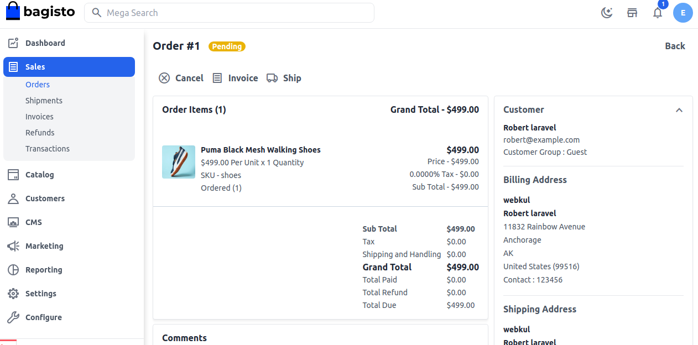
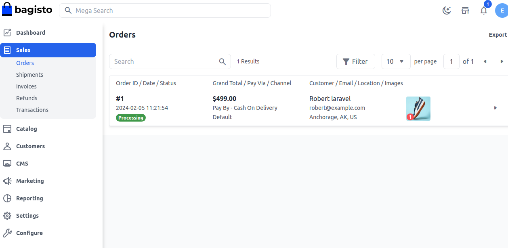

# إنشاء فاتورة

من هنا، يمكنك إنشاء الفاتورة للطلب وتأكيد طلب العميل من خلال النقر على **فاتورة**. يمكن للإدارة التحقق من التفاصيل وإدخال الكمية في الفاتورة ثم النقر على فاتورة.

تستخدم الفاتورة لتأكيد معاملة التجارة الإلكترونية وتوفير تأكيد تفصيلي للطلب للعملاء. ومع ذلك، قد يقدم بعض التجار في الأعمال التجارية بين الشركات الائتمان—سيتم تقديم الطلب أولاً وسيتم إرسال الفاتورة لاحقًا لطلب الدفع.

وثيقة تجارية مفصلة تسجل المنتجات أو الخدمات المقدمة للعميل، والمبلغ الإجمالي المستحق، وطريقة الدفع المفضلة. يمكن للبائع إرسال فواتير ورقية أو إلكترونية للعميل. إنها وثيقة تستخدم لتسجيل معاملة بين المشتري والبائع. تحتوي على معلومات حول العنصر وسعره، والضرائب المرتبطة به، إلخ.

بعد إنشاء الفاتورة، تتغير حالة الطلب تلقائيًا من **قيد الانتظار** إلى **قيد المعالجة**.

باتباع الخطوات المذكورة أعلاه، يمكنك بسهولة إنشاء **فاتورة** في Bagisto.