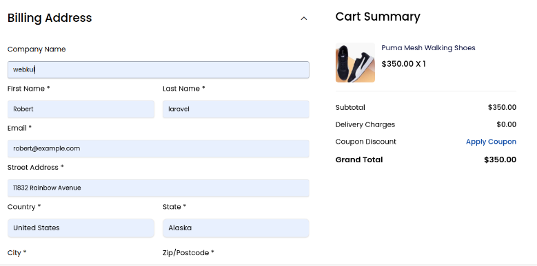
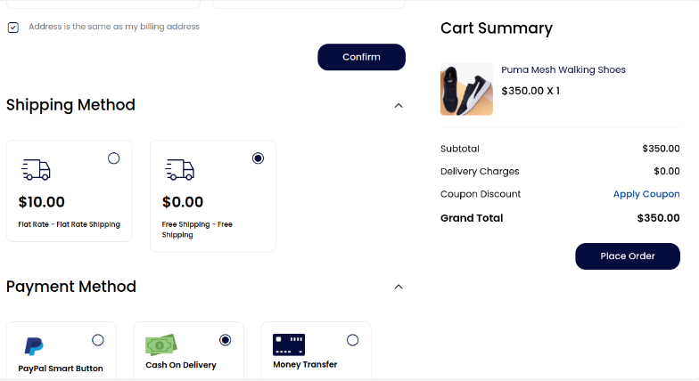
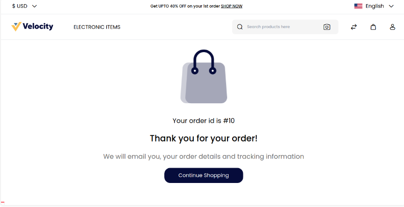
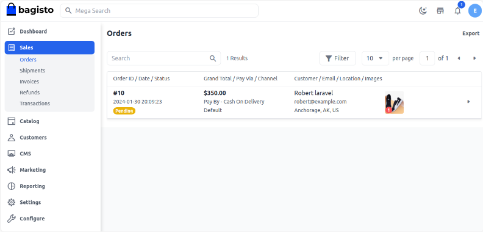

# إنشاء الطلبات

يتم إنشاء الطلب عندما يقوم عميل بزيارة موقعك، واختيار منتج ما، ثم تقديم طلب له. هنا سنناقش كيفية إدارة الطلبات في Bagisto.

عندما يقوم العميل بتقديم طلب من الواجهة الأمامية، يتم إنشاء حالة الطلب في لوحة الإدارة حيث يمكن للإدارة معالجة الطلب لاحقًا.

### كيفية إدارة الطلبات في Bagisto 2.2.0

**إضافة منتجات إلى السلة**

**الخطوة 1**: افتح صفحة تفاصيل المنتج و**أضف المنتج** إلى السلة كما هو موضح أدناه.

**الخطوة 2**: الآن تابع إلى صفحة الدفع داخل **عربة التسوق** كما هو موضح أدناه.

**الخطوة 3**: بعد ذلك، سيتم توجيهك إلى صفحة الدفع واملأ المعلومات الضرورية بخصوص **عنوان الفواتير** كما هو موضح أدناه.

**الخطوة 4**: بعد التأكيد، أضف طريقة الشحن وطريقة الدفع ثم انقر على **تقديم الطلب** كما هو موضح في الصورة أدناه.

**الخطوة 5**: بعد النقر على **تقديم الطلب**، ستفتح الصفحة التالية كما هو موضح أدناه، وستحصل على رقم الطلب.

### لوحة العملاء

على لوحة معلومات العملاء، يمكن للعملاء رؤية جميع تاريخ الطلبات مع حالة الطلب. يمكن للعملاء أيضًا إلغاء الطلب.

### المعلومات

في صفحة المعلومات، يمكن للإدارة التحقق من تفاصيل العميل مثل الاسم، والعنوان، والكمية، إلخ. يمكن للإدارة أيضًا إلغاء الطلب.

**ملاحظة: زر الإلغاء سيكون مرئيًا عندما تكون حالة الطلب قيد الانتظار.**

لذا، من خلال ذلك، يمكنك بسهولة إنشاء **الطلبات** في Bagisto.