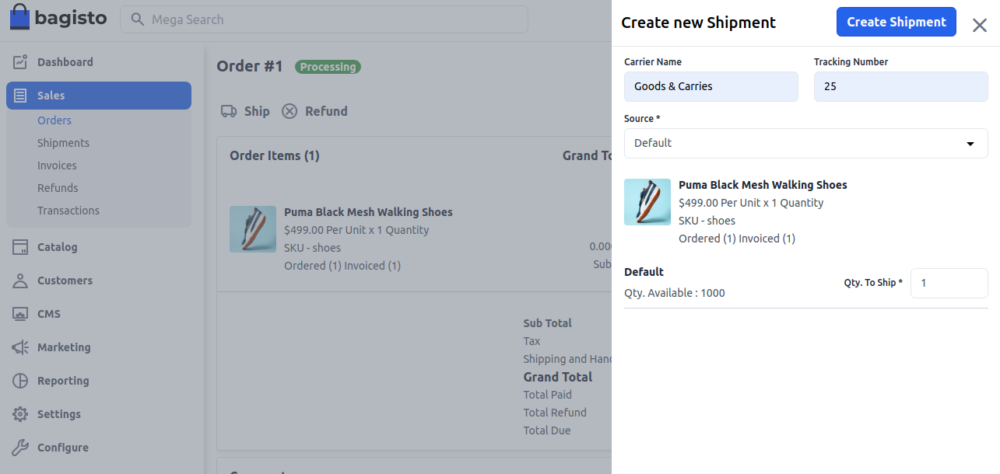
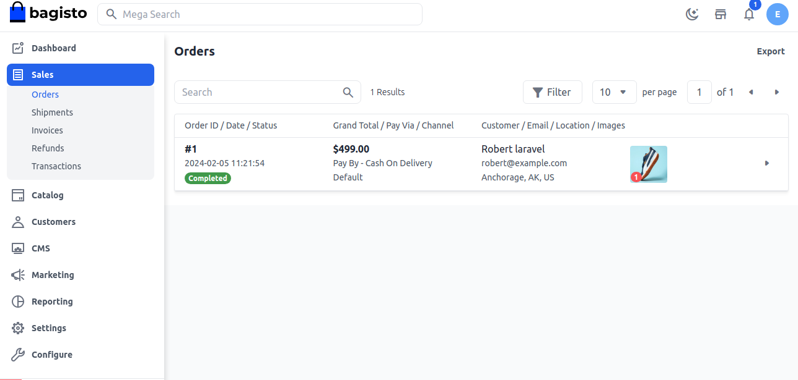

# إنشاء شحنة

الشحن هو عملية يتم من خلالها شحن البضائع باستخدام الإنترنت كوسيلة الاتصال الرئيسية. إنها طريقة مريحة للشحن لكل من المستهلكين والشركات، حيث توفر وسيلة سريعة وسهلة لإرسال العناصر من موقع إلى آخر.

تشير كلمة "الشحن" إلى معالجة وتعبئة وإرسال العناصر الصغيرة التي يمكن إرسالها بسرعة وسهولة، عادةً من خلال خدمة توصيل محلية.

لإنشاء شحنة لهذا الطلب، انقر على زر **شحن**. أدخل **اسم الناقل، رقم التتبع** واختر **مصدر المخزون** من القائمة المنسدلة. أدخل الكمية المراد شحنها ثم انقر على **إنشاء شحنة**.

الآن حالة الطلب هي **مكتمل**، ويمكنك التحقق من ذلك في قائمة الطلبات كما هو موضح في الصورة أدناه.

باتباع الخطوات المذكورة أعلاه، يمكنك بسهولة إنشاء **شحنة** في Bagisto.