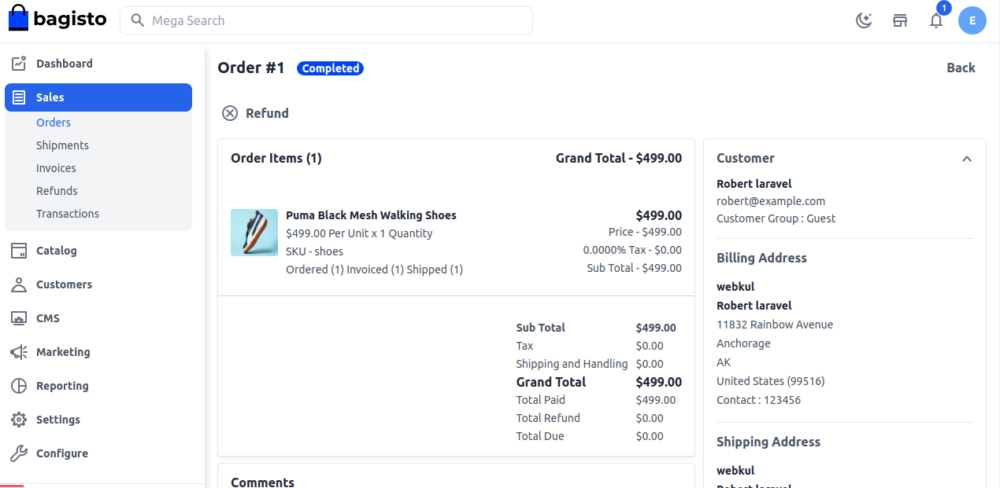
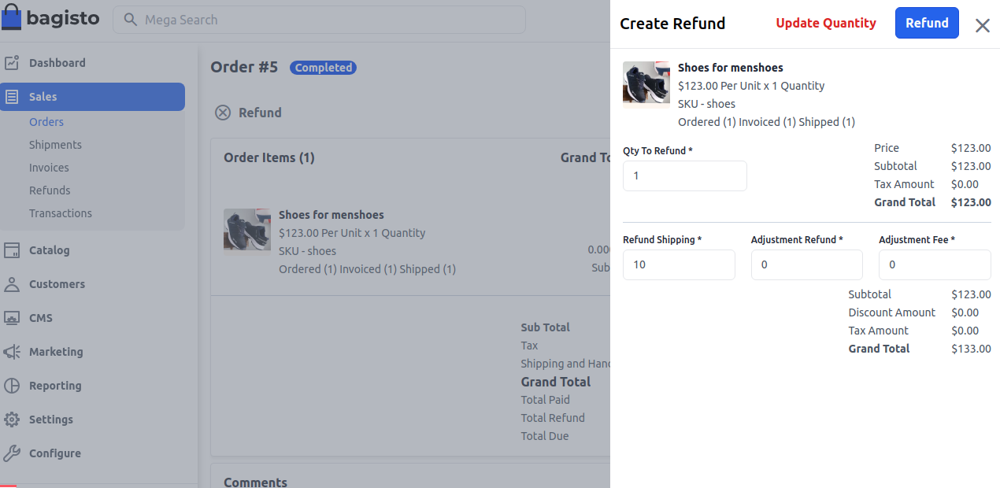
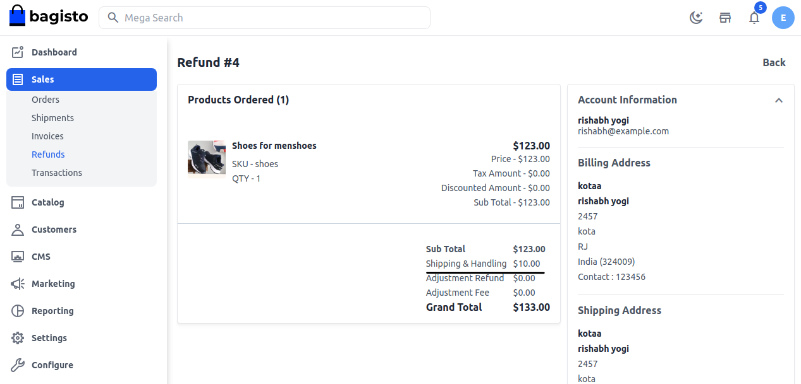
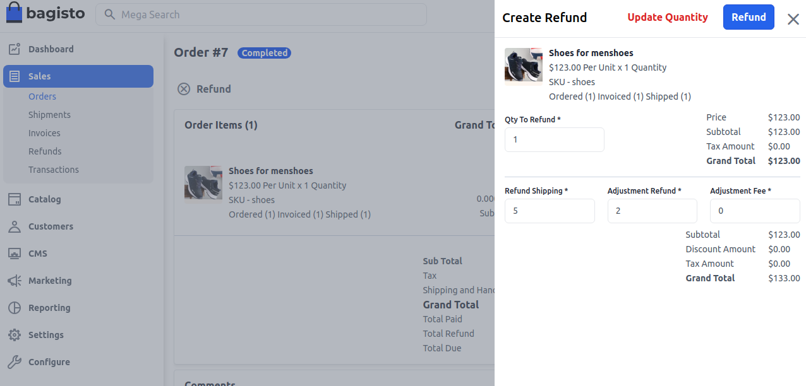
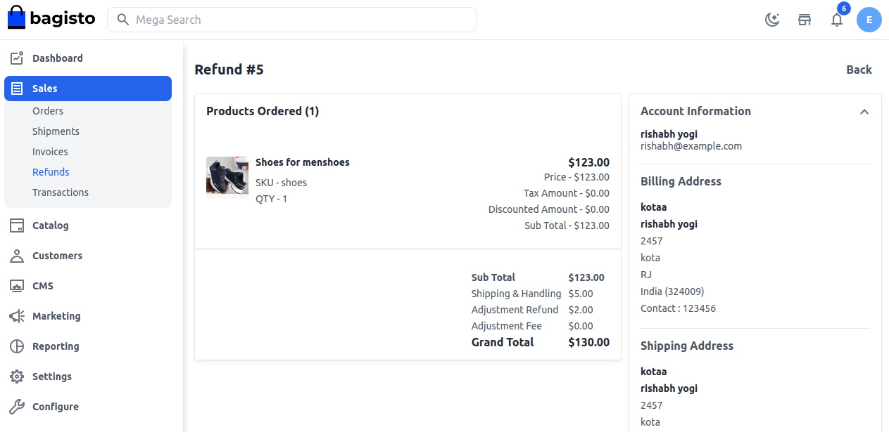
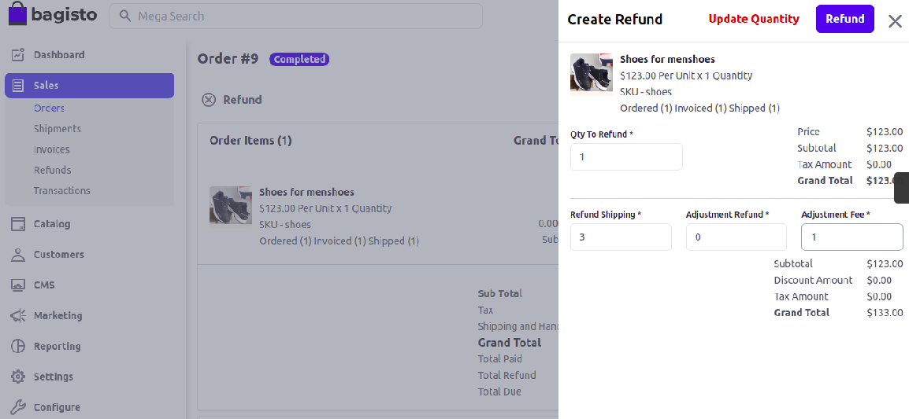
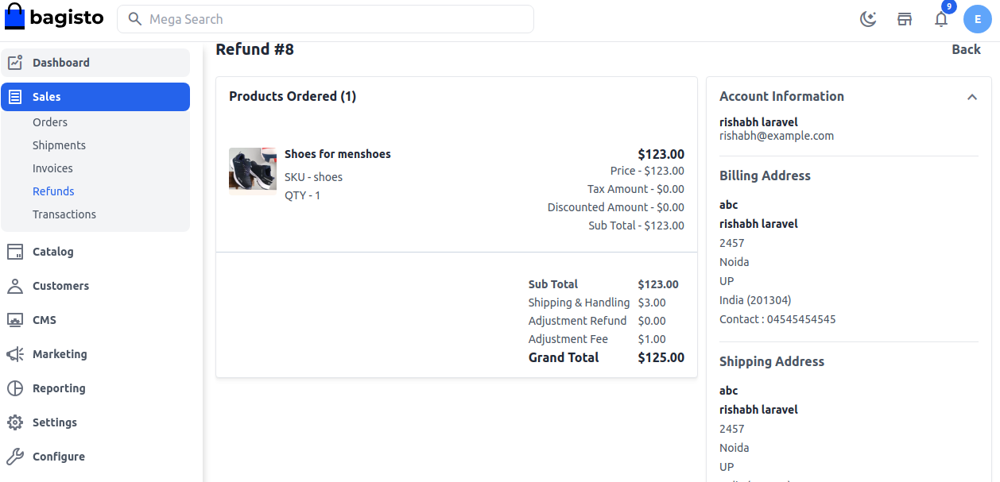
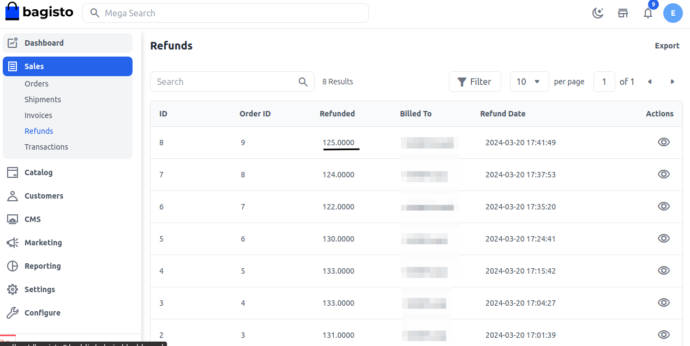

# المبالغ المستردة

عادةً، تقدم متاجر التجارة الإلكترونية فترة من 15 إلى 30 يومًا يمكن للعملاء خلالها إعادة منتج وطلب استرداد. بعض الشركات تمدد هذه الفترة حتى 90 يومًا. بغض النظر عن الإطار الزمني الذي تختاره، من الضروري أن تضمن وجود فترة زمنية.

يمكن للعميل الذي اشترى عنصرًا أن يطلب من المتجر استرداد أمواله إذا لم يناسبه حسب اختياره. يمكنك أن تطلب منهم إرجاع أموالك.

في Bagisto، بعد أن يصبح طلبك **مكتملًا** بعد إنشاء شحنة، يمكنك تعديل ذلك الطلب ومن هناك يمكنك بسهولة التقدم بطلب لاسترداد الأموال.

الآن أدخل **الكمية** التي تريد تقديم طلب استرداد لها.

**استرداد رسوم الشحن:** في هذا الحقل، يمكنك إدخال المبلغ الذي تريد استرداده من رسوم الشحن. في البداية، سيظهر هذا الحقل إجمالي مبلغ الشحن المتاح للاسترداد. يمكن تقليل رسوم الشحن المستردة ولكن لا يمكن زيادتها إلى المبلغ الأصلي (المبلغ الأولي للشحن).

في الصورة أدناه، قمنا بتقديم مبلغ استرداد قدره 10 دولارات كرسوم شحن، وهو المبلغ الإجمالي الذي ينطبق على رسوم الشحن.

تم استرداد المبلغ بالكامل، أي 10 دولارات كـ **رسوم شحن وتعليمات** كما هو موضح في الصورة أدناه.

**استرداد التعديل:** يمكنك إدخال المبلغ الذي سيتم إضافته إلى المبلغ الإجمالي المسترد كمبلغ إضافي لا يتضمن أي شحن أو سعر منتج أو تكلفة ضريبة.

في الصورة أدناه، استردينا **5 دولارات كرسوم شحن و2 دولار كاسترداد تعديل**.

تم استرداد المبلغ الإجمالي **7 دولارات كرسوم شحن وتعليمات واسترداد تعديل** كما هو موضح في الصورة أدناه.

**رسوم التعديل:** أدخل المبلغ الذي سيتم طرحه من المبلغ الفرعي.

في الصورة أدناه، **رسوم استرداد الشحن هي 3 دولارات ورسم التعديل هو 1 دولار**.

الآن تم **طرح 1 دولار كرسوم تعديل** من المبلغ الفرعي و**إضافة 3 دولارات كرسوم شحن وتعليمات** في **المبلغ الإجمالي الذي يحتاج إلى استرداد**.

بعد ذلك، سيتم إعادة توجيهك إلى **شبكة الاسترداد** وستظهر المبلغ المسترد في الشبكة كما هو موضح في الصورة أدناه.

باتباع الخطوات المذكورة أعلاه، يمكنك بسهولة **استرداد** في Bagisto.