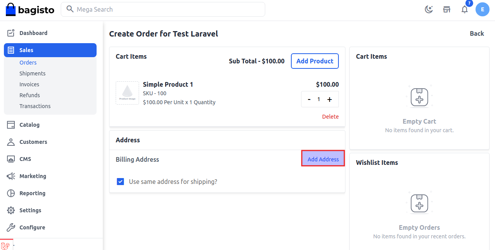

# إعادة الطلب

إعادة الطلب هي عملية تقديم طلب لنفس العنصر الذي قمت بشرائه سابقًا. قد لا يرغب بعض العملاء في الالتزام طويل الأجل بالاشتراك، وقد يختارون إعادة طلب نفس المنتج منك لأن إعادة الطلب أكثر مرونة من الاشتراك العادي.

### كيفية إدارة إعادة الطلب في Bagisto 2.2.0

**الخطوة 1:** في لوحة الإدارة، انقر على **المبيعات >> الطلبات >> تعديل الطلب**، ثم انقر على **إعادة الطلب** كما هو موضح في الصورة أدناه.

**الخطوة 2:** يمكنك أيضًا زيادة كمية المنتج. الآن انقر على إضافة عنوان كما هو موضح في الصورة أدناه.

**الخطوة 3:** الآن أضف جميع المعلومات في نموذج عنوان الفاتورة، ثم انقر على زر **حفظ** كما هو موضح في الصورة أدناه.

**الخطوة 4:** الآن أضف طرق الشحن والدفع، ثم انقر على **تقديم الطلب** كما هو موضح في الصورة أدناه.

**الخطوة 5:** تم تحديث إعادة الطلب بنجاح في جدول بيانات الطلبات كما هو موضح في الصورة أدناه.

