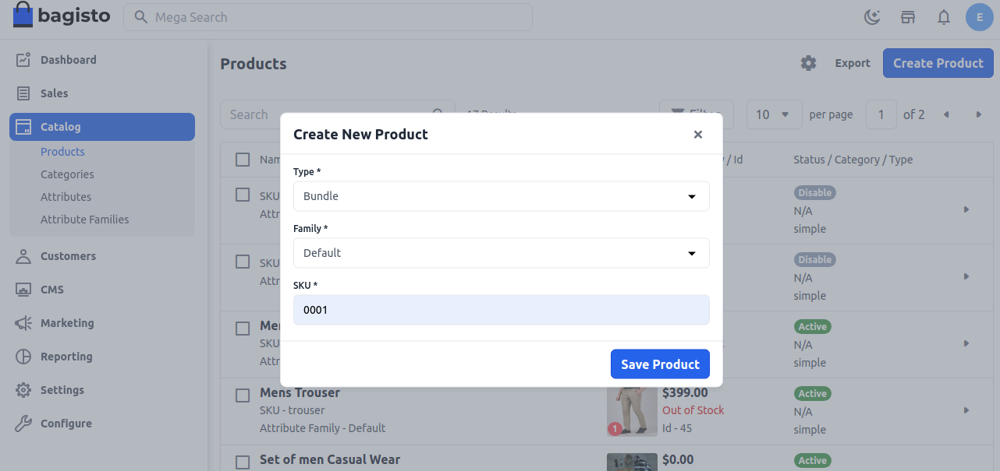
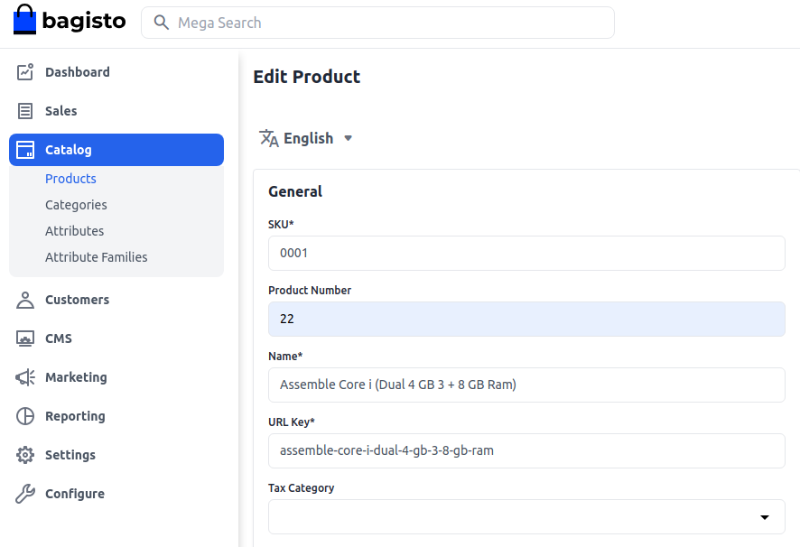
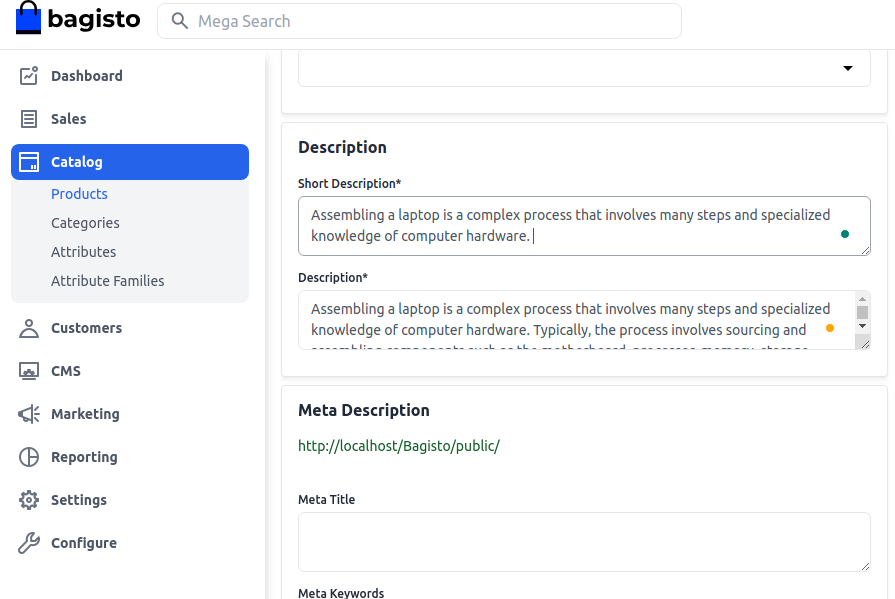
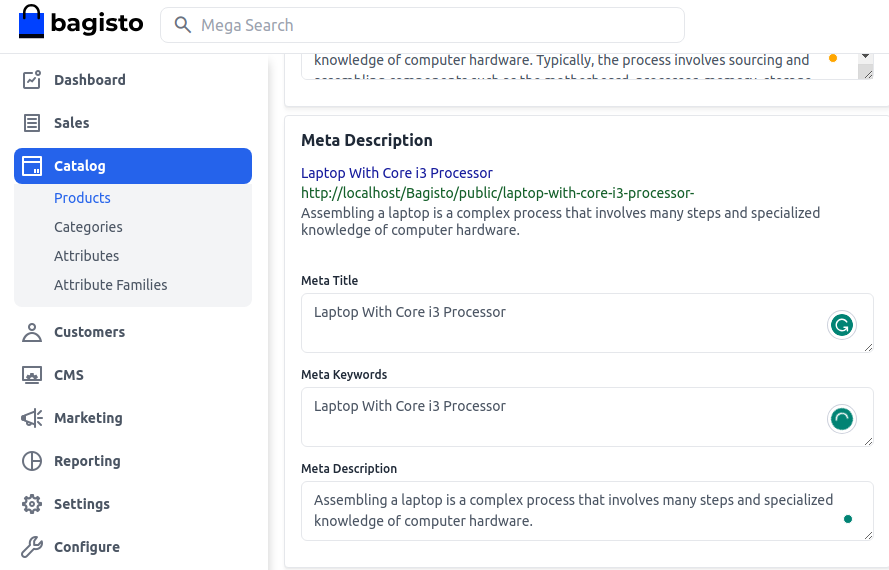
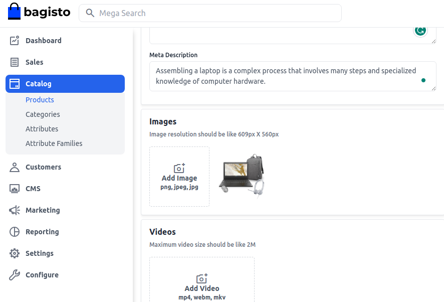
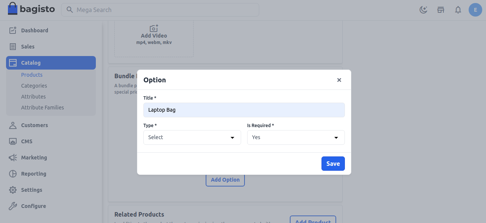
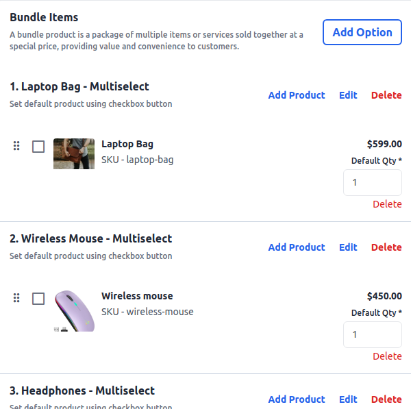
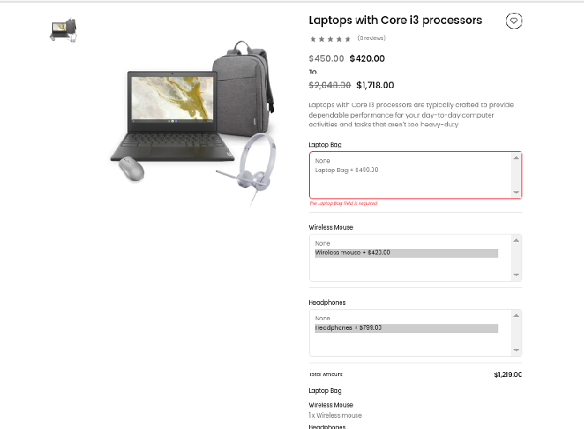

# المنتج الحزمة

سيوجهك المستند اليوم حول كيفية إنشاء منتجات المجموعة في Bagisto. تعد منتجات الحزم والمنتجات المجمعة متشابهة، حيث تتضمن منتجات الحزم عناصر قابلة للتخصيص يمكن للمتجر صاحب المتجر تكوينها لإنشاء منتج فريد في [Bagisto](https://bagisto.com/en/)

يمكن أن يكون كل عنصر في منتج الحزم مبنيًا على أحد أنواع المنتجات التالية:

- [المنتج البسيط](https://bagisto.com/en/how-to-create-simple-product-in-bagisto/)
- [المنتجات القابلة للتكوين](https://bagisto.com/en/how-to-create-configurable-product-in-bagisto/)

### خطوات إنشاء منتج حزم في Bagisto 2.2.0

1. في لوحة تحكم المسؤول Bagisto ، انتقل إلى **قسم الفئة >> المنتجات >> حدد Bundle** تحت نوع المنتج.
2. حدد **عائلة السمة**.
3. أدخل **SKU** (رمز التعريف الفردي للمنتج) للمنتج (فريد لكل منتج).
4. انقر على **حفظ**.

    

بعد النقر على زر حفظ المنتج، سيتم إعادة توجيهك إلى الصفحة التالية مع إعدادات جديدة.

### الإعدادات العامة

- **الاسم:** أدخل اسم المنتج.
- **مفتاح URL:** سيكون هذا نهاية عنوان URL، على سبيل المثال، http://bagisto.test.com/products/assembled-core-i3-4-gb-ddr3500-gbwindows-10-pro151-inch-screen-black.
- **فئة الضريبة:** حدد فئة الضريبة من القائمة المنسدلة.

    

#### جديد

- قم بتشغيل زر التبديل لعرض المنتج كمنتج جديد، ويظهر في قسم المنتجات الجديدة.

#### متميز

- قم بتشغيل زر التبديل لعرض المنتج في قسم المنتجات المميزة.

#### مرئي بشكل فردي

- قم بتشغيل زر التبديل لجعل المنتج مرئيًا على الواجهة الأمامية.

#### الحالة

- قم بتشغيل زر التبديل لتمكين المنتج في متجرك الإلكتروني.

#### شراء كضيف

- قم بتشغيل زر التبديل للسماح للعملاء الضيوف بطلب المنتج.

    

### الوصف

املأ الحقول التالية تحت الوصف:

- **وصف موجز:** أدخل وصفًا موجزًا لميزة المنتج.
- **الوصف:** اذكر منتجك بالتفصيل.

    

### الميتا وصف

املأ الحقول التالية تحت الميتا وصف لتحسين قابلية البحث على محركات البحث:

- **عنوان الميتا:** قدم العنوان الرئيسي للمنتج.
- **كلمات مفتاحية للميتا:** قدم كلمات مفتاحية للميتا للتحسين المحدد لمحرك البحث.
- **وصف الميتا:** أدخل وصفًا لقوائم محركات البحث.

    

### الصور

لإضافة صور المنتج ، انقر فوق **إضافة صور**. يمكنك إضافة العديد من الصور لمنتجك.

### القنوات

حدد القنوات التي تريد حفظ هذا المنتج فيها.

### عنصر المجموعة

انقر فوق إضافة خيار و:

- أدخل **عنوان الخيار**.
- اضبط **نوع الإدخال** (اختيار ، أزرار الراديو ، فحص ، اختيار متعدد).
- ضع علامة على خانة **مطلوب** إذا كان الحقل إلزاميًا.

في قسم البحث عن المنتج ، ابحث عن المنتج الذي تريد إضافته إلى الحزمة. بمجرد العثور عليه ، أضف المنتج إلى الحزمة ، مع تحديد الكمية لكل عنصر.

في الواجهة الأمامية ، يمكن للعملاء زيادة كمية المنتج لإضافته إلى السلة ، ولكن لا يمكن تغيير الكمية الافتراضية المضمنة في عنصر الحزم.

### المنتج في الواجهة الأمامية

سيكون منتج المجموعة مرئيًا في الواجهة الأمامية.

