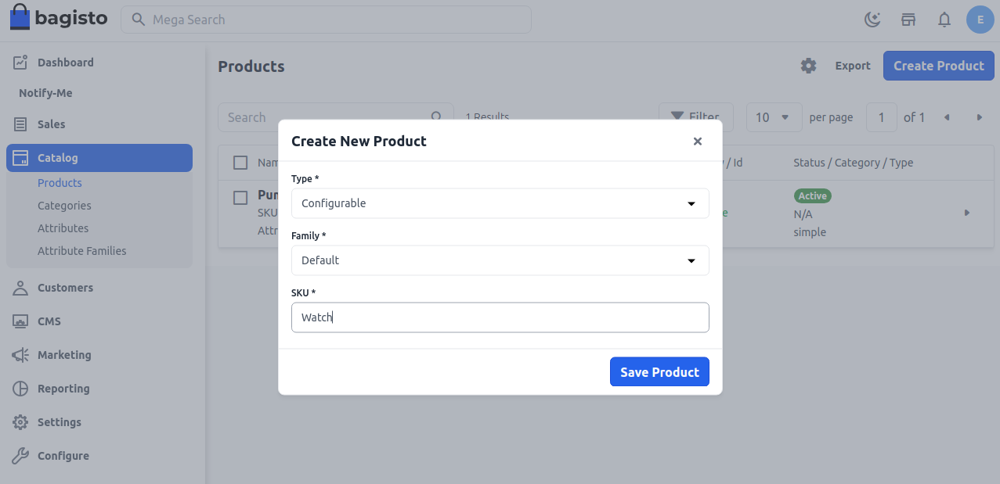
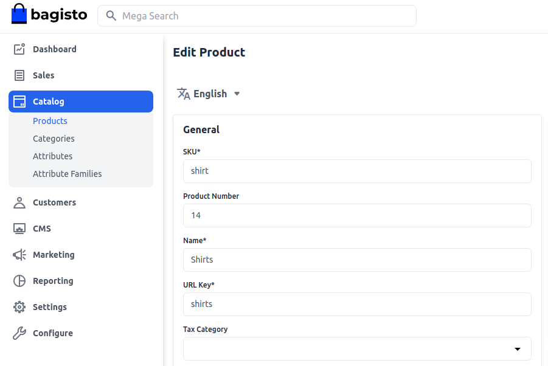
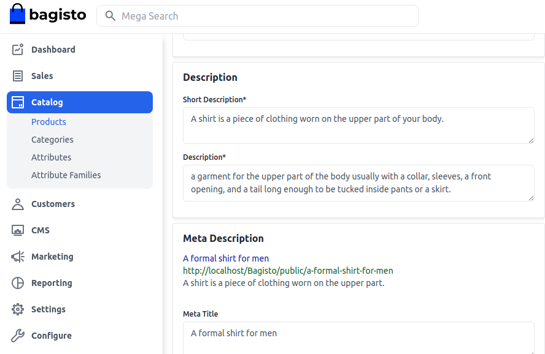
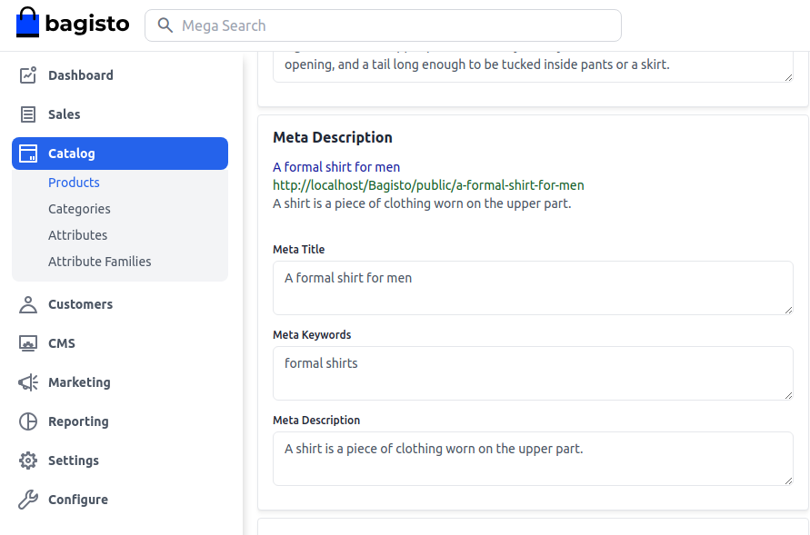
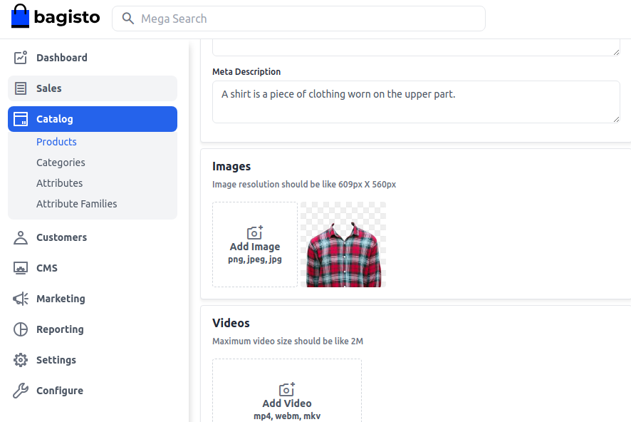
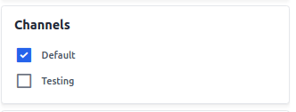
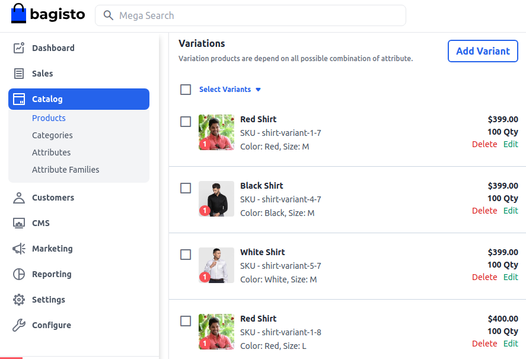
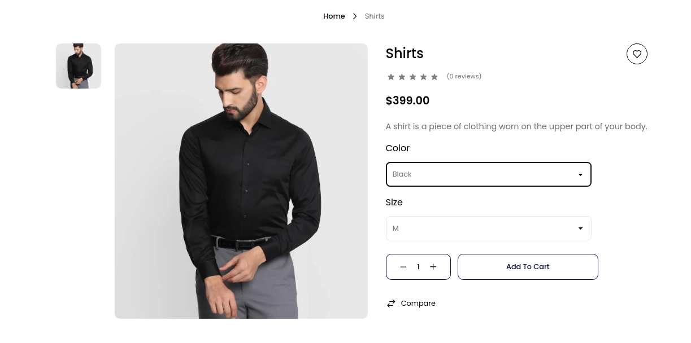

# منتجات قابلة للتكوين

المنتجات القابلة للتكوين هي عناصر أو خدمات تتيح للعملاء المرونة في تخصيص بعض السمات وفقًا لتفضيلاتهم. سواء في التصنيع أو التجارة الإلكترونية أو البرمجيات، تمكّن هذه المنتجات المستخدمين من الاختيار من بين خيارات محددة مسبقًا، مثل الميزات أو المواصفات أو الألوان أو الأحجام.

يسمح هذا التخصيص بوجود مجموعة متنوعة من الاختلافات دون الحاجة إلى إنشاء منتجات فريدة. تم تصميم المنتجات القابلة للتكوين لتلبية الاحتياجات الفردية، وتعزيز رضا العملاء وتوفير تجربة مصممة خصيصًا في [Bagisto](https://bagisto.com/ar/).

### كيفية إنشاء منتج قابل للتكوين في Bagisto 2.2.0
1. **إضافة منتج:** انقر على **الفهرس >> اختر منتج قابل للتكوين** كنوع منتج >> اختر **العائلة** >> أدخل **SKU** ثم **احفظ المنتج** كما هو موضح في الصورة أدناه.

 
 
   بعد أن تقوم بحفظ المنتج، ستحصل على خيار لتحديد **اللون والحجم**. في حالة إذا كنت تريد سمة أخرى في منتجك القابل للتكوين، فأنت بحاجة إلى إنشاء سمة أولاً ثم حفظ المنتج كما هو موضح في الصورة أدناه.

   [Configurable](../../assets/2.2.0/images/configurable-product/configurableAttributes.png)

### السمات العامة
فيما يلي قائمة بالحقول التي تحتاج إلى ملئها تحت السمات العامة.

- **SKU:** قدم SKU (Stock Keeping Unit) للمنتج والذي هو فريد لكل منتج.
- **مفتاح URL:** سيكون هذا نهاية عنوان URL، على سبيل المثال، http://bagisto.test.com/products/philips-speaker (السماعة (speaker) هي مفتاح URL)
- **فئة الضريبة:** يمكنك تحديد فئة الضريبة من القائمة المنسدلة التي تريد تطبيقها على المنتج.

   

تأكد أيضًا من تمكين الإعدادات.

- **جديد:** قم بتمكين زر التبديل إذا كنت تريد أن يظهر المنتج كمنتج جديد. سيتم عرض المنتج الناتج في قسم المنتجات الجديدة.
- **مرئي بشكل فردي:** قم بتمكين زر التبديل حتى يكون المنتج مرئيًا على الواجهة الأمامية.
- **المميز:** قم بتمكين زر التبديل إذا كنت تريد عرض المنتج في قسم المنتجات المميزة.
- **الحالة:** قم بتمكين زر التبديل لتفعيل المنتج في متجرك الإلكتروني.
- **الدفع بدون تسجيل:** قم بتمكين زر التبديل لتسمح للعميل الضيف بطلب المنتج.

   

### الوصف
فيما يلي قائمة بالحقول التي تحتاج إلى ملئها فيما يتعلق بالمنتج تحت الوصف.

- **وصف قصير:** أدخل وصفًا موجزًا لميزات المنتج.
- **الوصف:** هنا يمكنك ذكر منتجك بالتفصيل.

   

### وصف التعريف الميتا
فيما يلي قائمة بالحقول التي يجب عليك توفيرها تحت وصف التعريف الميتا لجعل منتجك سهل البحث عنه في محركات البحث.

- **عنوان الميتا:** قدم العنوان الرئيسي للمنتج الذي سيُعرف به منتجك.
- **كلمات المفتاح الميتا:** يجب توفير كلمات المفتاح الميتا للمنتج لتحسين قابليته للبحث في محرك البحث لكلمات مفتاحية محددة.
- **وصف الميتا:** أدخل الوصف حتى يتمكن المنتج من الظهور بسهولة في قائمة محرك البحث.

   

### الصور
أضف صور المنتج، انقر فوق **إضافة صور**. يمكنك إضافة العديد من الصور لمنتجك.

   

### القنوات

حدد القنوات التي تريد حفظ هذا المنتج فيها.

   

### التنويعات

الآن ستتمكن من رؤية **التنويعات** مباشرةً أسفل قسم الفيديو كما هو موضح أدناه. يمكنك ببساطة تحرير كل منتج حسبما قمنا بإنشائه وفقًا للون والحجم.

   

بعد إنشاء جميع التنويعات، أخيرًا، **احفظ المنتج**.

### الواجهة الأمامية
سيكون المنتج مرئيًا كما هو موضح أدناه على الواجهة الأمامية.

   