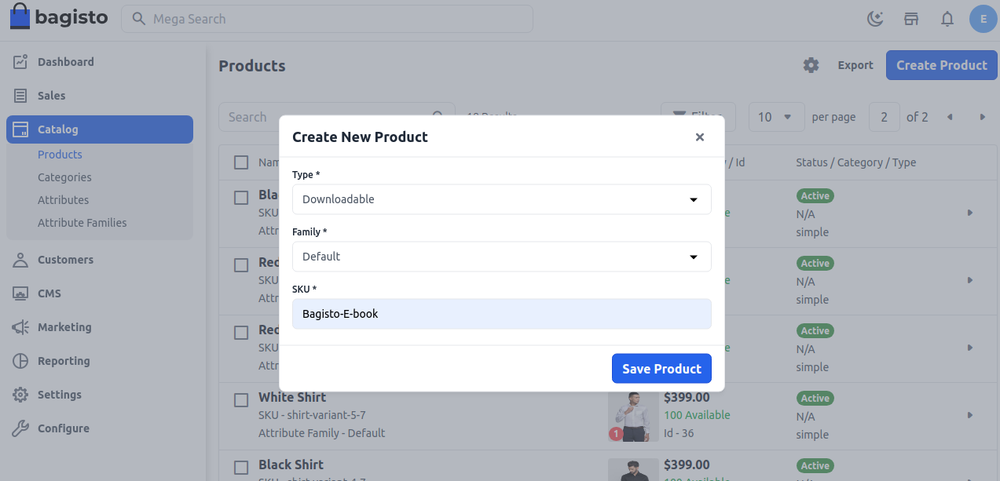
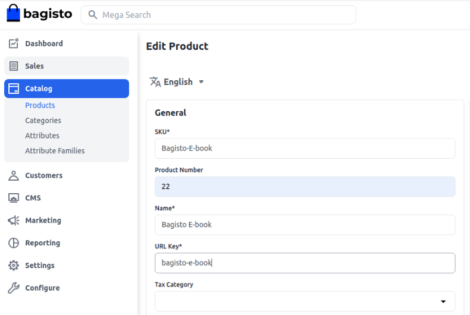
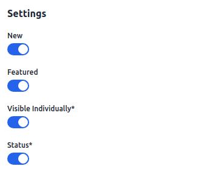
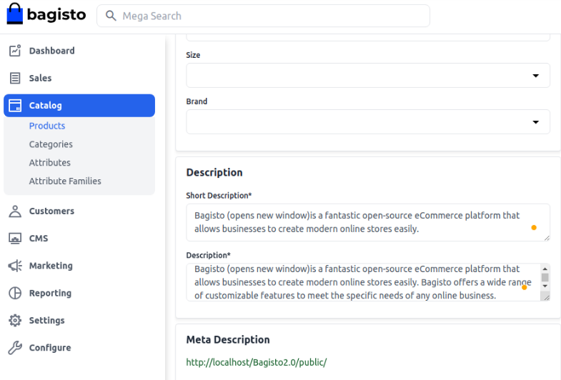
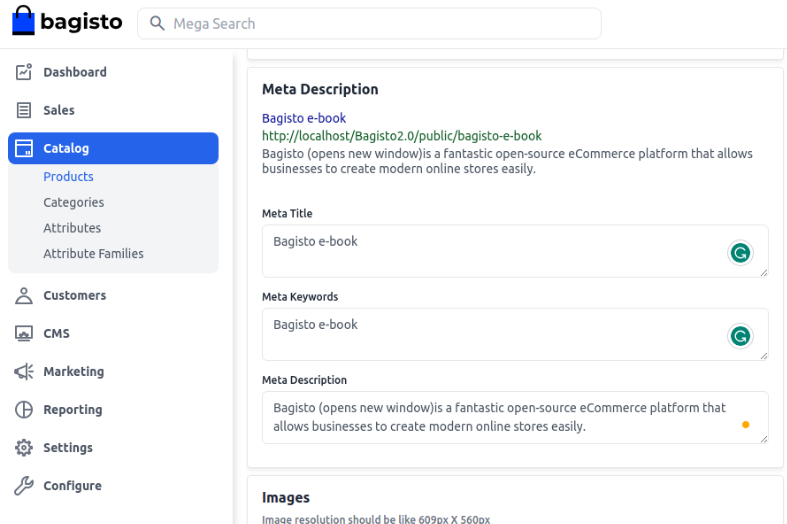
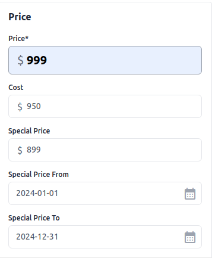
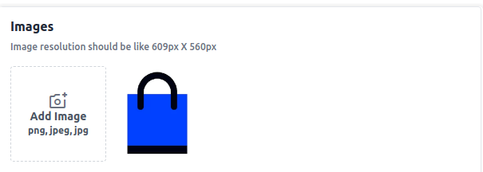
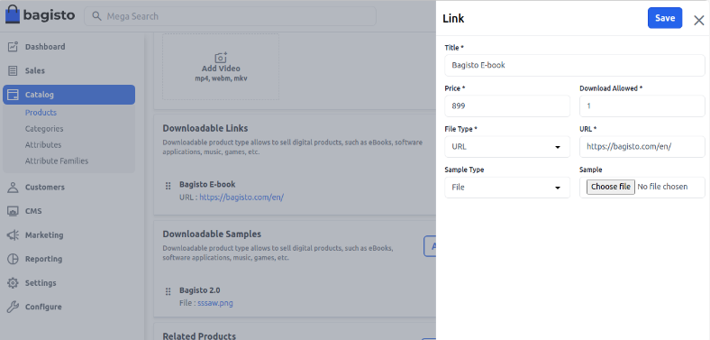
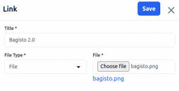
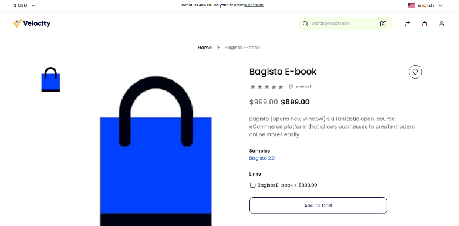

# منتج قابل للتنزيل

اليوم، في هذه الوثيقة، سنستكشف "كيفية إنشاء منتج قابل للتنزيل في Bagisto 2.2.0". تشير المنتجات القابلة للتنزيل إلى العناصر التي يمكن تنزيلها، مثل الكتب الإلكترونية وتطبيقات البرامج والموسيقى والتحديثات والألعاب وما إلى ذلك. هذه المنتجات رقمية ولا تتضمن طريقة شحن عند الخروج.

### خطوات إنشاء منتج قابل للتنزيل في Bagisto 2.2.0

1. في لوحة تحكم المسؤول في Bagisto، انتقل إلى **قسم الكتالوج >> المنتجات >> حدد "قابل للتنزيل"** تحت نوع المنتج.
2. اختر **عائلة السمات**.
3. أدخل **الرمز التعريفي الفريد** (وحدة الحفظ المخزونة) للمنتج، والذي يكون فريدًا لكل منتج.
4. الآن **احفظ المنتج**، وسيتم إعادة توجيهك إلى الصفحة التالية مع الإعدادات العامة.

### الإعدادات العامة

- **الاسم:** أدخل اسم المنتج.
- **مفتاح عنوان URL:** سيكون هذا نهاية عنوان URL، على سبيل المثال، http://bagisto.test.com/products/bagisto-e-book (bagisto-e-book هو مفتاح عنوان URL).
- **فئة الضريبة:** حدد فئة الضريبة من القائمة المنسدلة.

#### جديد

- قم بتمكين زر التبديل لعرض المنتج كمنتج جديد، والمعروض في قسم المنتجات الجديدة.

#### مميز

- قم بتمكين زر التبديل لإظهار المنتج تحت قسم المنتجات المميزة.

#### مرئي بشكل فردي

- قم بتمكين زر التبديل لجعل المنتج مرئيًا على الواجهة الأمامية.

#### الحالة

- قم بتمكين زر التبديل لتمكين المنتج في متجرك الإلكتروني.

### الوصف

أكمل الحقول التالية تحت الوصف:

- **الوصف المختصر:** أدخل وصفًا موجزًا لميزات المنتج.
- **الوصف:** اذكر منتجك بالتفصيل.

### الوصف التعريفي

أكمل الحقول التالية تحت الوصف التعريفي لتحسين إمكانية البحث على محركات البحث:

- **العنوان التعريفي:** قدم العنوان الرئيسي للمنتج.
- **الكلمات الرئيسية التعريفية:** قدم الكلمات الرئيسية التعريفية لتحسين محركات البحث.
- **الوصف التعريفي:** أدخل وصفًا لتحسين إدراجات محركات البحث.

### السعر

أدخل السعر والتكلفة والسعر الخاص. قم بتعيين تاريخ السعر الخاص الذي سيتم عرضه على الموقع الإلكتروني.

### الصور

لإضافة صور المنتج، انقر فوق إضافة صور. يمكنك إضافة العديد من الصور لمنتجك.

### القنوات

حدد القنوات التي تريد حفظ هذا المنتج فيها.

### المعلومات القابلة للتنزيل

هنا، أدخل المعلومات القابلة للتنزيل عن منتجك:

- **الاسم:** أدخل اسم منتجك القابل للتنزيل.
- **السعر:** أدخل سعر المنتج القابل للتنزيل.
- **الملف:** إرفق الملف.  - **تحميل الملف:** قم بتحميل الملف.  - **إدراج عنوان URL:** أدرج عنوان URL.
- **العينة:** أدرج عنوان URL/حمل الملف لتقديم عينة مجانية.
- **السماح بالتنزيل:** حدد الحد الأقصى لعدد التنزيلات. أدخل "0" للتنزيلات غير محدودة.

### العينات

إذا كنت ترغب في توفير عينة مجانية من منتجك، أضف رابطًا جديدًا من قسم العينات أسفل قسم الروابط. أدخل العنوان وارفق ملف العينة.

### المنتج على الواجهة الأمامية

سيكون المنتج القابل للتنزيل مرئيًا على الواجهة الأمامية.

