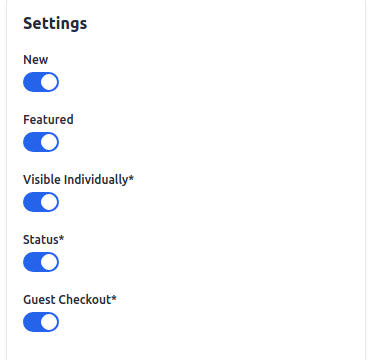

# منتج مجمع

يوجه هذا المستند خطوات إنشاء منتج مجمع في Bagisto 2.2.0. المنتج المجمع هو مجموعة من المنتجات البسيطة التي يمكن الجمع بينها في Bagisto. يسمح هذا النوع المرن من المنتجات لك بعرض تباينات منتج واحد أو مجموعة من المنتجات كمجموعة منسقة. يمكن شراء كل منتج في المنتج المجمع بشكل منفصل أو معًا كجزء من المجموعة.

### خطوات إنشاء منتج مجمع في Bagisto 2.2.0

1. من لوحة تحكم مسؤول Bagisto ، انتقل إلى **قسم الفهرس >> المنتجات >> حدد المجمع** تحت نوع المنتج.
2. حدد **عائلة السمات >> أدخل SKU >> ** انقر لحفظ المنتج.
3. أدخل **SKU** (وحدة الاحتفاظ بالمخزون) للمنتج ، والتي تكون فريدة لكل منتج.

بعد النقر على زر حفظ المنتج ، سيتم إعادة توجيهك إلى الصفحة التالية مع بعض الإعدادات الجديدة كما هو موضح في الصورة أدناه.

### الإعدادات العامة

- **الاسم:** أدخل اسم المنتج.
- **مفتاح URL:** هذا سيكون نهاية عنوان URL ، على سبيل المثال ، http://bagisto.test.com/products/set-of-men-casual-wear (set-of-men-casual-wear هو مفتاح URL).
- **فئة الضرائب:** حدد فئة الضرائب من القائمة المنسدلة.

#### جديد

- قم بتشغيل زر التبديل لتسليط الضوء على المنتج كمنتج جديد ، والذي سيظهر في قسم المنتجات الجديدة.

#### متميز

- قم بتشغيل زر التبديل لعرض المنتج في قسم المنتجات المتميزة.

#### مرئي بشكل فردي

- قم بتشغيل زر التبديل لجعل المنتج مرئيًا على الواجهة الأمامية.

#### الحالة

- قم بتشغيل زر التبديل لتمكين المنتج في متجر التجارة الإلكترونية الخاص بك.

#### الدفع نيابة عن الضيف

- قم بتشغيل زر التبديل للسماح للمنتج بالطلب من قبل عملاء الضيوف.

### الوصف

املأ الحقول التالية تحت الوصف:

- **الوصف القصير:** أدخل وصفًا مختصرًا لميزة المنتج.
- **الوصف:** اذكر منتجك بالتفصيل.

### وصف ميتا

املأ الحقول التالية تحت وصف ميتا لتحسين إمكانية البحث على محركات البحث:

- **عنوان ميتا:** قدم العنوان الرئيسي للمنتج.
- **كلمات مفتاحية ميتا:** قدم كلمات مفتاحية ميتا للتحسين المحدد لمحرك البحث.
- **وصف ميتا:** أدخل وصفًا لتحسين سجلات محرك البحث.

### الصور

لإضافة صور المنتج ، انقر فوق إضافة الصور. يمكنك إضافة العديد من الصور لمنتجك.

### القنوات

حدد القنوات التي تريد حفظ هذا المنتج فيها.

### المنتجات المجمعة

ابحث عن المنتجات في قسم **ابحث عن المنتج** ، يمكنك ببساطة البحث عن المنتج البسيط في المنتج المجمع. بمجرد إضافة جميع المنتجات المطلوبة إلى المنتج المجمع ، سيتم سردها.

لذلك هنا يمكنك إدخال الكمية الافتراضية (والتي سيتم إضافتها تلقائيًا إلى سلة عميل) للمنتج وترتيب الطلبات وفقًا لذلك سيتم سرد المنتج على الواجهة الأمامية. كما هو موضح في الصورة أدناه.

### المنتج في الواجهة الأمامية

سيكون المنتج المجمع مرئيًا في الواجهة الأمامية ، كما هو موضح في الصورة أدناه:

