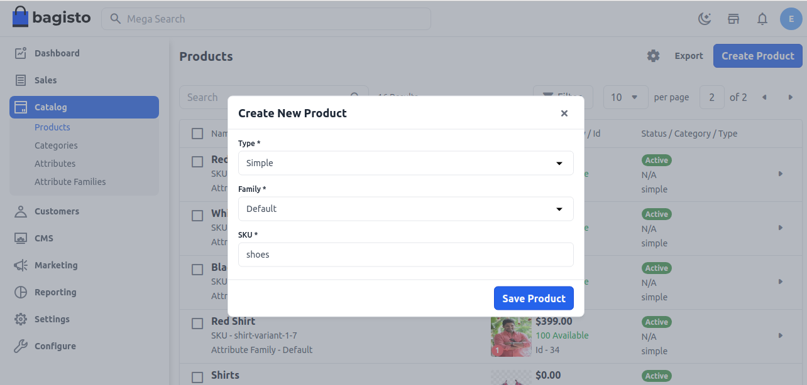
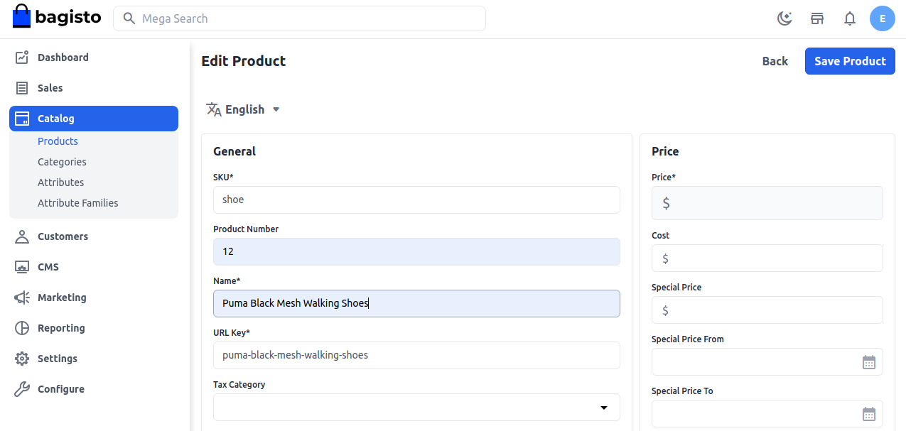
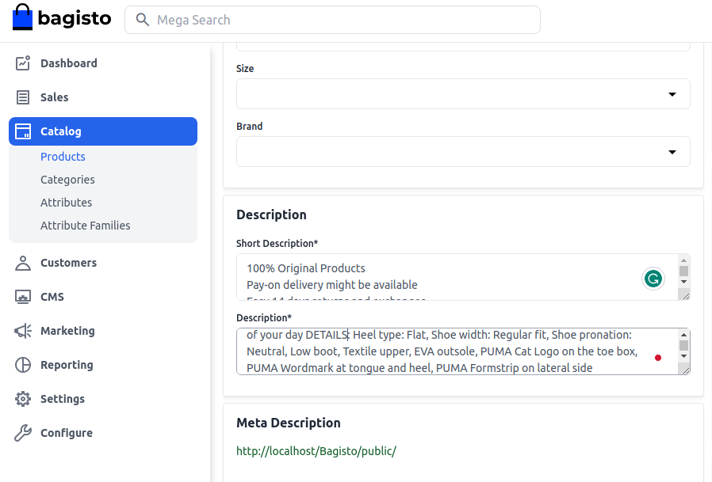
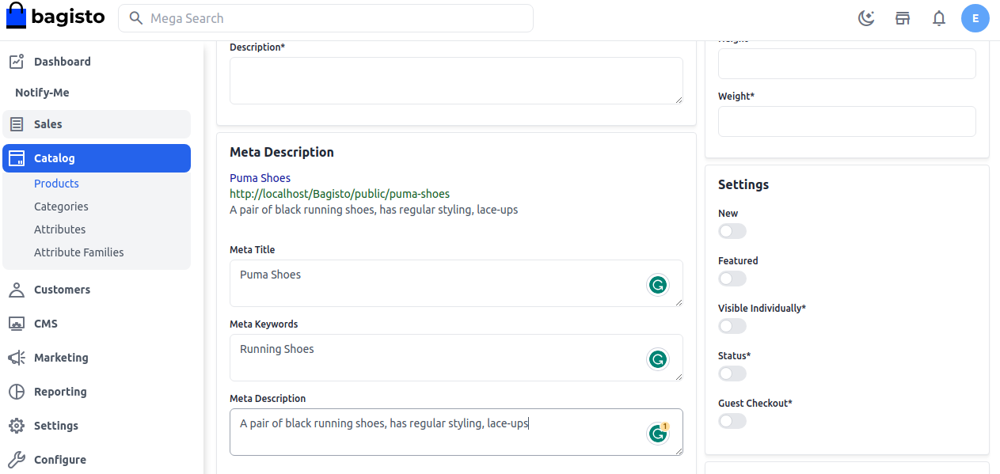
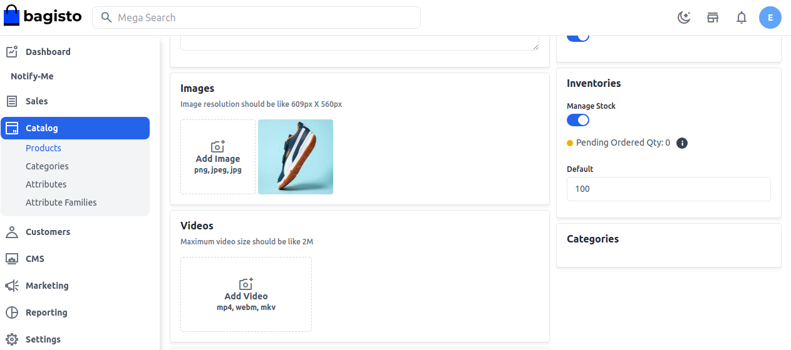
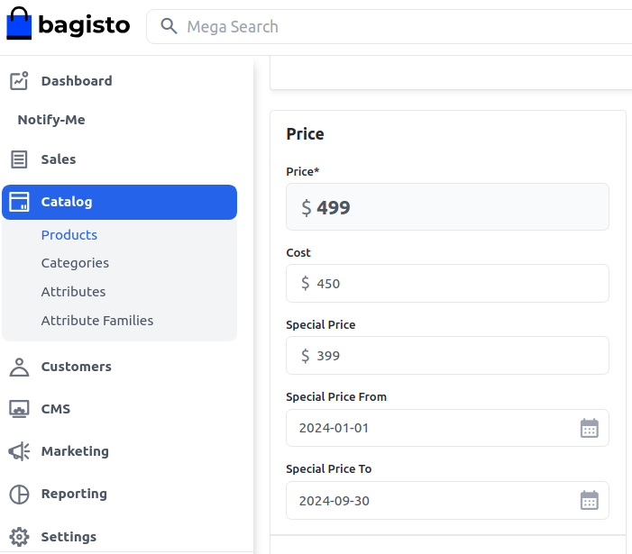
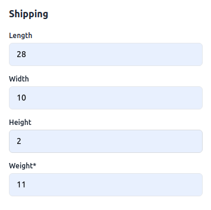
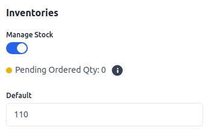
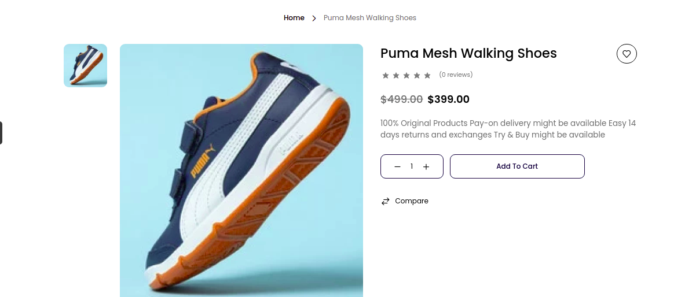

# المنتج البسيط

المنتج **البسيط** هو نوع منتج في التجارة الإلكترونية لا يتطلب من العملاء اختيار سمات إضافية (مثل الحجم أو اللون) لإضافتها إلى السلة. يجب أن يكون عنصرًا مادياً ويمكن شحنه إلى العملاء.

وبالتالي، لا يُعتبر أي خدمة، مثل العناصر القابلة للتنزيل، منتجًا بسيطًا. فيما يلي الخطوات التفصيلية حول كيفية إضافة منتج بسيط في [Bagisto](https://bagisto.com/en/).

### إنشاء منتج بسيط في Bagisto 2.2.0
1. انقر على **الفهرس >> المنتجات >>** وحدد **بسيط** تحت نوع المنتج.

    

الآن **احفظ المنتج**، وسيتم إعادة توجيهك إلى صفحة تحرير المنتج كما هو موضح أدناه.

### السمات العامة
فيما يلي قائمة الحقول التي يجب عليك ملؤها تحت السمات العامة.

### الوصف
فيما يلي قائمة الحقول التي يجب عليك ملؤها فيما يتعلق بالمنتج تحت الوصف.

#### الوصف القصير
أدخل وصفًا موجزًا لميزات المنتج.

#### الوصف
اذكر منتجك بالتفصيل.

### وصف ميتا
فيما يلي قائمة الحقول التي يجب عليك توفيرها تحت وصف ميتا لجعل منتجك سهل البحث عنه على محركات البحث.

#### عنوان ميتا
قدّم العنوان الرئيسي للمنتج الذي سيكون معروفًا به منتجك.

#### كلمات مفتاحية ميتا
يجب تقديم الكلمات المفتاحية ميتا للمنتج لتحسين إمكانية البحث عنه على محرك البحث لكلمات مفتاحية محددة.

#### وصف ميتا
أدخل الوصف حتى يمكن أن تظهر المنتجات بسهولة في قوائم محركات البحث.

### الصور
لإضافة صور المنتج، انقر على **إضافة صور**. يمكنك إضافة العديد من الصور لمنتجك.

### جديد
قم بتمكين زر التبديل إذا كنت تريد عرض المنتج على أنه منتج جديد. سيتم عرض المنتج الناتج تحت قسم المنتجات الجديدة.

### مميز
قم بتمكين زر التبديل إذا كنت تريد عرض المنتج تحت قسم المنتجات المميزة.

### مرئي بشكل فردي
قم بتمكين زر التبديل حتى يكون المنتج مرئيًا على الواجهة الأمامية.

### الحالة
قم بتمكين زر التبديل لتفعيل المنتج في متجرك الإلكتروني.

### الدفع بدون تسجيل
قم بتمكين زر التبديل للسماح للضيوف بطلب المنتج.

### السعر
أدخل السعر والتكلفة والسعر الخاص وحدد تاريخ السعر الخاص الذي سيتم عرضه على الموقع.

### الشحن
قم بتعيين العرض والارتفاع والعمق والوزن للمنتج.

### المخزون
أدخل كمية المنتج الموجودة في مخزونك. بشكل افتراضي، يتم ضبطها على 0 حتى تظهر على الواجهة الأمامية على أنها غير متوفرة.

### القنوات

حدد القنوات التي تريد حفظ هذا المنتج بها.

في النهاية، **احفظ المنتج**.

### الواجهة الأمامية
سيكون المنتج مرئيًا على النحو الموضح أدناه على الواجهة الأمامية.

