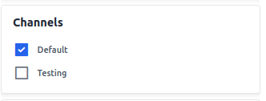

# منتج افتراضي

يوفر هذا المستند دليلاً لإنشاء منتجات افتراضية في Bagisto 2.2.0. في متجر التجارة الإلكترونية ، يمكن تصنيف المنتجات بشكل عام إلى نوعين: مادية وغير ملموسة. تندرج المنتجات الافتراضية تحت فئة المنتجات غير الملموسة ، بما في ذلك العضويات والخدمات والضمانات أو الاشتراكات في [Bagisto](https://bagisto.com/en/).

المنتج الافتراضي ، بخلاف المنتج القابل للتنزيل ، ليس شيئًا يمكن تنزيله ولكنه خدمة يتم تقديمها للعملاء.

### خطوات إنشاء منتج افتراضي في Bagisto 2.2.0

1. انتقل إلى **Catalog >> Products >> Select Virtual** تحت نوع المنتج حدد **Family**.
2. أدخل **SKU** وقم **بحفظ المنتج** ، كما هو موضح في الصورة أدناه.

 

بعد النقر فوق زر حفظ المنتج ، سيتم إعادة توجيهك إلى الصفحة التالية مع إعدادات جديدة متنوعة.

### الإعدادات العامة

- **الاسم:** أدخل اسم المنتج.
- **مفتاح URL:** سيكون هذا نهاية عنوان URL ،
    على سبيل المثال ، http://bagisto.test.com/products/fitness-membership (fitness-membership هو مفتاح URL).
- **فئة الضريبة:** حدد فئة الضريبة من القائمة المنسدلة.

 

#### جديد

- قم بتمكين زر التبديل لتميز المنتج كمنتج جديد ، والذي سيظهر في قسم المنتجات الجديدة.

#### مميز

- قم بتمكين زر التبديل لإظهار المنتج في قسم المنتجات المميزة.

#### مرئي فرديًا

- قم بتمكين زر التبديل لجعل المنتج مرئيًا في الواجهة الأمامية.

#### الحالة

- قم بتمكين زر التبديل لتمكين المنتج في متجر التجارة الإلكترونية الخاص بك.

#### تسجيل الخروج كضيف

- قم بتمكين زر التبديل للسماح للعملاء الضيوف بطلب المنتج.

 

### الوصف

قم بتعبئة الحقول التالية تحت الوصف:

- **وصف موجز:** أدخل وصفًا موجزًا لميزات المنتج.
- **الوصف:** قدم وصفًا تفصيليًا للمنتج.

### الوصف التعريفي

قم بتعبئة الحقول التالية تحت الوصف التعريفي لتحسين إمكانية الوصول في محركات البحث:

- **عنوان الميتا:** قدم العنوان الرئيسي للمنتج.
- **كلمات مفتاحية للميتا:** قدم كلمات مفتاحية للميتا لتحسين محركات البحث.
- **وصف الميتا:** أدخل وصفًا لإدراجات محركات البحث الأفضل.

    

### الصور

أضف صور المنتج بالنقر فوق **إضافة صور**. يمكن إضافة صور متعددة.

 

### القنوات

حدد القنوات التي تريد حفظ هذا المنتج بها.

### المخزون

أدخل كمية المنتج المتاحة في مخزونك. الافتراضي محدد على 0 ، مما يشير إلى نفاد المخزون في الواجهة الأمامية.

### السعر

أدخل السعر والتكلفة والسعر الخاص. حدد تاريخ السعر الخاص لعرض السعر الخاص على الموقع.

### المنتج في الواجهة الأمامية

سيكون المنتج الافتراضي مرئيًا في الواجهة الأمامية.

