# القنوات

يسمح لك Bagisto بإعداد وإدارة عدة نسخ من النطاقات أو المتاجر في واجهة واحدة. ستوجهك هذه الإرشادات حول كيفية إنشاء عدة مواقع ويب بدومينات مختلفة في Bagisto.

### إنشاء القنوات في Bagisto.

**الخطوة 1:** تتيح لك وظيفة القنوات في Bagisto إنشاء مواقع ويب متعددة. هنا تحتاج إلى الانتقال إلى **الإعدادات >> القنوات >> إنشاء قناة** كما هو موضح في الصورة أدناه.

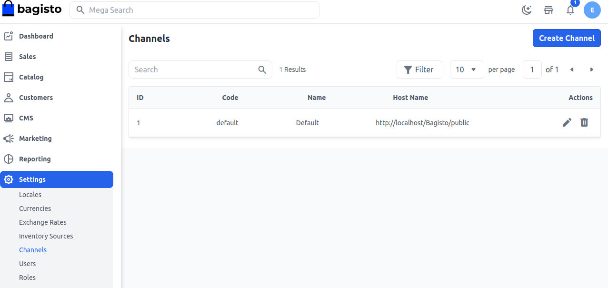
### عام

فيما يلي الحقول التي تقع تحت قسم **عام**.

**1. الرمز:** قدم رمزًا لقناتك.

**2. الاسم:** قدم اسمًا مميزًا لقناتك.

**3. الوصف:** قدم مزيدًا من الوصف حول قناتك بخصوص استخداماتها والمنتجات التي ستبيعها.

**4. مصادر المخزون:** هنا يمكنك اختيار أو تحديد مصادر المخزون التي ستستخدمها لهذه القناة المحددة.

**5. الفئة الرئيسية:** يمكنك اختيار فئة رئيسية واحدة من القائمة المنسدلة لقناتك.

**6. اسم المضيف:** هنا يمكنك تقديم عنوان URL لموقعك الذي تريد ربطه مع النسخة الرئيسية من Bagisto.

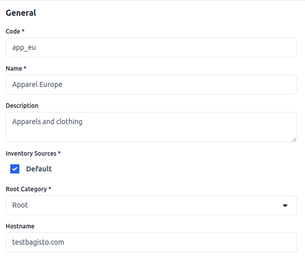
### العملات واللغات

هنا يجب إعداد الإعدادات اللازمة للعملة واللغة.

**1. اللغات:** هنا يمكنك اختيار أو تحديد اللغات التي ستستخدمها للقناة المحددة.

**2. اللغة الافتراضية:** من بين اللغات التي أنشأتها، يمكنك اختيار اللغة التي يجب أن تكون افتراضية لقناتك.

**3. العملات:** هنا يمكنك اختيار أو تحديد العملات التي ستستخدمها للقناة المحددة.

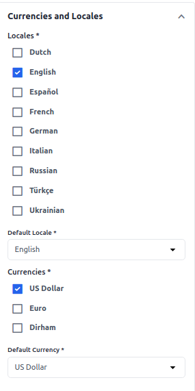
### التصميم

داخل قسم التصميم، يمكنك اختيار ثيم من الخيار المنسدل إذا تم إنشاء ثيمات متعددة.

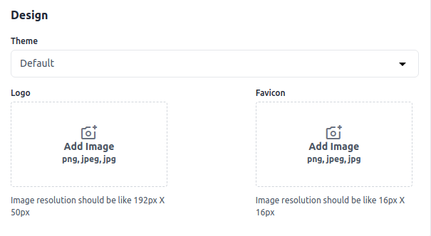
### الشعار

لإنشاء **شعار** للواجهة الأمامية، يرجى النقر على خيار إضافة صورة الشعار واختيار الشعار من نظامك ثم النقر على زر **حفظ القناة**.

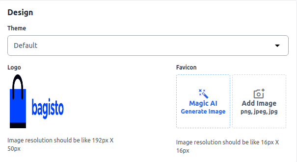
### الشعار في الواجهة الأمامية

الآن تحقق من النتيجة، حيث تم تحديث الشعار بنجاح في الواجهة الأمامية.

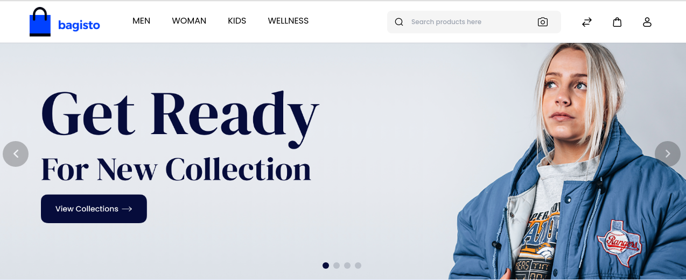
### أيقونة الموقع

لإنشاء **أيقونة موقع** للواجهة الأمامية، يرجى النقر على خيار إضافة صورة الأيقونة واختيار الأيقونة من نظامك ثم النقر على زر **حفظ القناة**.

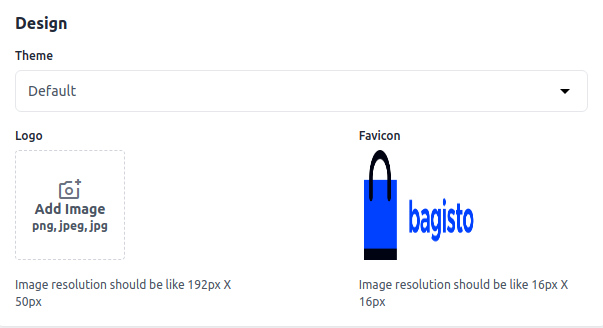
### أيقونة الموقع في الواجهة الأمامية

الآن تحقق من النتيجة، حيث تم تحديث الأيقونة بنجاح في الواجهة الأمامية.

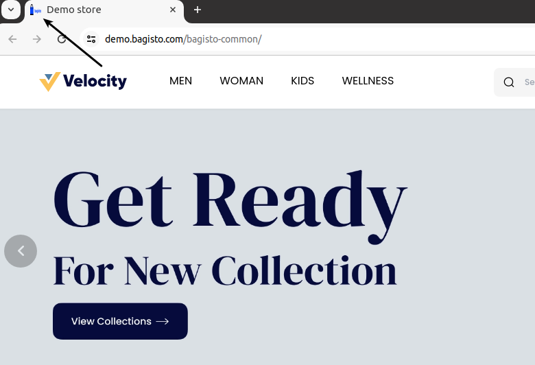
### تحسين محركات البحث للصفحة الرئيسية

**1. العنوان التعريفي:** قدم العنوان الرئيسي للمنتج الذي سيتم التعرف عليه من خلاله.

**2. الكلمات المفتاحية التعريفية:** يجب تقديم الكلمات المفتاحية لتحسين قابلية البحث عن المنتج على محركات البحث.

**3. الوصف التعريفي:** أدخل الوصف حتى تتمكن المنتجات من الظهور بسهولة في قوائم محركات البحث.

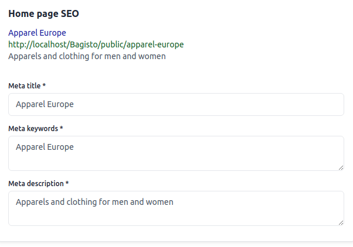
### وضع الصيانة

في Bagisto، يشير **وضع الصيانة** إلى ميزة تتيح لك وضع متجرك الإلكتروني في حالة غير متصلة مؤقتًا. عادةً ما يستخدم هذا الوضع عندما تحتاج إلى إجراء تحديثات أو مهام صيانة أو إجراء تغييرات كبيرة على واجهة المتجر أو الخلفية دون تعطيل تجربة العملاء.

**1) الرسالة:** أدخل الرسالة التي ستظهر للعملاء عندما يزورون متجرك في وضع الصيانة.

**2) عناوين IP المسموح بها:** أدخل عنوان IP الذي سيعمل في وضع الصيانة.

**3) الحالة:** قم بتمكين/تعطيل الحالة لوضع الصيانة.

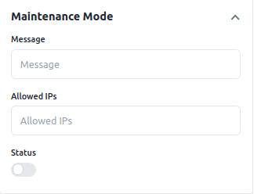
الآن انقر على **حفظ القناة** وستتمكن من رؤية **القناة** الجديدة كما هو موضح أدناه.

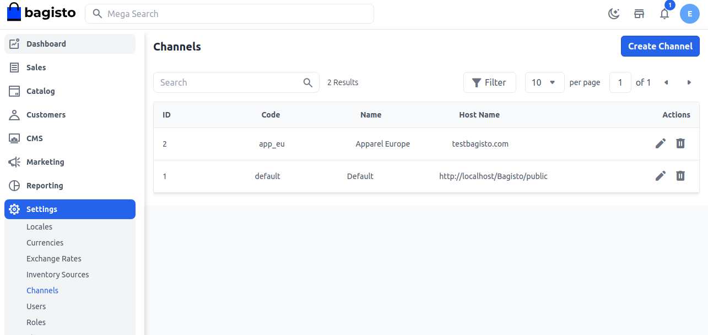
لذا، يمكنك بسهولة إنشاء **قنوات** جديدة في Bagisto.