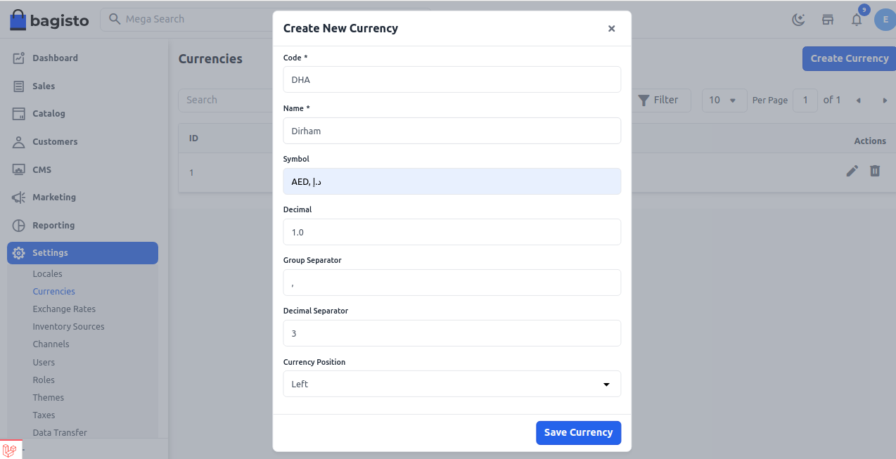
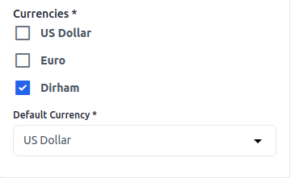

# العملات

قبل إطلاق موقع التجارة الإلكترونية الخاص بك، تحتاج إلى إعداد العملة التي ستقوم بالتعامل بها. سيكون رمز العملة مرئيًا في أسعار المنتجات، الطلبات، الفواتير، المعاملات، إلخ. هنا ذكرنا خطوات كيفية إضافة العملة في Bagisto.

### إضافة عملة في Bagisto

**الخطوة 1:** في لوحة التحكم الخاصة بـ Bagisto، انتقل إلى **الإعدادات >> العملات >> إنشاء عملة** كما هو موضح في الصورة أدناه.

**الخطوة 2:** الآن أدخل التفاصيل أدناه

**1) الرمز -** رمز العملة.

**2) الاسم -** اسم العملة.

**3) الرمز -** رمز العملة.

**4) الفاصلة العشرية -** الفاصلة العشرية للعملة.

**5) فاصل المجموعة -** يساعد على فصل العملة بواسطة ",". على سبيل المثال - 2,50,000

**6) فاصل الفاصلة العشرية -** يساعد على فصل القيم العشرية. على سبيل المثال، إذا أدخلت 3 قيم عشرية، ستكون العملة 200.000

**7) الموضع -** يساعد على تحديد موضع العملة يسارًا أو يمينًا، إلخ.

**الخطوة 3:** الآن ستتمكن من رؤية **عملة** جديدة باسم **درهم** كما هو موضح أدناه.

### إعداد القناة للعملة

في لوحة الإدارة، افتح **الإعدادات >> القنوات**، وسترى قسم العملات والعملتك الجديدة هناك.

بمجرد الانتهاء من إعداد القناة، انقر على **حفظ القناة** كما هو موضح في الصورة أدناه.

لذا، يمكنك بسهولة إنشاء **عملة** في Bagisto.