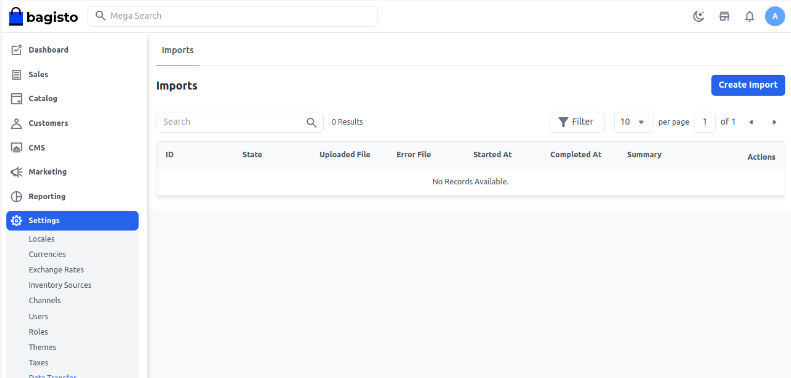
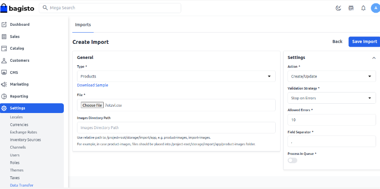
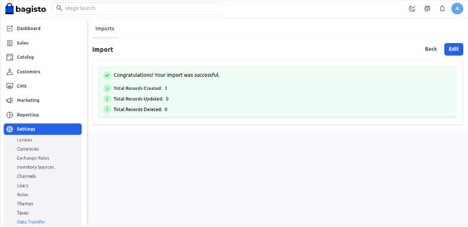
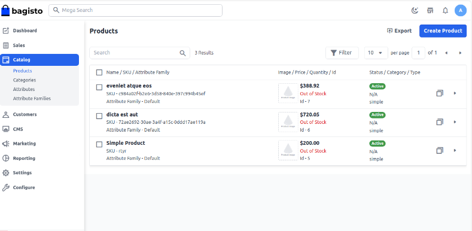

# الاستيراد بالجملة

الاستيراد بالجملة هي ميزة تتيح للمستخدمين استيراد كميات كبيرة من البيانات إلى نظام بسرعة وكفاءة. تُبسط هذه العملية وتوفر الوقت من خلال عدم الحاجة لإضافة كل قطعة من المعلومات واحدة تلو الأخرى. تعمل هذه الميزة بشكل مختلف لكل نظام ولها مجموعة واسعة من الاستخدامات عبر العديد من الصناعات، بما في ذلك Bagisto.

### خطوات إضافة الاستيراد بالجملة في Bagisto 2.2.0

**الخطوة 1:** انتقل إلى لوحة الإدارة الخاصة بـ Bagisto، انقر على **الإعدادات >> نقل البيانات** ثم انقر على زر **إنشاء استيراد**.

**الخطوة 2:** تحت الإعدادات العامة، اختر الحقول التالية:

**1) النوع** – يرجى اختيار النوع (المنتجات، العملاء، معدلات الضرائب) الذي تريد استيراده.

**2) الملف** – اختر الملف بالتنسيق المطلوب (CSV، XLS، XLSX)، وتأكد من أنك قد قمت بتضمين جميع الحقول المطلوبة في الملف.

**ملاحظة** - عند استيراد بيانات المنتجات، يمكن استيراد **أنواع المنتجات البسيطة، القابلة للتكوين، الافتراضية، المجمعة والمجموعة** باستثناء **المنتجات القابلة للتنزيل**.

**3) تنزيل نموذج** – يمكنك أيضًا تنزيل ملفات نماذج من الأنواع (المنتجات، العملاء، معدلات الضرائب). تأكد من أن الملف الذي تقوم بتحميله مشابه لهذا الملف النموذجي.

**4) مسار دليل الصور** – استخدم مسارًا نسبيًا إلى /project-root/storage/import/app، مثل product-images، import-images.

**5) الإجراء** – يرجى اختيار من إعدادات التكوين ما إذا كنت تريد إنشاء/تحديث أو حذف السجلات.

**6) إستراتيجية التحقق** – هذه الميزة الفريدة تتيح لك **تخطي الأخطاء** أو **التوقف عند الأخطاء** أثناء استيراد البيانات.

**7) الأخطاء المسموح بها** – هذه الميزة تحدد مقدار الأخطاء التي سيتم تجاهلها أثناء استيراد البيانات.

**8) فاصل الحقول** – هذه الميزة تتيح لك تحديد الحقول.

**9) المعالجة في قائمة الانتظار** – هذه الميزة تتيح لك تشغيل عملية الاستيراد في قائمة انتظار.

الآن انقر على زر **حفظ الاستيراد**.

**الخطوة 3:** الآن ستبدأ عملية الاستيراد وبعد الانتهاء ستكتمل عملية استيراد المنتجات.

**الخطوة 4:** الآن ستتمكن من رؤية جميع المنتجات تحت قسم **الكتالوج >> المنتجات** كما هو موضح في الصورة المعطاة.

من خلال الخطوات السابقة، يمكنك بسهولة إنشاء **استيراد بالجملة** في Bagisto 2.2.0.