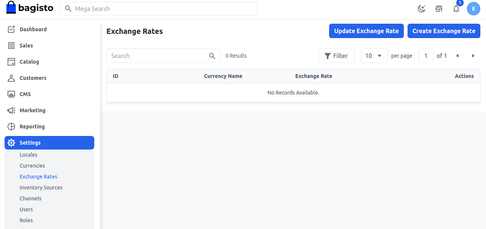
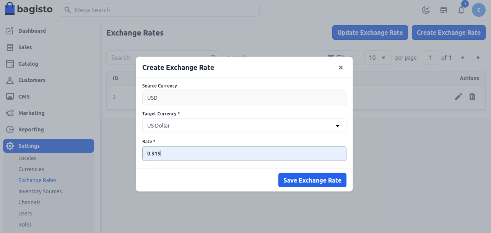
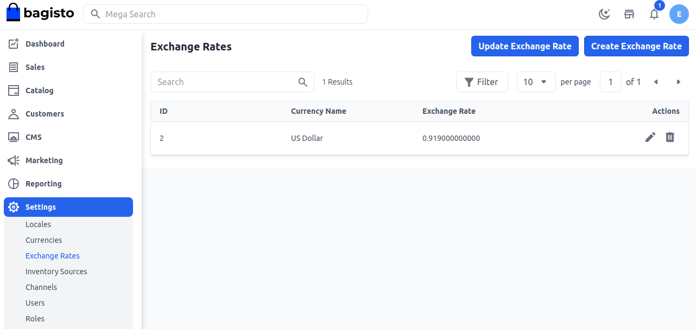

# أسعار الصرف

سعر الصرف هو قيمة عملة دولة واحدة مقارنة بعملات دول أخرى.

على سبيل المثال، كم يورو تحتاج لشراء 1 دولار؟ تحتاج إلى €0.88 لشراء $1. هذا يعني أن سعر صرف اليورو هو 0.88 مقابل الدولار. هنا سنناقش كيفية تعيين سعر الصرف في Bagisto.

### تعيين سعر الصرف في Bagisto

**الخطوة 1:** في لوحة الإدارة الخاصة بـ Bagisto، انتقل إلى **الإعدادات >> أسعار الصرف >> إنشاء سعر صرف** كما هو موضح في الصورة أدناه.

**الخطوة 2:** الآن أدخل **عملة المصدر، عملة الهدف، السعر** وانقر على **حفظ سعر الصرف** كما هو موضح أدناه.

**الخطوة 3:** الآن ستتمكن من رؤية **سعر الصرف** الجديد الذي تم إنشاؤه كما هو موضح أدناه.

### الواجهة الأمامية:-

تم تطبيق **سعر الصرف** بنجاح وهو **0.919** على سعر المنتج **$499**. لذا بعد هذا السعر، سيكون السعر الجديد **$458.58** كما هو موضح أدناه.

لذا، يمكنك بسهولة إنشاء **سعر صرف** في Bagisto.