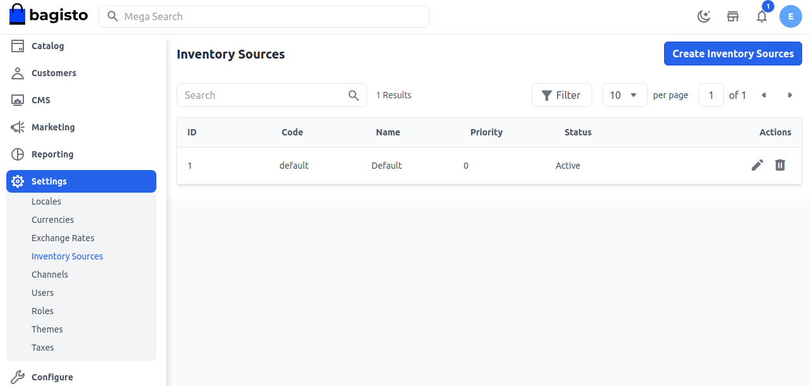
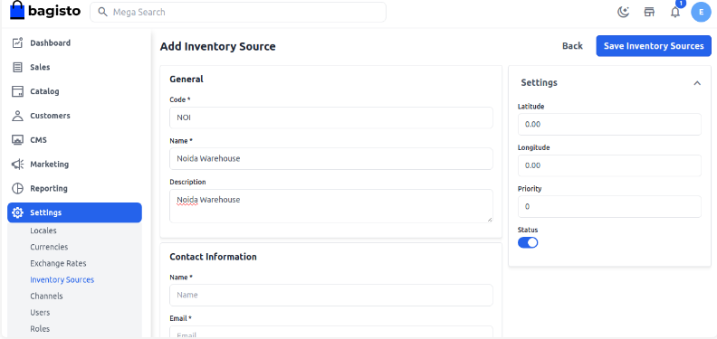
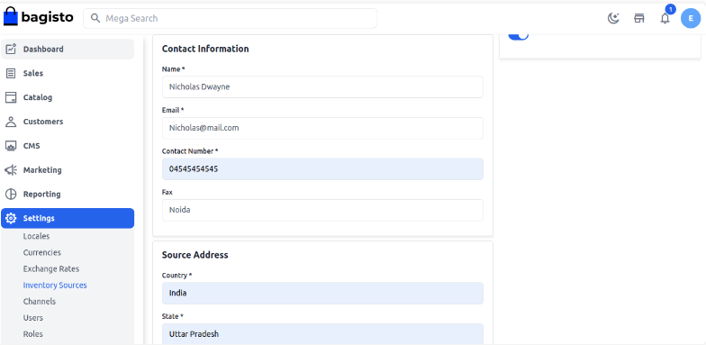
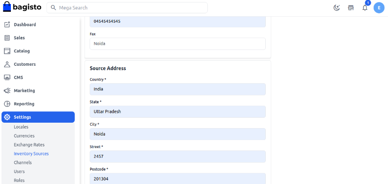
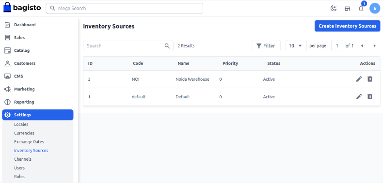
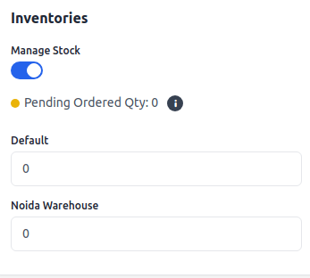
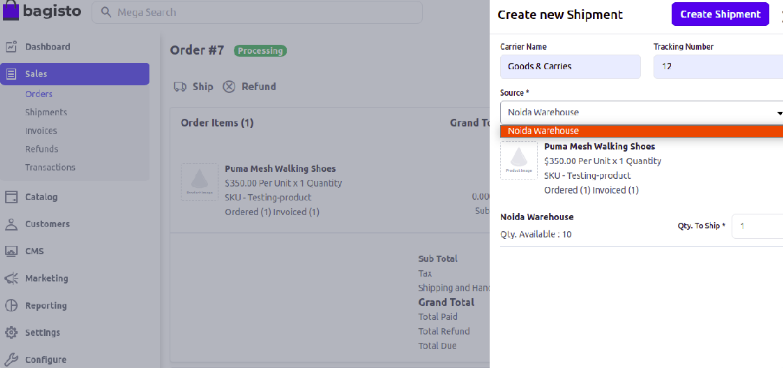

# مصدر المخزون

إدارة المخزون متعدد المستودعات هي واحدة من الميزات الفريدة في Bagisto. هنا سنشرح كيف يمكنك إدارة المخزون متعدد المستودعات في Laravel eCommerce وتقديم خدمة موثوقة لعملائك. وجود مصدر مخزون واحد يمكن أن يفرض بعض القيود على متجرك الإلكتروني.

على سبيل المثال، افترض أن لديك مخزونًا واحدًا فقط في دلهي. طلب عميل من تشيناي بعض المنتجات. لذا، يمكن أن يؤدي تسليم هذا المنتج من موقع دلهي إلى تأثيرات مثل تأخير في التسليم، وزيادة في تكاليف النقل، إلخ. ومع ذلك، إذا كان لديك مخزون في تشيناي، فسيصل المنتج إلى العميل بسرعة كبيرة مما سيوفر الوقت وتكاليف الشحن.

باستخدام إدارة المخزون متعدد المستودعات، يمكنك بسهولة إدارة جميع مصادر المخزون. في Bagisto، يمكنك إنشاء العديد من مصادر المخزون وإدارتها بسهولة.

### خطوات سهلة لإدارة المخزون الخاص بك في Bagisto 2.2.0

**الخطوة 1:** في لوحة الإدارة الخاصة بـ Bagisto، انقر على **الإعدادات >> مصادر المخزون >> إنشاء مصدر مخزون** كما هو موضح في الصورة أدناه.

**الخطوة 2:** **عام**

أدخل **الرمز، الاسم، الوصف، خطوط العرض، خطوط الطول، والأولوية**، واضبط **الحالة** على نشط.

**الخطوة 3:** **معلومات الاتصال**

يجب عليك إدخال **الاسم، البريد الإلكتروني، الفاكس، ورقم الاتصال**.

**الخطوة 4:** **عنوان المصدر**

يجب عليك إدخال عنوان المصدر مثل البلد، والعنوان، والولاية، والمدينة، إلخ لمخزونك.

بعد ذلك، تحتاج إلى النقر على **حفظ مصدر المخزون**. الآن ستتمكن من رؤية مصدر المخزون الجديد الذي تم إنشاؤه بنجاح كما هو موضح في الصورة أدناه.

**الخطوة 5:** انقر على **الإعدادات >> القناة**. افتح القناة المحددة في **وضع التعديل >> مصادر المخزون**. هذه نوعية متعددة الاختيار حيث يمكنك اختيار مصادر مخزون متعددة لقنواتك. بعد ذلك، انقر على **حفظ القناة**.

### إعداد المخزون في صفحة المنتج

انقر على **الكتالوج >> المنتجات**. افتح المنتج المحدد في **وضع التعديل** وأدخل **الكمية** في كل مصدر مخزون. في النهاية، بعد ملء الحقول الضرورية، انقر على **حفظ المنتج**. **ملاحظة:** إذا لم تقم بإدخال أي كمية، سيتم حفظ 0 بشكل افتراضي، ووجود مخزون بكمية 0 لن يظهر في خيار المخزون في صفحة الشحن.

### إعداد المخزون في صفحة الشحن

انقر على **المبيعات >> الطلبات**. افتح الطلب المحدد في **وضع التعديل >> الفاتورة >> حفظ الفاتورة >> الشحن**. تحت قسم المنتجات المطلوبة، يمكن للمسؤول أن يقرر من أي مخزون يريد تسليم المنتج.

**ملاحظة:** يمكنك تمكين مخزون واحد فقط في كل مرة. عند اختيار مخزون واحد، سيتم تعطيل باقي المخزون تلقائيًا. على سبيل المثال، إذا اخترت مستودع نويدا، فسيتم تعطيل المخزون الآخر. أدخل الكمية للشحن و**إنشاء شحنة**.

لذا، يمكنك بسهولة إنشاء **مصادر المخزون** في Bagisto.