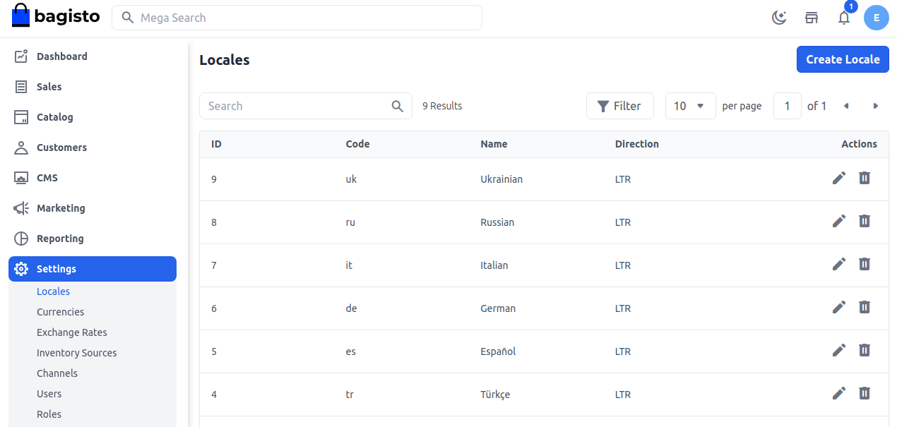
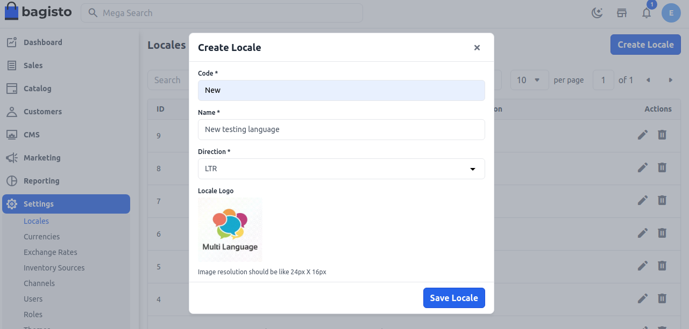
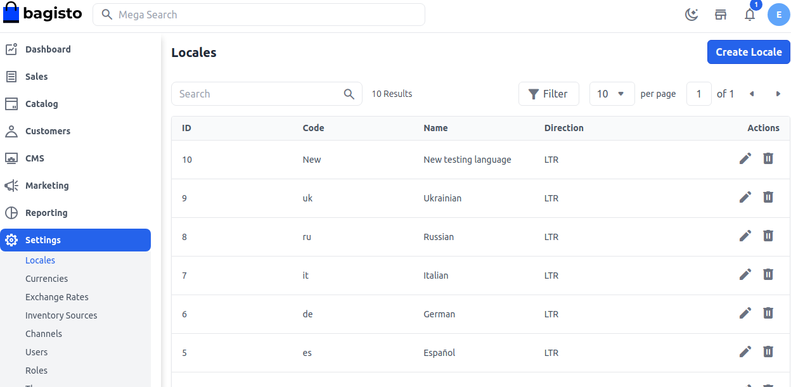
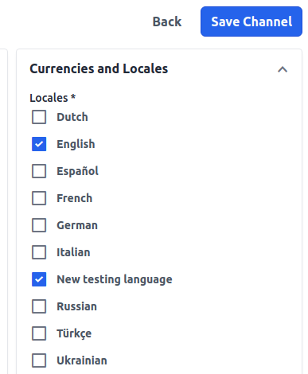

# اللغات

لعرض موقعك الإلكتروني بلغة مختلفة، تحتاج إلى ضبط اللغة في Bagisto. وجود أكثر من لغة لموقعك يمكن أن يحسن تجربة التسوق لعملائك.

### تعيين اللغات في Bagisto

هنا شرح للخطوات اللازمة لتعيين اللغات في Bagisto.

**الخطوة 1:** في لوحة الإدارة الخاصة بـ Bagisto، انتقل إلى **الإعدادات >> اللغات >> إنشاء لغة** كما هو موضح أدناه.

**الخطوة 2:** الآن أضف الحقول التالية

**1. الرمز** كل لغة لها رمز فريد.

**2. الاسم** اسم اللغة.

**3. الاتجاهات** أضف الاتجاه الذي تعمل به لغتك **LTR (من اليسار إلى اليمين)، RTL (من اليمين إلى اليسار)**.

**4. الشعار** أضف شعار لغتك.

الآن **احفظ اللغة** كما هو موضح في الصورة أدناه.

**الخطوة 3:** الآن ستتمكن من رؤية **اللغة** الجديدة كما هو موضح أدناه.

**الخطوة 4:** في لوحة الإدارة، افتح **الإعدادات >> القنوات**. ستتمكن من رؤية لغتك الجديدة في قسم العملات واللغات. لتمكينها، انقر على ذلك و**احفظ القناة** كما هو موضح في الصورة أدناه.

بهذا يمكنك بسهولة إنشاء **اللغات** في Bagisto وجعل موقعك وفقًا للغتك.