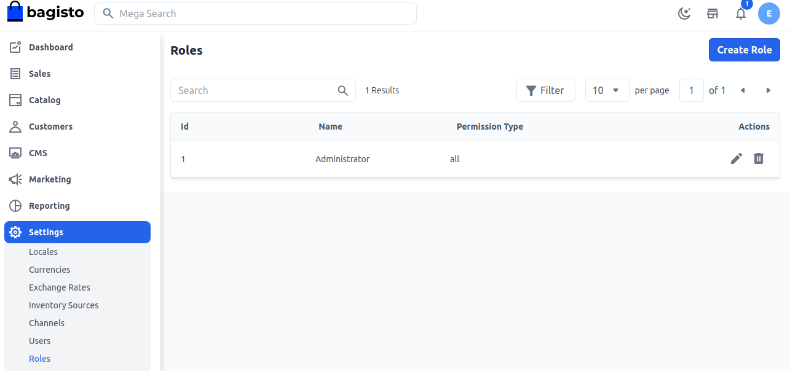
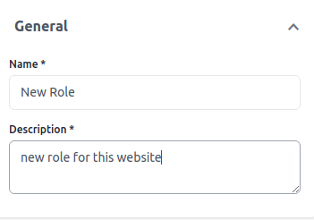
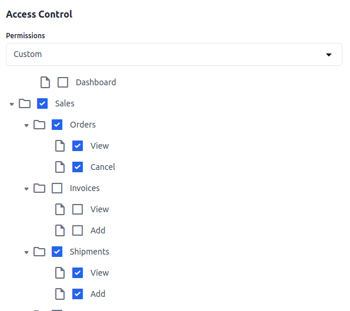
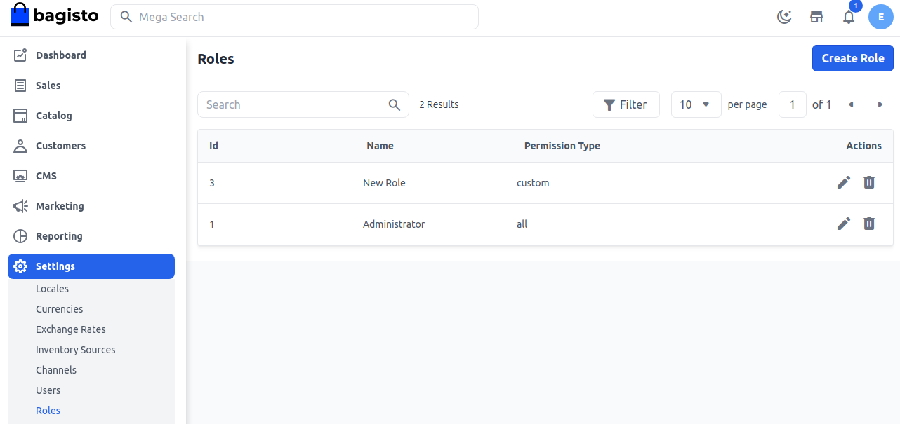

# الأدوار

تسمح الأدوار في Bagisto لمالك المتجر بإنشاء المستخدمين وتوفير أدوار لكل مستخدم. هنا سنناقش كيفية إنشاء تحكم الوصول الإداري (ACL) في Bagisto.

### إنشاء الأدوار

**الخطوة 1:** يمكن ضبطها في لوحة الإدارة بالانتقال إلى **الإعدادات >> الأدوار**. هنا يمكنك إنشاء دور جديد من خلال النقر على زر **إنشاء دور** كما هو موضح في الصورة أدناه.

**الخطوة 2:** أضف الحقول التالية.

**1. الاسم:** أدخل اسم الدور

**2. الوصف:** أدخل وصف الدور

**الخطوة 3:** أضف **تحكم الوصول** وفقًا لمتطلباتك.

الآن انقر على زر **حفظ الدور**.

**الخطوة 4:** الآن ستتمكن من رؤية **الدور** الجديد باسم **الدور الجديد** الذي تم إنشاؤه بنجاح كما هو موضح أدناه.

بهذا يمكنك إنشاء **الأدوار** في Bagisto.