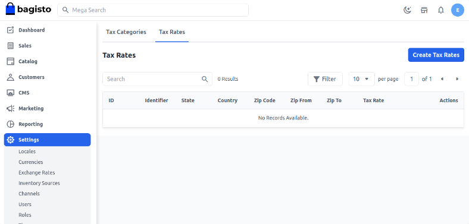
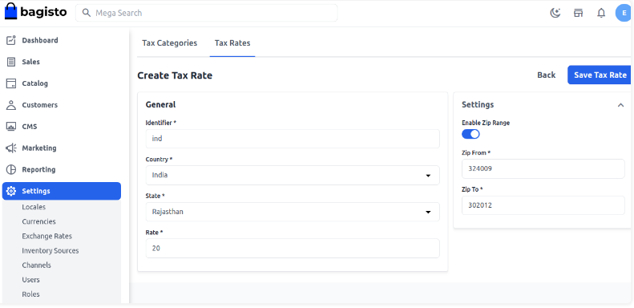
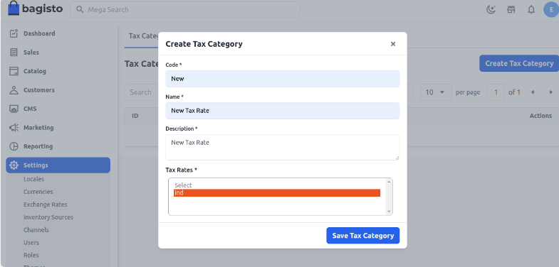
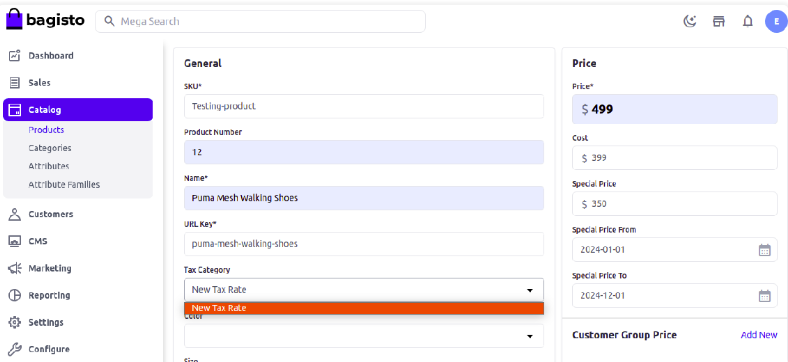
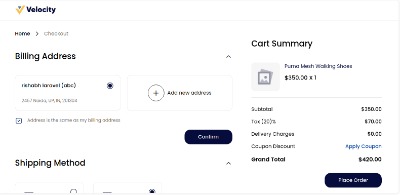

# الضرائب

في التجارة الإلكترونية، توجد ضرائب مختلفة تتعلق بشراء المنتج. تختلف هذه الضرائب ومعدلاتها من بلد لآخر. هنا سنشرح كيف يمكنك إنشاء وإدارة الضرائب في Bagisto.

## معدل الضريبة

**الخطوة 1:** يمكن ضبطه في لوحة الإدارة من خلال النقر على **الإعدادات >> الضرائب >> معدلات الضريبة >> إنشاء معدل ضريبة** كما هو موضح في الصورة أدناه.

**الخطوة 2:** أدخل **المعرف، الدولة، الولاية، الرمز البريدي، ومعدل الضريبة**.

**ملاحظة:** يمكنك أيضًا تعيين نطاق الرمز البريدي بحيث يتم تطبيق الضريبة فقط ضمن هذا النطاق، ثم انقر على **حفظ معدل الضريبة**.

## فئات الضرائب

**الخطوة 1:** لإنشاء فئات الضرائب، انقر على **فئات الضرائب**.

### أضف الحقول التالية

**1. الرمز:** أدخل رمزًا فريدًا لفئة الضريبة.

**2. الاسم:** أدخل اسم فئة الضريبة.

**3. الوصف:** أدخل وصف فئة الضريبة.

**4. معدل الضريبة:** أدخل معدل الضريبة.

انقر على زر **حفظ فئة الضريبة**.

**الخطوة 3:** قم بتعيين فئة الضريبة عند إنشاء منتج.

### الواجهة الأمامية:

أدخل عنوان الفواتير أو إذا كان لديك حساب، انقر على تسجيل الدخول ثم **استمر**.

اختر طريقة **الشحن** و**الدفع** ثم **استمر**.

ستظهر الضريبة في الواجهة الأمامية، انقر على "تقديم الطلب". هنا قمنا بتعيين ضريبة بنسبة 20%، لذا ستطبق الضريبة على سعر المنتج.

بهذا يمكنك بسهولة إنشاء **ضرائب** في Bagisto.