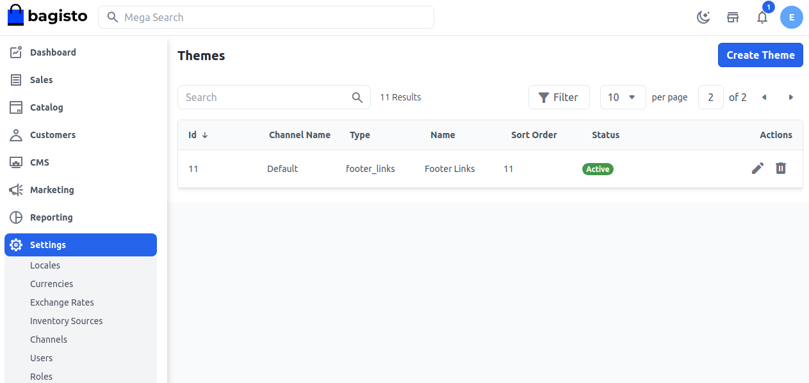
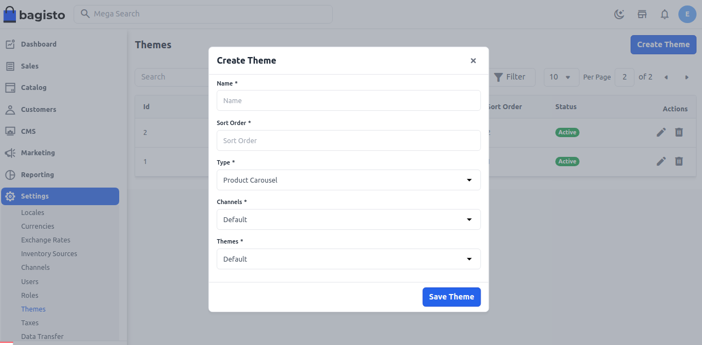
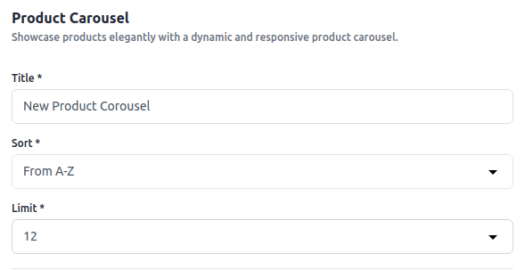
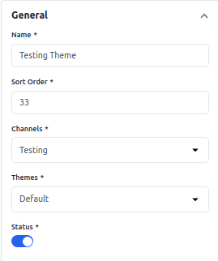
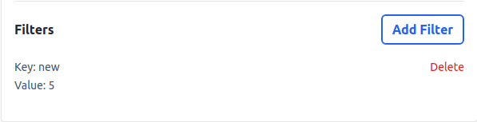
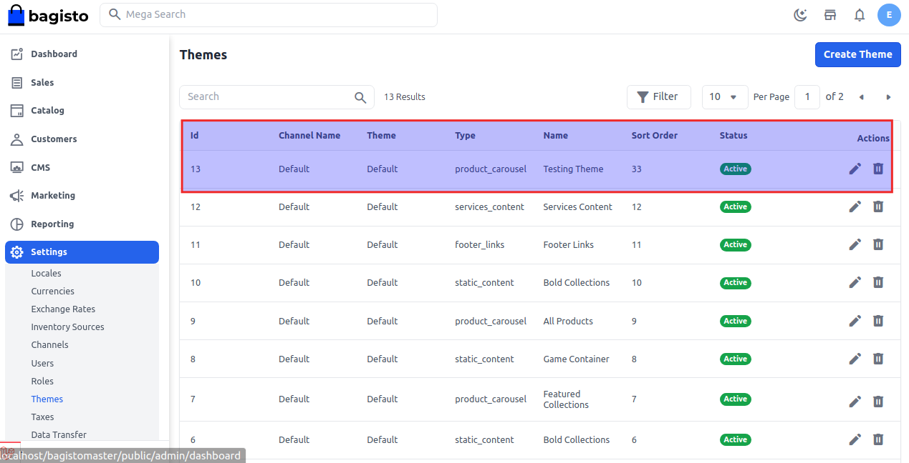

# القوالب

قالب الموقع هو المظهر العام له، ولهذا يلعب دورًا كبيرًا في إنشاء الانطباع الأول في ذهن المشاهد.

يتضمن القالب خيارات مختلفة مثل قسم السلايدر مع خيارات سلايدر متنوعة، قسم المنتجات، خيار التذييل، الشريط الجانبي الأيمن، خيار تغيير حجم الشعار، إعدادات الأزرار، إعدادات المدونة، خيار تحميل الموقع مسبقًا، خيارات ذات صلة، خيار تغيير الأيقونات، قالب بعرض كامل، خيارات الألوان، الأدوات، تخطيطات الشريط الجانبي، والرأس.

تدعم جدول تخصيص القوالب الآن التخصيصات لعدة قوالب وقنوات متعددة. تتيح هذه الميزة لك تعريف تخصيصات مختلفة لكل مجموعة من القوالب والقنوات، مما يوفر مرونة أكبر وتحكمًا أفضل في مظهر تطبيقك.

تم تعزيز قسم تخصيص القوالب بإضافة ميزة لتصفية السمات.

### إنشاء القوالب

**الخطوة 1:** يمكن ضبطه في لوحة الإدارة من خلال الانتقال إلى **الإعدادات >> القوالب**. هنا يمكنك إنشاء قالب جديد من خلال النقر على زر **إنشاء قالب** كما هو موضح في الصورة أدناه.

**الخطوة 2:** أضف الحقول التالية.

**1. الاسم:** أدخل اسم القالب.

**2. ترتيب الفرز:** أدخل ترتيب الفرز.

**3. النوع:** اختر النوع من القائمة المنسدلة وفقًا لمتطلباتك. لقد اخترنا Carousel للمنتجات في هذا المثال.

**4. القنوات:** اختر القناة.

**5. القوالب:** اختر القالب.

الآن انقر على زر **حفظ القالب** وستتم إعادة توجيهك إلى النوع الذي اخترته للتو.

### Carousel للمنتجات

**الخطوة 3:** أضف الحقول التالية.

**1. العنوان:** أضف عنوان Carousel للمنتجات.

**2. ترتيب الفرز:** أضف ترتيب الفرز.

**3. الحد:** أضف الحد لCarousel للمنتجات.

### عام

**1. الاسم:** أضف الاسم.

**2. ترتيب الفرز:** أضف ترتيب الفرز.

**3. القنوات:** اختر القناة.

**4. القوالب:** اختر القوالب.

**5. الحالة:** قم بتمكين الحالة.

### المرشحات

**1. المفتاح:** أضف المفتاح.

**2. القيمة:** أضف القيمة.

الآن انقر على زر **حفظ**.

**الخطوة 4:** الآن ستتمكن من رؤية **الحقل** الجديد المضاف في Carousel للمنتجات باسم **القالب الجديد** كما هو موضح أدناه.

بهذا يمكنك إضافة محتوى قالب في Bagisto.