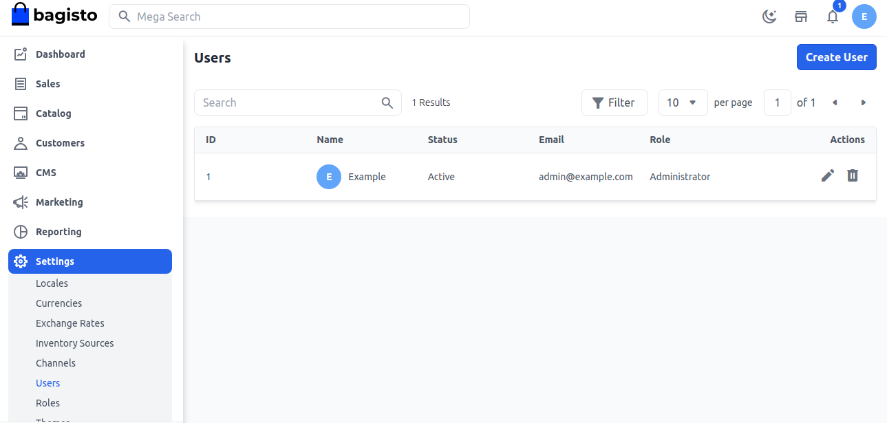
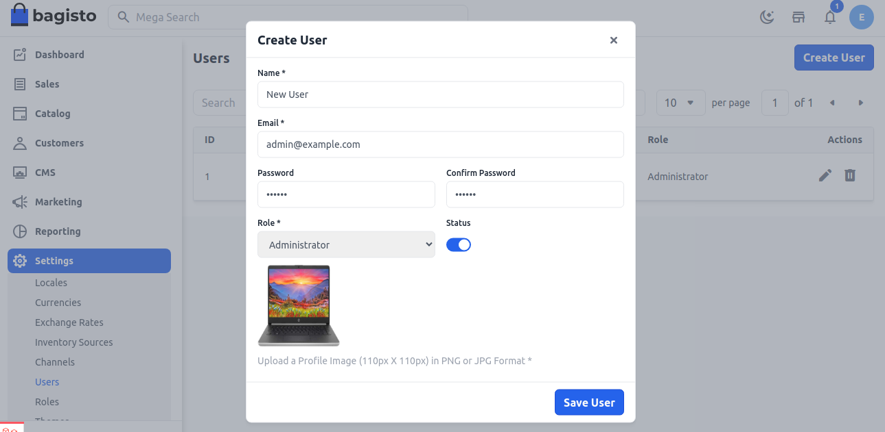
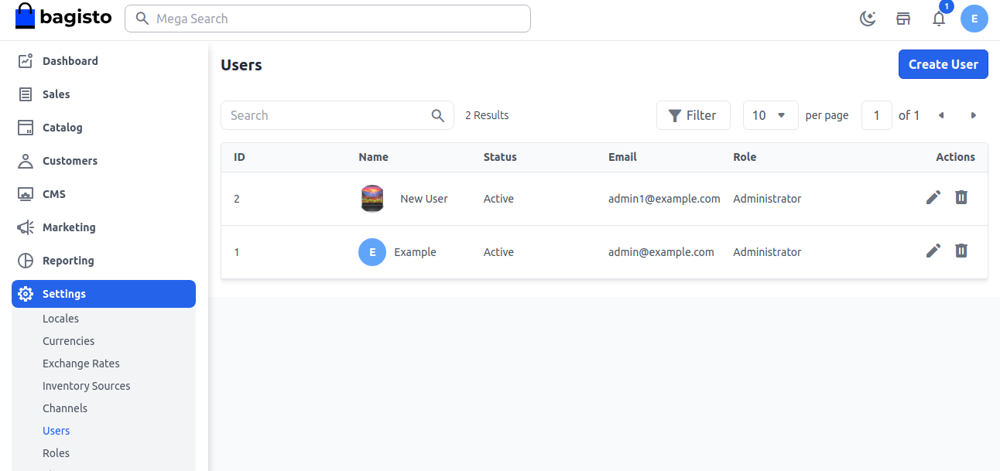

# المستخدمون

تسمح قواعد قائمة التحكم في الوصول في Bagisto لمالك المتجر بإنشاء المستخدمين وتوفير أدوار لكل مستخدم. هنا سنناقش كيفية إنشاء ACL إداري في Bagisto.

### إنشاء مستخدم

**الخطوة 1:** يمكن ضبط ذلك في لوحة الإدارة من خلال الانتقال إلى **الإعدادات >> المستخدمون**. هنا يمكنك إنشاء مستخدمين جدد من خلال النقر على زر **إنشاء مستخدم** كما هو موضح في الصورة أدناه.

**الخطوة 2:** أضف الحقول التالية.

**1. الاسم:** أدخل اسم المستخدم.

**2. البريد الإلكتروني:** أدخل عنوان البريد الإلكتروني للمستخدم.

**3. كلمة المرور:** يجب عليك إدخال كلمة المرور وتأكيدها.

**4. الدور:** اختر دورًا.

**5. الصورة:** أضف صورة للمستخدم.

الآن انقر على زر **حفظ المستخدم**.

**الخطوة 3:** الآن ستتمكن من رؤية **المستخدم** الجديد باسم **المستخدم الجديد** الذي تم إنشاؤه بنجاح كما هو موضح أدناه.

بهذا يمكنك إنشاء **مستخدم** في Bagisto.