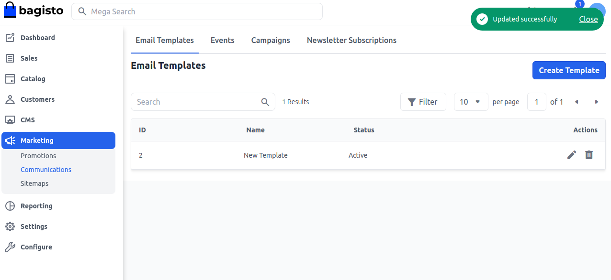

# Communications

Constant communication with the customer, especially after they have made a purchase, about their order status, delivery status, product warranty, how to use explainer videos, ongoing or upcoming offers and discounts and sharing personalized cross-sell product offers consequently has proven to be a good strategy.

## Email Templates
As we all know, everyone wants some customization according to their own taste that's why knowing about changing the email template is also quite helpful for some users.

### Step 1: 

**Add New Email Template**

On Admin panel, go to **Marketing >> Communications >> Email Templates** click on **Create Template** as shown in below image.
 

### Step 2: 

Add **Name** and **Status** as Active, Inactive, or Draft of the Email Template as shown in the below image.

### Step 3: 

Add the content by simply copy and paste also you can apply a link after right click on the content and add the **URL , Text to display , Title, Open Link in** as shown in below image.

Now you will able to see the new **Email Template** as shown below

So by this you can easily create a **Email Temaplate** and used in emails in Bagisto.

## Events

An event parameter is an additional piece of data about a user interaction on a website and/or app, offering valuable context and details about the interaction For Example Birthdays,Aniversaries, Baby Shower etc. 

### Step 1: 
**Add Event**

On Admin panel, go to **Marketing >> Communications >> Events** click on **Create Event** as shown in below image.

### Step 2: 

Now add the **Event Name , Description , Date** as shown in below image.

### Step 3: 

Now you will able to see the new **Event** as shown below.

By this you can easily create a **Events** in Bagisto.

## Campaigns

Ecommerce marketing campaigns are designed to drive traffic and increase sales. They can help you reach many potential customers, keep existing customers engaged, and build brand loyalty.

**Add Campaigns**

On Admin panel, go to **Marketing >> Communications >> Campaigns** click on **Create Campaign** as shown in below image.

### Fill the necessary fields.

**1.Name** Add the name of the campaign.

**2.Subject** Add the subject according to your requirements.

**3.Events** Select the event which you want to apply the camapaign for you can also add your events in this also.

**4.Email Template** Select the Email template which you want apply to to send the emails for the campaign.

**5.Channel** Select the channel.

**6.Customer Group** Select the customer group which you want to apply the campaign for.

**7.Status** Select the the Status to yes/no.

 ### Step 4: 

Now you will able to see the new **Campaign** as shown below.

By this you can easily create a **Campaigns** in Bagisto.