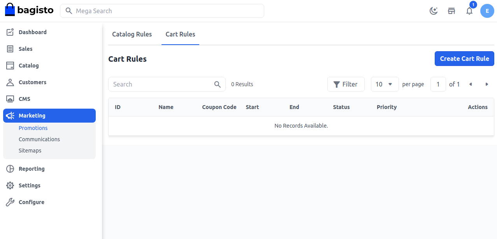
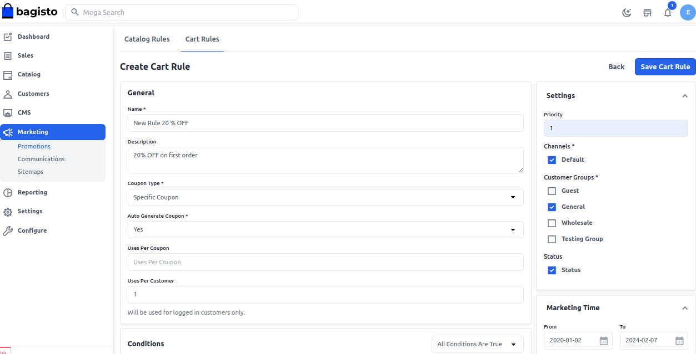
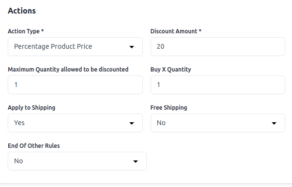
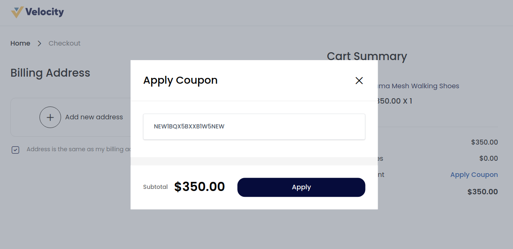
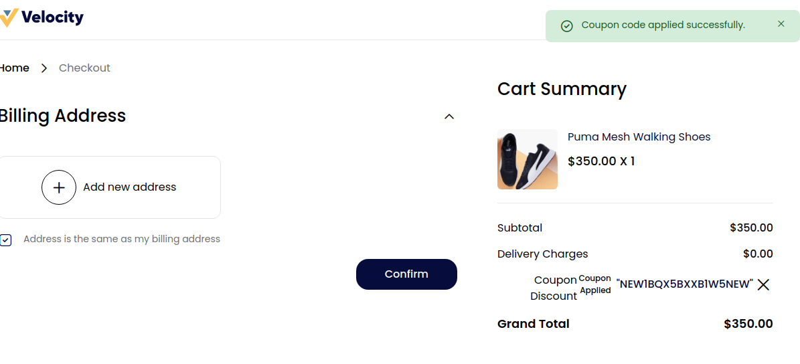
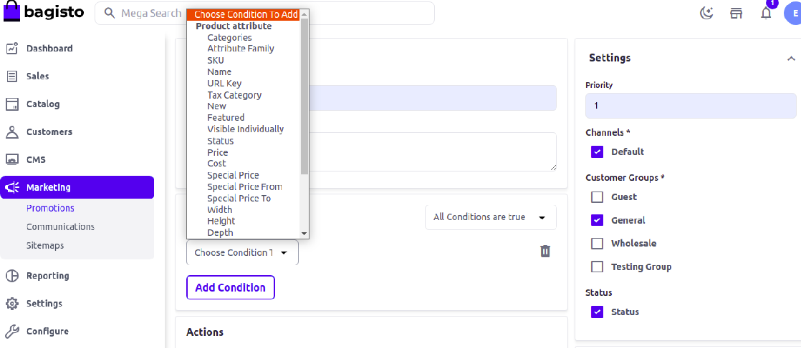
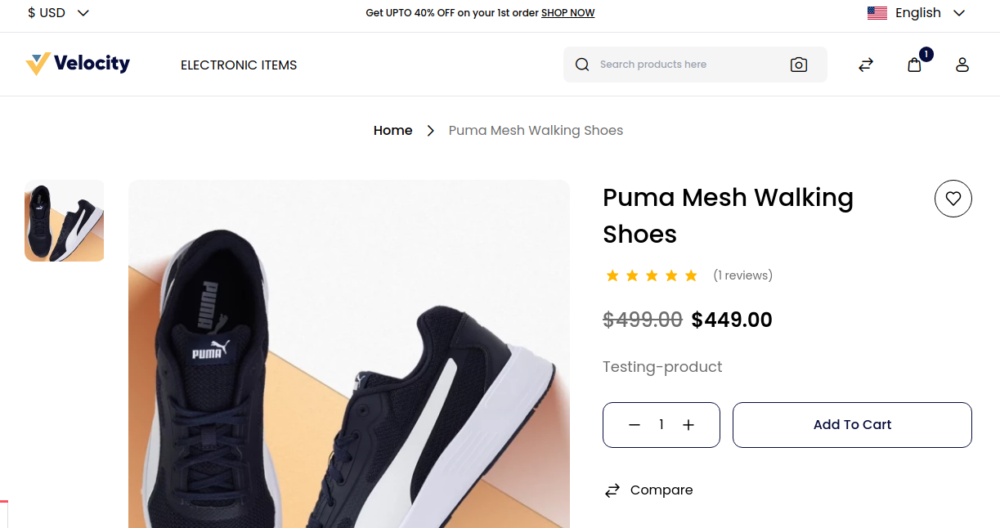

# Promotions

Promotion is when you offer sales and discounts to online shoppers to get new customers and increase revenue. And more importantly, these promotions can turn new visitors into loyal customers and repeat buyers.

## Cart Rules

It is human nature that everyone is attracted to the offers, sales, and discounts while doing Shopping. Cart rule applied to the product in the shopping cart. Here will discuss how to set cart rules in bagisto.

By using it, you can set one or multiple discounts on the same product. Follow the below step “how to set cart rules in bagisto”.

### Step 1: Add New Cart Rule

1. On Admin panel, go to **Marketing >> Promotions >> Cart Rules** click on create **Cart Rule** as shown in below image

 

### Do the following entry in Rule Information Section

**1.Name:-** Enter the name of the new cart rule. (only for internal reference)

**2.Description:-** Enter a description of the rule. (only for internal reference)

**3.Status:-** Set status of cart rule is active.

**4.Channels:-** Select the channel on which this cart rule will be applied.

**5.Customer Group:-** Select the customer group on which this cart rule will be applied.

**6.Coupon Type:-** Select coupon type with or without the coupon. If you want to cart rule applied on all the cart Set “No Coupon“.

### If you want to use coupon then select “Specific coupon” and do the entry in the following field.

**1.Auto Generate Coupon:-** Set  Yes/No, If you select No then do the following step. if you  Set “Yes” then generate the automatic coupon.

**2.Coupon Code:-** Enter the coupon code, that is entered while doing the checkout process to get a discount.

**3.Uses Per Coupon:-** To determine the number of times the coupon can be used. Leave it blank if there is no limitation.

**4.Uses per Customer:-** To determine the number times cart rule can be used for the same customer. Leave it blanks if there is no limitation.

**5.From and To dates:-** Set the range of dates, when cart rule will be affected. If you do not set the dates, the rule applies as soon as rule is saved.

**6.Priority:-** Enter the priority of this rule.

**Note:-  Priority is important when products meet the condition set for more than one cart rule. The highest priority is 0. So when more than one condition, the highest priority will be applied first.**

 

### Step 2: Set Conditions

The condition in cart rule is based on the cart attribute, cart item attribute, product attribute. If you want to apply the rule on all products don’t set any condition. Set the condition type all conditions are true or any condition is true.

 

Then click on the Add condition to set the conditions. Under the list of a product attribute, select the attribute which you want to set for the condition.

For example, you have selected Categories then you have to choose contains/does not contain and select the category as in below image.

If you want to delete any condition, then click on the delete icon.

### Step 3: Set the Actions

In the Action section, we have to set action like how we want to apply the rule on the product.

**1.Actions Type:-**  You can apply a discount on a percentage basis or fixed amount basis.

**2.Discount Amount:-** Enter discount amount.

**3.End Other Rules:-** To stop applying other rules after this rule applies set “Yes”. This will work for applying multiple discounts on the same product.

**4.Apply to Shipping:-** Add Yes/No according to your requirement if you want to apply shipping or not 

**5.Buy X Quantity:-** The number of quantity you want to add.

**6.Free Shipping:-** Add Yes/No according to your requirement if you want to apply Free shipping or not. 

**7.Maximum Quantity allowed to be discounted:-** Add the number of quantity you wanted to apply discount for

So after click the **Save Cart Rule** button 

Now copy the **Coupon Code** as shown in below image

### Front End:-

On the **Checkout Page** while placing an order click on **Apply Coupon** as shown in below image 

After add the coupon code and click on **Apply** button as shown below 

Now **Coupon** is applied successfully 

By following the above Steps you can easily create a **Cart Rules** in Bagisto.

## Catalog Rules

Catalog rule is a special rule that allows the customer to purchase the product at discounted prices that are set by the admin from the backend. Here will discuss how to set catalog rules in bagisto.

Catalog rule applied to the product before placed into the shopping cart. Follow the below step “how to set catalog rules in bagisto”.

### Step 1: Add New Catalog Rule

a)On Admin panel, go to **Marketing >> Promotions >> Catalog Rules**

b)On the upper right side, click on **Create Catalog Rule** button as shown below

### Do the following entry in Rule Information Section

**1.Name:-** Enter the name of the new catalog rule. (only for internal reference)

**2.Description:-** Enter a description of the rule. (only for internal reference)

**3.Status:-** Set status of catalog rule is active.

**4.Channels:-** Select the channel on which this catalog rule will be applied.

**5.Customer Group:-** Select the customer group on which this catalog rule will be applied.

**6.From and To dates:-** Set the range of dates, when catalog rule will be affected. If you do not set the dates, the rule applies as soon as rule is saved.

**7.Priority:-** Enter the priority of this rule.

### Step 2: Set Conditions

All condition in catalog rule is based on the product attribute. If you want to apply the rule on all products don’t set any condition. Set the condition type all conditions are true or any condition is true.

Then click on the Add condition to set the conditions. Under the list of a product attribute, select the attribute which you want to set for the condition.

For example, you have selected Categories then you have to choose contains/does not contain and select the category as in below image.

If you want to delete any condition, then click on the delete icon.

### Step 3: Set the Actions

In the Action section, we have to set action like how we want to apply the rule on the product.

**1.Actions Type:-**  You can apply a discount on a percentage basis or fixed amount basis.

**2.Discount Amount:-** Enter discount amount.

**3.End Other Rules:-** To stop applying other rules after this rule applies set “Yes”. This will work for applying multiple discounts on the same product.

**Note:- If you want that multiple rules apply on the product then set “NO”. So in that case then rule which has the highest priority will apply first.**

Now **Save the Catalog Rule** and you will able to see a new **Catalog Rule** is been created successfully.

### Front End:-

You will get a flat 50 % OFF on the product after applied a catalog rule  as shown below 

By this you can easily create a **Catalog Rule** in Bagisto.
